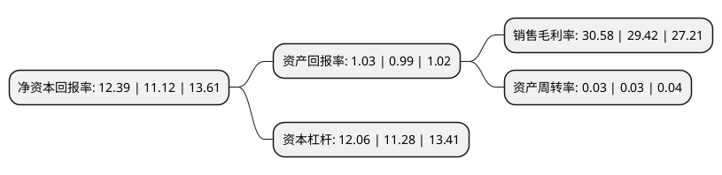

> 本页面由自动化程序生成于 2022年5月20日 01:30
> 内容可能存在错误，如有bug请提交issue至：https://github.com/Eroleice/doc-pi/issues
{.is-warning}

# 上市公司基本情况

## 基本资料

江苏常熟农村商业银行股份有限公司（以下简称“常熟银行”）成立于2001年12月03日，苏州市。于2016年09月30日在上交所主板上市。

常熟银行注册资本274,085.593万元，主要从事业务包括公司业务，个人业务以及资金业务。以下是详细信息：

- 公司名称: 江苏常熟农村商业银行股份有限公司
- 股票代码: 601128.SH
- 所在地: 江苏 - 苏州市
- 成立日期: 2001年12月03日
- 注册资本: 274,085.593万元
- 法定代表人: 庄广强
- 主营业务: 主要从事业务包括公司业务，个人业务以及资金业务
- 公司官网: www.csrcbank.com
- 公司介绍: 公司是全国首批组建的股份制农村金融机构。改制以来，公司全面贯彻落实科学发展观，充分发挥法人银行的体制机制优势，大胆改革创新，灵活稳健经营，在发挥常熟地方金融主力军作用的同时，积极致力于探索多元化的跨区发展之路。在全国农村中小金融机构中首家成功引进战略投资者(交通银行)；首家走出注册地开展跨区经营；首批启动IPO上市工作。公司牢记农村金融改革赋予的使命，坚持服务“三农”、“小微”的市场定位，积极探索差异化、特色化发展之路，支持了一大批个体工商户创业、发展与成长，被广大客户亲切的称为“自己的银行”，先后获得《金融时报》金龙奖“年度最具竞争力农商行”、中国银行业协会(花旗集团)微型创业“年度创新发展奖”等。

## 股东及高管情况

上市公司第一大股东为交通银行股份有限公司，持股246,896,692股，占比9.01%，**疑似为**上市公司实际控制人。

截至2022年03月31日，上市公司的前十大股东中，共有4名机构股东，5个产品账户，1个海外主体，其中5%以上大股东共有2名。上市公司前十大股东明细如下：

> 未能通过持股比例判定出上市公司实际控制人（持股30%以上）
> 可能存在通过间接持股、联合持股、协议控制等方式拥有实际控制权的主体，具体请参考上市公司定期公告！
{.is-warning}

> 上市公司第一大股东持股不超过10%，请检查是否存在公司控制权风险！
{.is-danger}

> 截至2022年03月31日，上市公司前十大股东信息如下：

| 股东名称 | 持股数量（股） | 持股比例 |
| --- | --- | --- |
| 交通银行股份有限公司 | 246,896,692 | 9.01% |
| 香港中央结算有限公司(陆股通) | 190,703,613 | 6.96% |
| 常熟市发展投资有限公司 | 84,431,888 | 3.08% |
| 江苏江南商贸集团有限责任公司 | 76,695,845 | 2.8% |
| 全国社保基金四一三组合 | 71,986,573 | 2.63% |
| 全国社保基金一一零组合 | 55,751,686 | 2.03% |
| 平安银行股份有限公司-中庚价值品质一年持有期混合型证券投资基金 | 50,996,137 | 1.86% |
| 华泰证券股份有限公司-中庚价值领航混合型证券投资基金 | 49,662,068 | 1.81% |
| 中国农业银行股份有限公司-易方达金融行业股票型发起式证券投资基金 | 43,539,539 | 1.59% |
| 江苏白雪电器股份有限公司 | 36,640,404 | 1.34% |

## 利润表分析

上市公司2021年总收入为76.55亿元，净利润为23.41亿元，实现盈利。

## 杜邦分析

> 数据列示周期：2021年 | 2020年 | 2018年
{.is-info}

上市公司的净资产收益率在近一年有所上升，上升幅度为11.42%，其变化情况分解如下：
- 上市公司的销售毛利率在近一年上升了3.94%，可能是生产效率的提升、商品原材料价格下跌或商品价格的上涨所致。
- 上市公司的资产周转率在近一年下降了0%，可能是源自于更慢的销售回款或库存管理效果下降。
- 上市公司的财务杠杆比率在近一年上升了6.91%，可能是增加负债扩大生产规模。

