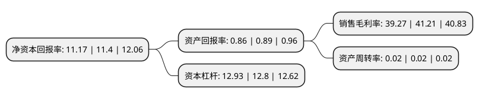

> 本页面由自动化程序生成于 2022年5月20日 01:30
> 内容可能存在错误，如有bug请提交issue至：https://github.com/Eroleice/doc-pi/issues
{.is-warning}

# 上市公司基本情况

## 基本资料

上海银行股份有限公司（以下简称“上海银行”）成立于1996年01月30日，上海市。于2016年11月16日在上交所主板上市。

上海银行注册资本1,420,663.709万元，主要业务分部包括公司金融业务，零售金融业务和资金业务等以下是详细信息：

- 公司名称: 上海银行股份有限公司
- 股票代码: 601229.SH
- 所在地: 上海 - 上海市
- 成立日期: 1996年01月30日
- 注册资本: 1,420,663.709万元
- 法定代表人: 金煜
- 主营业务: 主要业务分部包括公司金融业务，零售金融业务和资金业务等
- 公司官网: www.bosc.cn
- 公司介绍: 公司由上海市国有股份、中资法人股份、外资股份及众多个人股份共同组成，实行“一级法人、两级经营”管理体制。公司以“精品银行”为战略愿景，以“精诚至上，信义立行”为核心价值观，近年来通过推进专业化经营和精细化管理，着力在中小企业、财富管理和养老金融、金融市场、跨境金融、在线金融等领域培育和塑造经营特色，不断增强可持续发展能力。公司目前在上海、北京、深圳、天津、成都、宁波、南京、杭州、苏州、无锡、绍兴、南通、常州、盐城等城市设立分支机构，形成长三角、环渤海、珠三角和中西部重点城市的布局框架；发起设立四家村镇银行、上银基金管理有限公司、上海尚诚消费金融股份有限公司，设立上海银行(香港)有限公司，并与全球120多个国家和地区近1500多家境内外银行及其分支机构建立了代理行关系。

## 股东及高管情况

上市公司第一大股东为上海联和投资有限公司，持股2,085,100,328股，占比14.68%，**疑似为**上市公司实际控制人。

截至2022年03月31日，上市公司的前十大股东中，共有8名机构股东，1个海外主体，1名其他股东，其中5%以上大股东共有4名。上市公司前十大股东明细如下：

> 未能通过持股比例判定出上市公司实际控制人（持股30%以上）
> 可能存在通过间接持股、联合持股、协议控制等方式拥有实际控制权的主体，具体请参考上市公司定期公告！
{.is-warning}

> 截至2022年03月31日，上市公司前十大股东信息如下：

| 股东名称 | 持股数量（股） | 持股比例 |
| --- | --- | --- |
| 上海联和投资有限公司 | 2,085,100,328 | 14.68% |
| 上海国际港务(集团)股份有限公司 | 1,178,744,443 | 8.3% |
| 西班牙桑坦德银行有限公司 | 929,137,290 | 6.54% |
| TCL科技集团股份有限公司 | 817,892,166 | 5.76% |
| 中国建银投资有限责任公司 | 687,322,763 | 4.84% |
| 中船国际贸易有限公司 | 579,764,799 | 4.08% |
| 香港中央结算有限公司(陆股通) | 428,235,892 | 3.01% |
| 上海商业银行有限公司 | 426,211,240 | 3% |
| 上海市静安区财政局 | 290,856,868 | 2.05% |
| 上海企顺建创资产经营有限公司 | 275,340,146 | 1.94% |

## 利润表分析

上市公司2021年总收入为562.29亿元，净利润为220.8亿元，实现盈利。

## 杜邦分析

> 数据列示周期：2021年 | 2020年 | 2019年
{.is-info}

上市公司的净资产收益率在近一年有所下降，下降幅度为-2.02%，其变化情况分解如下：
- 上市公司的销售毛利率在近一年下降了-4.71%，可能是生产效率的下降、商品原材料价格上涨或商品价格的下跌所致。
- 上市公司的资产周转率在近一年下降了0%，可能是源自于更慢的销售回款或库存管理效果下降。
- 上市公司的财务杠杆比率在近一年上升了1.02%，可能是增加负债扩大生产规模。

