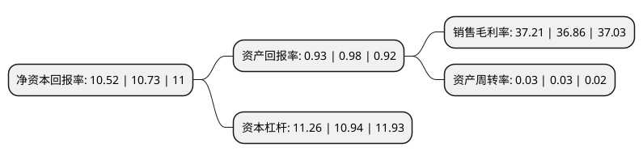

> 本页面由自动化程序生成于 2022年5月20日 01:31
> 内容可能存在错误，如有bug请提交issue至：https://github.com/Eroleice/doc-pi/issues
{.is-warning}

# 上市公司基本情况

## 基本资料

浙江绍兴瑞丰农村商业银行股份有限公司（以下简称“瑞丰银行”）成立于2005年01月28日，绍兴市。于2021年06月25日在上交所主板上市。

瑞丰银行注册资本150,935.492万元，本行业务主要包括公司业务，个人业务以及资金业务。以下是详细信息：

- 公司名称: 浙江绍兴瑞丰农村商业银行股份有限公司
- 股票代码: 601528.SH
- 所在地: 浙江 - 绍兴市
- 成立日期: 2005年01月28日
- 注册资本: 150,935.492万元
- 法定代表人: 章伟东
- 主营业务: 本行业务主要包括公司业务，个人业务以及资金业务
- 公司官网: www.borf.cn
- 公司介绍: 瑞丰银行是一家经中国银行业监督管理委员会批准，由辖内自然人、农村工商户、企业法人和其他经济组织自愿入股组成的股份有限公司，成立于2011年1月18日，前身是绍兴县农村合作银行。瑞丰银行综合实力位居绍兴县金融同业首位、浙江省农信系统前列。入选2010年度中国最具发展潜力农村金融机构、主体长期信用等级为AA-、连续三年获得浙江农信系统“特级银行”、“十强银行”、“优胜单位”，连续三年绍兴县行风评议名列第二。改制后的瑞丰银行，以打造“区域首选零售银行”为发展愿景，通过“精品+规模”的战略实施，着力建设成为全国一流的中型农村商业银行。

## 股东及高管情况

上市公司第一大股东为绍兴市柯桥区天圣投资管理有限公司，持股101,428,589股，占比6.72%，**疑似为**上市公司实际控制人。

截至2022年03月31日，上市公司的前十大股东中，共有10名机构股东，其中5%以上大股东共有1名。上市公司前十大股东明细如下：

> 未能通过持股比例判定出上市公司实际控制人（持股30%以上）
> 可能存在通过间接持股、联合持股、协议控制等方式拥有实际控制权的主体，具体请参考上市公司定期公告！
{.is-warning}

> 上市公司第一大股东持股不超过10%，请检查是否存在公司控制权风险！
{.is-danger}

> 截至2022年03月31日，上市公司前十大股东信息如下：

| 股东名称 | 持股数量（股） | 持股比例 |
| --- | --- | --- |
| 绍兴市柯桥区天圣投资管理有限公司 | 101,428,589 | 6.72% |
| 浙江绍兴华通商贸集团股份有限公司 | 61,128,837 | 4.05% |
| 浙江勤业建工集团有限公司 | 61,128,837 | 4.05% |
| 浙江上虞农村商业银行股份有限公司 | 61,128,837 | 4.05% |
| 绍兴安途汽车转向悬架有限公司 | 61,128,837 | 4.05% |
| 浙江华天实业有限公司 | 61,128,837 | 4.05% |
| 浙江永利实业集团有限公司 | 59,996,822 | 3.97% |
| 浙江明牌卡利罗饰品有限公司 | 58,638,405 | 3.88% |
| 长江精工钢结构(集团)股份有限公司 | 56,508,382 | 3.74% |
| 浙江蓝天实业集团有限公司 | 44,714,612 | 2.96% |

## 利润表分析

上市公司2021年总收入为33.1亿元，净利润为12.94亿元，实现盈利。

## 杜邦分析

> 数据列示周期：2020年 | 2019年 | 2018年
{.is-info}

上市公司的净资产收益率在近一年有所下降，下降幅度为-1.96%，其变化情况分解如下：
- 上市公司的销售毛利率在近一年上升了0.95%，可能是生产效率的提升、商品原材料价格下跌或商品价格的上涨所致。
- 上市公司的资产周转率在近一年下降了0%，可能是源自于更慢的销售回款或库存管理效果下降。
- 上市公司的财务杠杆比率在近一年上升了2.93%，可能是增加负债扩大生产规模。

