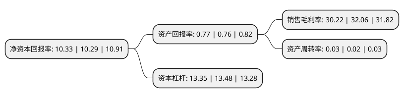

> 本页面由自动化程序生成于 2022年5月20日 01:31
> 内容可能存在错误，如有bug请提交issue至：https://github.com/Eroleice/doc-pi/issues
{.is-warning}

# 上市公司基本情况

## 基本资料

齐鲁银行股份有限公司（以下简称“齐鲁银行”）成立于1996年06月05日，济南市。于2021年06月18日在上交所主板上市。

齐鲁银行注册资本458,083.333万元，公司银行业务，个人银行业务及资金业务等以下是详细信息：

- 公司名称: 齐鲁银行股份有限公司
- 股票代码: 601665.SH
- 所在地: 山东 - 济南市
- 成立日期: 1996年06月05日
- 注册资本: 458,083.333万元
- 法定代表人: 黄家栋
- 主营业务: 公司银行业务，个人银行业务及资金业务等
- 公司官网: www.qlbchina.com
- 公司介绍: 该银行成立于1996年6月，是全国首批、山东省首家设立并引进境外战投的城商行，是中国银行业协会城商行工作委员会第三届副主任单位，是山东省市场利率定价自律机制核心成员、副主任委员。2021年6月18日，该银行成功登陆上海证券交易所A股主板市场。该银行经营区域覆盖山东省内十二地市及天津市，战略投资济宁银行、发起投资德州银行，是山东省城商行联盟的并列第一大股东，在山东、河南、河北拥有16家村镇银行。该银行以“打造具有竞争力的精品区域银行，成为中小企业、城乡居民和驱动本地经济的首选银行”为战略愿景，专注零售、服务中小，大力发展普惠金融，积极探索县域金融、消费金融、科技金融、三板金融、物流金融等特色化发展模式，普惠金融业务在全省银行业金融机构中排在前列。

## 股东及高管情况

上市公司第一大股东为澳洲联邦银行，持股737,124,358股，占比16.09%，**疑似为**上市公司实际控制人。

截至2022年03月31日，上市公司的前十大股东中，共有9名机构股东，1名其他股东，其中5%以上大股东共有5名。上市公司前十大股东明细如下：

> 未能通过持股比例判定出上市公司实际控制人（持股30%以上）
> 可能存在通过间接持股、联合持股、协议控制等方式拥有实际控制权的主体，具体请参考上市公司定期公告！
{.is-warning}

> 截至2022年03月31日，上市公司前十大股东信息如下：

| 股东名称 | 持股数量（股） | 持股比例 |
| --- | --- | --- |
| 澳洲联邦银行 | 737,124,358 | 16.09% |
| 济南市国有资产运营有限公司 | 422,500,000 | 9.22% |
| 兖矿能源集团股份有限公司 | 357,320,000 | 7.8% |
| 济南城市建设投资集团有限公司 | 259,708,785 | 5.67% |
| 重庆华宇集团有限公司 | 254,795,642 | 5.56% |
| 济南西城置业有限公司 | 183,170,000 | 4% |
| 济钢集团有限公司 | 169,800,000 | 3.71% |
| 济南西城投资发展有限公司 | 153,535,058 | 3.35% |
| 山东三庆置业有限公司 | 143,820,000 | 3.14% |
| 中国重型汽车集团有限公司 | 129,314,059 | 2.82% |

## 利润表分析

上市公司2021年总收入为101.66亿元，净利润为30.72亿元，实现盈利。

## 杜邦分析

> 数据列示周期：2021年 | 2020年 | 2019年
{.is-info}

上市公司的净资产收益率在近一年有所上升，上升幅度为0.39%，其变化情况分解如下：
- 上市公司的销售毛利率在近一年下降了-5.74%，可能是生产效率的下降、商品原材料价格上涨或商品价格的下跌所致。
- 上市公司的资产周转率在近一年上升了50%，可能是源自于更快的销售回款或库存管理效果提升。
- 上市公司的财务杠杆比率在近一年下降了-0.96%，可能是减少负债降低财务费用。

