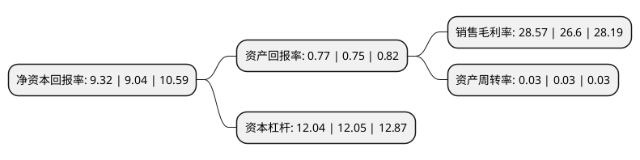

> 本页面由自动化程序生成于 2022年5月20日 01:31
> 内容可能存在错误，如有bug请提交issue至：https://github.com/Eroleice/doc-pi/issues
{.is-warning}

# 上市公司基本情况

## 基本资料

中国光大银行股份有限公司（以下简称“光大银行”）成立于1992年06月18日，北京市。于2010年08月18日在上交所主板上市。

光大银行注册资本5,403,192.073万元，主营业务为商业银行业务。主要产品为公司贷款产品，票据贴现，公司存款产品，中间业务产品与服务，借记卡，信用卡，个人存款等。以下是详细信息：

- 公司名称: 中国光大银行股份有限公司
- 股票代码: 601818.SH
- 所在地: 北京 - 北京市
- 成立日期: 1992年06月18日
- 注册资本: 5,403,192.073万元
- 法定代表人: 李晓鹏
- 主营业务: 主营业务为商业银行业务主要产品为公司贷款产品，票据贴现，公司存款产品，中间业务产品与服务，借记卡，信用卡，个人存款等
- 公司官网: www.cebbank.com
- 公司介绍: 公司成立于1992年8月，总部设在北京，是经国务院批复并经人民银行批准设立的金融企业，为客户提供全面的商业银行产品与服务。主要业务为经中国银行业监督管理委员会批准的包括对公及对私存款、贷款、支付结算、资金业务及其他金融业务。公司坚持“走出去”战略，境外机构建设步伐加快，中国香港分行、首尔分行、光银国际已开业运营，光银欧洲、卢森堡分行正在筹建；社会责任日益彰显，持续多年支持“母亲水窖”公益活动在社会上产生较大影响。多年来，伴随中国经济和金融业的发展进程，公司品牌形象和市场价值不断提升，在为广大客户和社会公众提供优质金融服务的同时，实现了良好的经营业绩，已成为一家运作规范、颇具影响力的上市银行。

## 股东及高管情况

上市公司第一大股东为中国光大集团股份公司，持股25,142,374,561股，占比46.53%，为上市公司实际控制人。

截至2022年03月31日，上市公司的前十大股东中，共有8名机构股东，2个海外主体，其中5%以上大股东共有3名。上市公司前十大股东明细如下：

> 截至2022年03月31日，上市公司前十大股东信息如下：

| 股东名称 | 持股数量（股） | 持股比例 |
| --- | --- | --- |
| 中国光大集团股份公司 | 25,142,374,561 | 46.53% |
| 香港中央结算(代理人)有限公司 | 5,615,957,380 | 10.39% |
| 华侨城集团有限公司 | 4,200,000,000 | 7.77% |
| 中国光大控股有限公司 | 1,572,735,868 | 2.91% |
| 中国人寿再保险有限责任公司 | 1,530,397,000 | 2.83% |
| 中国证券金融股份有限公司 | 989,377,094 | 1.83% |
| 中国再保险(集团)股份有限公司 | 789,487,619 | 1.46% |
| 申能(集团)有限公司 | 766,002,403 | 1.42% |
| 中远海运(上海)投资管理有限公司 | 723,999,875 | 1.34% |
| 香港中央结算有限公司(陆股通) | 634,178,602 | 1.17% |

## 利润表分析

上市公司2021年总收入为1,527.51亿元，净利润为436.39亿元，实现盈利。

## 杜邦分析

> 数据列示周期：2021年 | 2020年 | 2019年
{.is-info}

上市公司的净资产收益率在近一年有所上升，上升幅度为3.1%，其变化情况分解如下：
- 上市公司的销售毛利率在近一年上升了7.41%，可能是生产效率的提升、商品原材料价格下跌或商品价格的上涨所致。
- 上市公司的资产周转率在近一年下降了0%，可能是源自于更慢的销售回款或库存管理效果下降。
- 上市公司的财务杠杆比率在近一年下降了-0.08%，可能是减少负债降低财务费用。

