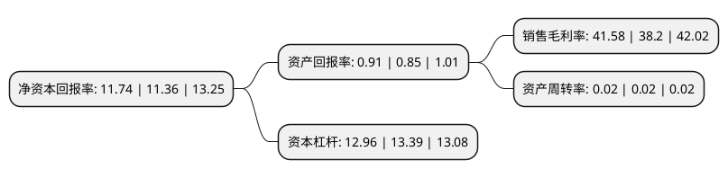

> 本页面由自动化程序生成于 2022年5月20日 01:31
> 内容可能存在错误，如有bug请提交issue至：https://github.com/Eroleice/doc-pi/issues
{.is-warning}

# 上市公司基本情况

## 基本资料

上海农村商业银行股份有限公司（以下简称“沪农商行”）成立于2005年08月23日，上海市。于2021年08月19日在上交所主板上市。

沪农商行注册资本964,444.445万元，主营业务为银行和相关金融业务，包括公司银行，个人银行，资金业务和其他类别业务。公司银行业务主要包括对公贷款，票据，贸易融资，对公存款和汇款。个人银行业务主要包括零售贷款，零售存款，信用卡和汇款。资金业务主要包括货币市场资金拆借和买入，投资类证券以及根据卖出回购协议售出证券。“其他”业务主要包括不能分类为上述业务分部的其他项目。以下是详细信息：

- 公司名称: 上海农村商业银行股份有限公司
- 股票代码: 601825.SH
- 所在地: 上海 - 上海市
- 成立日期: 2005年08月23日
- 注册资本: 964,444.445万元
- 法定代表人: 徐力
- 主营业务: 主营业务为银行和相关金融业务，包括公司银行，个人银行，资金业务和其他类别业务公司银行业务主要包括对公贷款，票据，贸易融资，对公存款和汇款个人银行业务主要包括零售贷款，零售存款，信用卡和汇款资金业务主要包括货币市场资金拆借和买入，投资类证券以及根据卖出回购协议售出证券“其他”业务主要包括不能分类为上述业务分部的其他项目
- 公司官网: www.srcb.com
- 公司介绍: 本行成立于2005年8月25日，是由国资控股、总部设在上海的法人银行，是全国首家在农信基础上改制成立的省级股份制商业银行。目前注册资本为86.8亿元人民币，营业网点近370家，员工总数超8,000人。围绕上海新三大任务、“五个中心”以及“四大品牌”建设，上海农商银行以“普惠金融助力百姓美好生活”为使命，践行“诚信、责任、创新、共赢”的核心价值观，推进“坚持客户中心、坚守普惠金融、坚定数字转型”核心战略，努力打造为客户创造价值的服务型银行，建设具有最佳体验和卓越品牌的区域综合金融服务集团。诞生于1949年的上海农信事业，亲历了共和国旗帜下城市发展的宏伟诗篇，上海农商银行传承上海农信七十余载历史，扎根大都会、携手千百业、贴近老百姓，坚持金融向善、金融向实、金融向阳，以金融诚善守护生活本真，以专业进取回应市场期待，实现银行商业价值和社会功能的有机统一。

## 股东及高管情况

上市公司第一大股东为上海国有资产经营有限公司，持股806,116,000股，占比8.36%，**疑似为**上市公司实际控制人。

截至2022年03月31日，上市公司的前十大股东中，共有10名机构股东，其中5%以上大股东共有5名。上市公司前十大股东明细如下：

> 未能通过持股比例判定出上市公司实际控制人（持股30%以上）
> 可能存在通过间接持股、联合持股、协议控制等方式拥有实际控制权的主体，具体请参考上市公司定期公告！
{.is-warning}

> 上市公司第一大股东持股不超过10%，请检查是否存在公司控制权风险！
{.is-danger}

> 截至2022年03月31日，上市公司前十大股东信息如下：

| 股东名称 | 持股数量（股） | 持股比例 |
| --- | --- | --- |
| 上海国有资产经营有限公司 | 806,116,000 | 8.36% |
| 中国远洋海运集团有限公司 | 800,000,000 | 8.29% |
| 宝山钢铁股份有限公司 | 800,000,000 | 8.29% |
| 上海久事(集团)有限公司 | 733,842,856 | 7.61% |
| 中国太平洋人寿保险股份有限公司 | 560,000,000 | 5.81% |
| 上海国盛集团资产有限公司 | 476,001,214 | 4.94% |
| 浙江沪杭甬高速公路股份有限公司 | 467,452,021 | 4.85% |
| 太平人寿保险有限公司 | 414,904,000 | 4.3% |
| 上海申迪(集团)有限公司 | 357,700,000 | 3.71% |
| 览海控股(集团)有限公司 | 336,000,000 | 3.48% |

## 利润表分析

上市公司2021年总收入为241.64亿元，净利润为100.46亿元，实现盈利。

## 杜邦分析

> 数据列示周期：2021年 | 2020年 | 2019年
{.is-info}

上市公司的净资产收益率在近一年有所上升，上升幅度为3.35%，其变化情况分解如下：
- 上市公司的销售毛利率在近一年上升了8.85%，可能是生产效率的提升、商品原材料价格下跌或商品价格的上涨所致。
- 上市公司的资产周转率在近一年下降了0%，可能是源自于更慢的销售回款或库存管理效果下降。
- 上市公司的财务杠杆比率在近一年下降了-3.21%，可能是减少负债降低财务费用。

