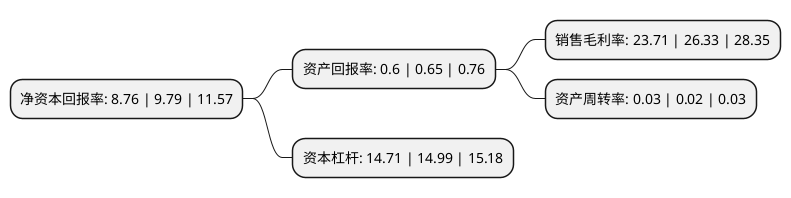

> 本页面由自动化程序生成于 2022年5月20日 01:31
> 内容可能存在错误，如有bug请提交issue至：https://github.com/Eroleice/doc-pi/issues
{.is-warning}

# 上市公司基本情况

## 基本资料

浙商银行股份有限公司（以下简称“浙商银行”）成立于1993年04月16日，杭州市。于2019年11月26日在上交所主板上市。

浙商银行注册资本2,126,869.678万元，主要业务包括公司银行业务，零售银行业务(小企业银行)，投资银行业务和资金业务等。以下是详细信息：

- 公司名称: 浙商银行股份有限公司
- 股票代码: 601916.SH
- 所在地: 浙江 - 杭州市
- 成立日期: 1993年04月16日
- 注册资本: 2,126,869.678万元
- 法定代表人: 张荣森
- 主营业务: 主要业务包括公司银行业务，零售银行业务(小企业银行)，投资银行业务和资金业务等
- 公司官网: www.czbank.com
- 公司介绍: 公司是唯一一家总部设立在浙江省的全国性股份制商业银行，以全资产经营战略为导向，业务快速增长、运营稳健高效、资产质量优良。业务主要位于华东地区(包括浙江、江苏与上海)。该银行目前经营的主要业务为公司银行业务、零售银行业务及资金业务。以总资产计，该银行在2015年英国《银行家》杂志公布的「全球银行业1000强」榜单中位列第145位。2015年中诚信国际给予该银行AAA主体信用评级，为中诚信国际给予中国金融机构评级中最高等级。

## 股东及高管情况

上市公司第一大股东为香港中央结算(代理人)有限公司，持股4,553,782,800股，占比21.41%，**疑似为**上市公司实际控制人。

截至2022年03月31日，上市公司的前十大股东中，共有9名机构股东，1个海外主体，其中5%以上大股东共有4名。上市公司前十大股东明细如下：

> 未能通过持股比例判定出上市公司实际控制人（持股30%以上）
> 可能存在通过间接持股、联合持股、协议控制等方式拥有实际控制权的主体，具体请参考上市公司定期公告！
{.is-warning}

> 截至2022年03月31日，上市公司前十大股东信息如下：

| 股东名称 | 持股数量（股） | 持股比例 |
| --- | --- | --- |
| 香港中央结算(代理人)有限公司 | 4,553,782,800 | 21.41% |
| 浙江省金融控股有限公司 | 2,655,443,774 | 12.49% |
| 旅行者汽车集团有限公司 | 1,346,936,645 | 6.33% |
| 横店集团控股有限公司 | 1,242,724,913 | 5.84% |
| 浙江省能源集团有限公司 | 841,177,752 | 3.96% |
| 民生人寿保险股份有限公司-自有资金 | 803,226,036 | 3.78% |
| 浙江永利实业集团有限公司 | 548,453,371 | 2.58% |
| 通联资本管理有限公司 | 543,710,609 | 2.56% |
| 浙江恒逸高新材料有限公司 | 508,069,283 | 2.39% |
| 浙江恒逸集团有限公司 | 494,655,630 | 2.33% |

## 利润表分析

上市公司2021年总收入为544.71亿元，净利润为129.16亿元，实现盈利。

## 杜邦分析

> 数据列示周期：2021年 | 2020年 | 2019年
{.is-info}

上市公司的净资产收益率在近一年有所下降，下降幅度为-10.52%，其变化情况分解如下：
- 上市公司的销售毛利率在近一年下降了-9.95%，可能是生产效率的下降、商品原材料价格上涨或商品价格的下跌所致。
- 上市公司的资产周转率在近一年上升了50%，可能是源自于更快的销售回款或库存管理效果提升。
- 上市公司的财务杠杆比率在近一年下降了-1.87%，可能是减少负债降低财务费用。

