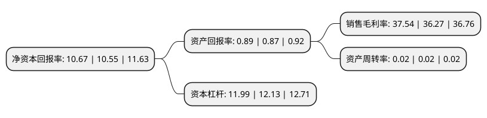

> 本页面由自动化程序生成于 2022年5月20日 01:32
> 内容可能存在错误，如有bug请提交issue至：https://github.com/Eroleice/doc-pi/issues
{.is-warning}

# 上市公司基本情况

## 基本资料

中国银行股份有限公司（以下简称“中国银行”）成立于1983年10月31日，北京市。于2006年07月05日在上交所主板上市。

中国银行注册资本29,438,779.124万元，主营业务:商业银行业务，投资银行业务及保险业务以下是详细信息：

- 公司名称: 中国银行股份有限公司
- 股票代码: 601988.SH
- 所在地: 北京 - 北京市
- 成立日期: 1983年10月31日
- 注册资本: 29,438,779.124万元
- 法定代表人: 刘连舸
- 主营业务: 主营业务:商业银行业务，投资银行业务及保险业务
- 公司官网: www.boc.cn
- 公司介绍: 公司是中国国际化和多元化程度最高的银行，在中国内地及51个国家和地区为客户提供全面的金融服务。主要经营商业银行业务，包括公司金融业务、个人金融业务和金融市场业务，并通过全资子公司中银国际控股有限公司开展投资银行业务，通过全资子公司中银集团保险有限公司及中银保险有限公司经营保险业务，通过全资子公司中银集团投资有限公司经营直接投资和投资管理业务，通过控股中银基金管理有限公司经营基金管理业务，通过控股中银航空租赁有限公司经营飞机租赁业务。在一百多年的发展历程中，公司始终秉承追求卓越的精神，将爱国爱民作为办行之魂，将诚信至上作为立行之本，将改革创新作为强行之路，将以人为本作为兴行之基，树立了卓越的品牌形象，得到了业界和客户的广泛认可和赞誉。

## 股东及高管情况

上市公司第一大股东为中央汇金投资有限责任公司，持股188,461,533,607股，占比64.02%，为上市公司实际控制人。

截至2022年03月31日，上市公司的前十大股东中，共有5名机构股东，2个产品账户，3个海外主体，其中5%以上大股东共有2名。上市公司前十大股东明细如下：

> 截至2022年03月31日，上市公司前十大股东信息如下：

| 股东名称 | 持股数量（股） | 持股比例 |
| --- | --- | --- |
| 中央汇金投资有限责任公司 | 188,461,533,607 | 64.02% |
| 香港中央结算(代理人)有限公司 | 81,830,124,241 | 27.8% |
| 中国证券金融股份有限公司 | 7,941,164,885 | 2.7% |
| 中央汇金资产管理有限责任公司 | 1,810,024,500 | 0.61% |
| 香港中央结算有限公司(陆股通) | 1,258,532,977 | 0.43% |
| MUFG Bank, Ltd. | 520,357,200 | 0.18% |
| 中国太平洋人寿保险股份有限公司-中国太平洋人寿股票红利型产品(寿自营)委托投资(长江养老) | 382,238,605 | 0.13% |
| 北京大地远通(集团)有限公司 | 152,000,037 | 0.05% |
| 中国人寿保险股份有限公司-传统-普通保险产品-005L-CT001沪 | 139,893,250 | 0.05% |
| 北京远通鑫海商贸有限公司 | 133,000,000 | 0.05% |

## 利润表分析

上市公司2021年总收入为6,055.59亿元，净利润为2,273.39亿元，实现盈利。

## 杜邦分析

> 数据列示周期：2021年 | 2020年 | 2019年
{.is-info}

上市公司的净资产收益率在近一年有所上升，上升幅度为1.14%，其变化情况分解如下：
- 上市公司的销售毛利率在近一年上升了3.5%，可能是生产效率的提升、商品原材料价格下跌或商品价格的上涨所致。
- 上市公司的资产周转率在近一年下降了0%，可能是源自于更慢的销售回款或库存管理效果下降。
- 上市公司的财务杠杆比率在近一年下降了-1.15%，可能是减少负债降低财务费用。

