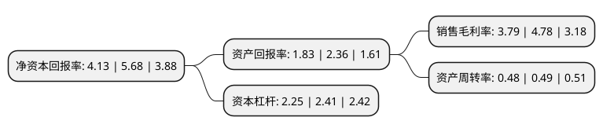

> 本页面由自动化程序生成于 2022年5月20日 01:06
> 内容可能存在错误，如有bug请提交issue至：https://github.com/Eroleice/doc-pi/issues
{.is-warning}

# 上市公司基本情况

## 基本资料

上海悦心健康集团股份有限公司（以下简称“悦心健康”）成立于1993年06月08日，上海市。于2007年08月23日在深交所中小板上市。

悦心健康注册资本92,650万元，主要产品为:陶瓷墙砖，陶瓷地砖，特殊用途地砖，主要用于各类内外墙，各类地面及特殊场所的装饰。以下是详细信息：

- 公司名称: 上海悦心健康集团股份有限公司
- 股票代码: 002162.SZ
- 所在地: 上海 - 上海市
- 成立日期: 1993年06月08日
- 注册资本: 92,650万元
- 法定代表人: 李慈雄
- 主营业务: 主要产品为:陶瓷墙砖，陶瓷地砖，特殊用途地砖，主要用于各类内外墙，各类地面及特殊场所的装饰
- 公司官网: www.everjoyhealth.com
- 公司介绍: 公司是专业生产和销售高级玻化石和高级釉面砖系列产品的企业，主营业务为玻化砖、釉面砖的生产与销售。产品先后被评为“上海名牌产品”、“工程建设推荐产品”、“中国名牌产品”。斯米克产品有多个磁砖品种获得国家专利，同时通过国家“3C认证”，是国家权威机构检测合格的“绿色建材”产品。公司通过整合两岸医疗和养老资源，建立以地区医院为核心的“区域健康综合体”，为客户提供全面、完整、可信赖的大健康服务体系，打造“悦心”和“斯米克”的双品牌运营战略。近年来，公司在医疗领域内开展了大量资源整合和业务布局工作，为未来大健康业务的扩张和发展在人才、管理、医疗资源等方面奠定了坚实的发展基础。

## 股东及高管情况

上市公司第一大股东为CIMIC INDUSTRIAL INC.(斯米克工业有限公司)，持股390,531,043股，占比42.15%，为上市公司实际控制人。

截至2022年03月31日，上市公司的前十大股东中，共有6名自然人股东，4名机构股东，其中5%以上大股东共有3名。上市公司前十大股东明细如下：

> 截至2022年03月31日，上市公司前十大股东信息如下：

| 股东名称 | 持股数量（股） | 持股比例 |
| --- | --- | --- |
| CIMIC INDUSTRIAL INC.(斯米克工业有限公司) | 390,531,043 | 42.15% |
| 上海斯米克有限公司 | 72,725,000 | 7.85% |
| DIGITAL PACIFIC INC.(太平洋数码有限公司) | 61,607,356 | 6.65% |
| 上海杜行工业投资发展公司 | 21,161,240 | 2.28% |
| 彭洁芳 | 10,284,386 | 1.11% |
| 张晓 | 5,698,900 | 0.62% |
| 许德全 | 2,328,400 | 0.25% |
| 洪小霞 | 2,233,000 | 0.24% |
| 郝洪太 | 1,999,300 | 0.22% |
| 张云鹤 | 1,435,920 | 0.15% |

## 利润表分析

上市公司2021年总收入为12.6亿元，净利润为0.47亿元，实现盈利。

## 杜邦分析

> 数据列示周期：2021年 | 2020年 | 2019年
{.is-info}

上市公司的净资产收益率在近一年有所下降，下降幅度为-27.29%，其变化情况分解如下：
- 上市公司的销售毛利率在近一年下降了-20.71%，可能是生产效率的下降、商品原材料价格上涨或商品价格的下跌所致。
- 上市公司的资产周转率在近一年下降了-2.04%，可能是源自于更慢的销售回款或库存管理效果下降。
- 上市公司的财务杠杆比率在近一年下降了-6.64%，可能是减少负债降低财务费用。

