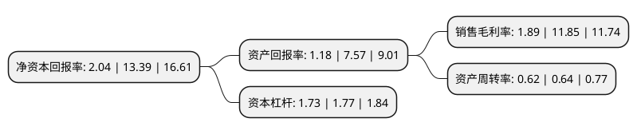

> 本页面由自动化程序生成于 2022年5月20日 01:13
> 内容可能存在错误，如有bug请提交issue至：https://github.com/Eroleice/doc-pi/issues
{.is-warning}

# 上市公司基本情况

## 基本资料

广东东鹏控股股份有限公司（以下简称“东鹏控股”）成立于2011年11月04日，清远市。于2020年10月19日在深交所中小板上市。

东鹏控股注册资本119,066万元，东鹏控股致力于成为国内领先的整体家居解决方案提供商。报告期内，公司主要产品包括瓷砖和洁具，此外还生产销售木地板，涂料产品。公司是国内规模最大的瓷砖，洁具产品专业制造商和品牌商之一。公司瓷砖产品以有釉砖和无釉砖为主，有釉砖主要产品包括抛釉砖，仿古砖和瓷片，无釉砖主要产品为抛光砖，除销售自有品牌瓷砖外，公司还在国内代理销售意大利Rex品牌瓷砖，丰富了公司瓷砖产品线的高端品类;洁具产品包括卫生陶瓷和卫浴产品，其中卫生陶瓷主要包括智能卫浴，座便器，洗手盆，小便器，蹲便器等，卫浴产品包括浴室柜，淋浴房，浴缸，龙头五金等。以下是详细信息：

- 公司名称: 广东东鹏控股股份有限公司
- 股票代码: 003012.SZ
- 所在地: 广东 - 清远市
- 成立日期: 2011年11月04日
- 注册资本: 119,066万元
- 法定代表人: 何新明
- 主营业务: 东鹏控股致力于成为国内领先的整体家居解决方案提供商报告期内，公司主要产品包括瓷砖和洁具，此外还生产销售木地板，涂料产品公司是国内规模最大的瓷砖，洁具产品专业制造商和品牌商之一公司瓷砖产品以有釉砖和无釉砖为主，有釉砖主要产品包括抛釉砖，仿古砖和瓷片，无釉砖主要产品为抛光砖，除销售自有品牌瓷砖外，公司还在国内代理销售意大利Rex品牌瓷砖，丰富了公司瓷砖产品线的高端品类;洁具产品包括卫生陶瓷和卫浴产品，其中卫生陶瓷主要包括智能卫浴，座便器，洗手盆，小便器，蹲便器等，卫浴产品包括浴室柜，淋浴房，浴缸，龙头五金等
- 公司官网: www.dongpeng.net
- 公司介绍: 公司致力于成为国内领先的整体家居解决方案提供商。报告期内，公司主要产品包括瓷砖和洁具，此外还生产销售木地板、涂料产品。公司是国内规模最大的瓷砖、洁具产品专业制造商和品牌商之一。公司瓷砖产品以有釉砖和无釉砖为主，有釉砖主要产品包括抛釉砖、仿古砖和瓷片，无釉砖主要产品为抛光砖，除销售自有品牌瓷砖外，公司还在国内代理销售意大利Rex品牌瓷砖，丰富了公司瓷砖产品线的高端品类；洁具产品包括卫生陶瓷和卫浴产品，其中卫生陶瓷主要包括智能卫浴、座便器、洗手盆、小便器、蹲便器等，卫浴产品包括浴室柜、淋浴房、浴缸、龙头五金等。

## 股东及高管情况

上市公司第一大股东为宁波利坚创业投资合伙企业(有限合伙)，持股350,379,778股，占比29.43%，**疑似为**上市公司实际控制人。

截至2022年03月31日，上市公司的前十大股东中，共有9名机构股东，1个海外主体，其中5%以上大股东共有3名。上市公司前十大股东明细如下：

> 未能通过持股比例判定出上市公司实际控制人（持股30%以上）
> 可能存在通过间接持股、联合持股、协议控制等方式拥有实际控制权的主体，具体请参考上市公司定期公告！
{.is-warning}

> 截至2022年03月31日，上市公司前十大股东信息如下：

| 股东名称 | 持股数量（股） | 持股比例 |
| --- | --- | --- |
| 宁波利坚创业投资合伙企业(有限合伙) | 350,379,778 | 29.43% |
| 佛山华盛昌陶瓷有限公司 | 162,000,000 | 13.61% |
| 宁波市鸿益升股权投资合伙企业(有限合伙) | 135,482,100 | 11.38% |
| 宁波东智瑞投资合伙企业(有限合伙) | 59,416,600 | 4.99% |
| SCC Growth I Holdco B, Ltd. | 58,877,208 | 4.94% |
| 北京红杉坤德投资管理中心(有限合伙)-上海喆德投资中心(有限合伙) | 56,961,601 | 4.78% |
| 宁波客喜徕投资合伙企业(有限合伙) | 42,608,500 | 3.58% |
| 宁波裕芝创业投资合伙企业(有限合伙) | 32,831,000 | 2.76% |
| 堆龙德庆睿盈创业投资合伙企业(有限合伙) | 24,500,000 | 2.06% |
| 广东裕和商贸有限公司 | 18,000,000 | 1.51% |

## 利润表分析

上市公司2021年总收入为79.78亿元，净利润为1.51亿元，实现盈利。

## 杜邦分析

> 数据列示周期：2021年 | 2020年 | 2019年
{.is-info}

上市公司的净资产收益率在近一年有所下降，下降幅度为-84.76%，其变化情况分解如下：
- 上市公司的销售毛利率在近一年下降了-84.05%，可能是生产效率的下降、商品原材料价格上涨或商品价格的下跌所致。
- 上市公司的资产周转率在近一年下降了-3.12%，可能是源自于更慢的销售回款或库存管理效果下降。
- 上市公司的财务杠杆比率在近一年下降了-2.26%，可能是减少负债降低财务费用。

