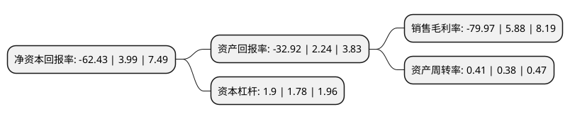

> 本页面由自动化程序生成于 2022年5月20日 01:33
> 内容可能存在错误，如有bug请提交issue至：https://github.com/Eroleice/doc-pi/issues
{.is-warning}

# 上市公司基本情况

## 基本资料

广东松发陶瓷股份有限公司（以下简称“松发股份”）成立于2002年07月11日，潮州市。于2015年03月19日在上交所主板上市。

松发股份注册资本12,416.88万元，公司是一家集研发，设计，生产，销售及服务于一体的专业化，高品质日用瓷供应商，致力于塑造“松发”的高端日用瓷品牌形象，使产品成为“品位生活”的承载体。公司主要产品包括日用瓷，精品瓷和陶瓷酒瓶。2012年，2013年和2014年，公司外销金额占营业收入的比例分别为70。47%，76。53%和76。81%，产品主要通过直销，经销，商超等渠道满足星级酒店，餐厅，中高端家庭用瓷及商业定制等需求。以下是详细信息：

- 公司名称: 广东松发陶瓷股份有限公司
- 股票代码: 603268.SH
- 所在地: 广东 - 潮州市
- 成立日期: 2002年07月11日
- 注册资本: 12,416.88万元
- 法定代表人: 卢堃
- 主营业务: 公司是一家集研发，设计，生产，销售及服务于一体的专业化，高品质日用瓷供应商，致力于塑造“松发”的高端日用瓷品牌形象，使产品成为“品位生活”的承载体公司主要产品包括日用瓷，精品瓷和陶瓷酒瓶2012年，2013年和2014年，公司外销金额占营业收入的比例分别为7047%，7653%和7681%，产品主要通过直销，经销，商超等渠道满足星级酒店，餐厅，中高端家庭用瓷及商业定制等需求
- 公司官网: www.songfa.com
- 公司介绍: 公司集陶瓷产品设计、研发、生产、销售为一体，主要经营家瓷、定制瓷和酒店瓷等日用陶瓷用品，产品涵盖餐具、茶具、咖啡器皿、陈列瓷、艺术收藏瓷以及不锈钢、水晶及玻璃等家居用品。公司先后为人民大会堂、中南海、东盟博览会和亚欧首脑会议研制生产国宴用瓷及礼品瓷，被誉为“国瓷”和“现代官窑”。公司通过国际标准化组织ISO9001质量管理体系认证、ISO14001环境管理体系认证和商业社会标准BSCI认证，并成为中国陶瓷国家标准制定者之一。公司获得中国外观设计优秀奖和被誉为设计界的“奥斯卡”红点奖等多项荣誉。松发产品远销海内外，长期成为“都会新贵的喜爱”——美国Crate&Barrel家居店之热销品牌。

## 股东及高管情况

上市公司第一大股东为恒力集团有限公司，持股37,428,000股，占比30.14%，为上市公司实际控制人。

截至2022年03月31日，上市公司的前十大股东中，共有8名自然人股东，2名机构股东，其中5%以上大股东共有3名。上市公司前十大股东明细如下：

> 截至2022年03月31日，上市公司前十大股东信息如下：

| 股东名称 | 持股数量（股） | 持股比例 |
| --- | --- | --- |
| 恒力集团有限公司 | 37,428,000 | 30.14% |
| 林道藩 | 27,644,000 | 22.26% |
| 刘壮超 | 7,392,000 | 5.95% |
| 林秋兰 | 1,764,000 | 1.42% |
| 黄光新 | 1,640,500 | 1.32% |
| 扶绥正心修身网络科技合伙企业(有限合伙) | 1,486,100 | 1.2% |
| 谢遂兰 | 918,814 | 0.74% |
| 徐群华 | 859,793 | 0.69% |
| 黄柏儒 | 778,500 | 0.63% |
| 王晶 | 760,000 | 0.61% |

## 利润表分析

上市公司2021年总收入为4.02亿元，净利润为-3.23亿元，**未实现盈利**。

## 杜邦分析

> 数据列示周期：2021年 | 2020年 | 2019年
{.is-info}

上市公司的净资产收益率在近一年有所下降，下降幅度为-1664.66%，其变化情况分解如下：
- 上市公司的销售毛利率在近一年下降了-1460.03%，可能是生产效率的下降、商品原材料价格上涨或商品价格的下跌所致。
- 上市公司的资产周转率在近一年上升了7.89%，可能是源自于更快的销售回款或库存管理效果提升。
- 上市公司的财务杠杆比率在近一年上升了6.74%，可能是增加负债扩大生产规模。

