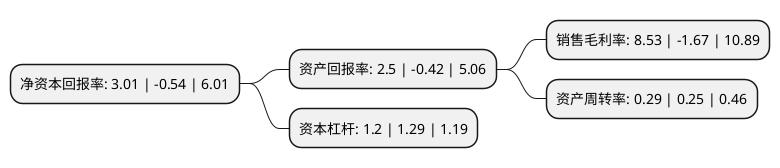

> 本页面由自动化程序生成于 2022年5月20日 01:35
> 内容可能存在错误，如有bug请提交issue至：https://github.com/Eroleice/doc-pi/issues
{.is-warning}

# 上市公司基本情况

## 基本资料

广东四通集团股份有限公司（以下简称“四通股份”）成立于1997年08月29日，潮州市。于2015年07月01日在上交所主板上市。

四通股份注册资本32,001.6万元，公司是一家集研发，设计，生产，销售于一体的新型家居生活陶瓷供应商，产品覆盖日用陶瓷，卫生陶瓷，艺术陶瓷等全系列家居生活用瓷。以下是详细信息：

- 公司名称: 广东四通集团股份有限公司
- 股票代码: 603838.SH
- 所在地: 广东 - 潮州市
- 成立日期: 1997年08月29日
- 注册资本: 32,001.6万元
- 法定代表人: 邓建华
- 主营业务: 公司是一家集研发，设计，生产，销售于一体的新型家居生活陶瓷供应商，产品覆盖日用陶瓷，卫生陶瓷，艺术陶瓷等全系列家居生活用瓷
- 公司官网: www.sitong.net
- 公司介绍: 公司是一家集研发、设计、生产、销售于一体的新型家居生活陶瓷供应商，产品覆盖日用陶瓷、卫生陶瓷、艺术陶瓷等全系列家居生活用瓷。公司以“全球家居生活陶瓷供应商”这一目标作为企业愿景，将传统工艺和现代技术紧密结合，通过资源综合利用、废瓷回收、节能降耗降低生产成本，通过全系列家居生活陶瓷产品为客户提供一站式采购服务，通过器型、材质、装饰、工艺的创新引领市场需求。公司是国家级高新技术企业，自成立以来，依托自主研发、技术创新与积累沉淀，已发展成为本土少数具备提供系列化优质生活陶瓷产品的名牌企业之一。

## 股东及高管情况

上市公司第一大股东为广东唯德实业投资有限公司，持股64,847,032股，占比20.26%，**疑似为**上市公司实际控制人。

截至2022年03月31日，上市公司的前十大股东中，共有9名自然人股东，1名机构股东，其中5%以上大股东共有2名。上市公司前十大股东明细如下：

> 未能通过持股比例判定出上市公司实际控制人（持股30%以上）
> 可能存在通过间接持股、联合持股、协议控制等方式拥有实际控制权的主体，具体请参考上市公司定期公告！
{.is-warning}

> 截至2022年03月31日，上市公司前十大股东信息如下：

| 股东名称 | 持股数量（股） | 持股比例 |
| --- | --- | --- |
| 广东唯德实业投资有限公司 | 64,847,032 | 20.26% |
| 黄建平 | 23,687,000 | 7.4% |
| 蔡镇城 | 14,476,995 | 4.52% |
| 蔡镇煌 | 14,437,101 | 4.51% |
| 蔡镇通 | 14,436,351 | 4.51% |
| 蔡镇锋 | 14,436,351 | 4.51% |
| 李维香 | 14,436,351 | 4.51% |
| 蔡镇茂 | 14,436,351 | 4.51% |
| 谢悦增 | 13,334,000 | 4.17% |
| 邓建华 | 13,334,000 | 4.17% |

## 利润表分析

上市公司2021年总收入为3.78亿元，净利润为0.32亿元，实现盈利。

## 杜邦分析

> 数据列示周期：2021年 | 2020年 | 2019年
{.is-info}

上市公司的净资产收益率在近一年有所下降，下降幅度为-657.41%，其变化情况分解如下：
- 上市公司的销售毛利率在近一年下降了-610.78%，可能是生产效率的下降、商品原材料价格上涨或商品价格的下跌所致。
- 上市公司的资产周转率在近一年上升了16%，可能是源自于更快的销售回款或库存管理效果提升。
- 上市公司的财务杠杆比率在近一年下降了-6.98%，可能是减少负债降低财务费用。

