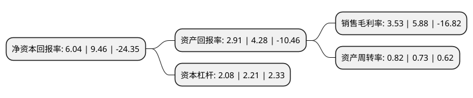

> 本页面由自动化程序生成于 2022年5月20日 01:02
> 内容可能存在错误，如有bug请提交issue至：https://github.com/Eroleice/doc-pi/issues
{.is-warning}

# 上市公司基本情况

## 基本资料

西王食品股份有限公司（以下简称“西王食品”）成立于2011年01月31日，滨州市。于1996年11月26日在深交所主板上市。

西王食品注册资本107,942.81万元，主营业务:健康食用油及运动营养和体重管理以下是详细信息：

- 公司名称: 西王食品股份有限公司
- 股票代码: 000639.SZ
- 所在地: 山东 - 滨州市
- 成立日期: 2011年01月31日
- 注册资本: 107,942.81万元
- 法定代表人: 王辉
- 主营业务: 主营业务:健康食用油及运动营养和体重管理
- 公司官网: www.xwsp.cc
- 公司介绍: 公司主产品为西王牌玉米胚芽油及鲜胚玉米胚芽油，产品涉及葵花籽油、橄榄油、亚麻籽油、花生油等多个健康油种，公司依托农业产业化国家重点龙头企业、中国糖都——西王集团得天独厚的资源优势，实现了玉米油的充足原料保障及毛油自主生产能力。公司拥有国内先进的玉米油生产工艺和全套生产线，生产过程实现了智能自动化控制，从原料到产品实行全程质量监控。公司拥有国内先进的玉米油生产线，引进了瑞典阿法拉伐精炼设备、法国的吹瓶线、意大利的灌装线、德国工业巨头克朗斯食用油吹灌一体生产线等，使生产过程实现了全自动化控制，从工艺和技术上确保了产品质量和食品安全。2016年，公司成功收购加拿大北美地区知名运动营养与体重管理健康食品Kerr公司，Kerr是加拿大安大略省的一家专注于运动营养产品和体重管理产品的非上市公司，主营业务为体重管理产品(Weight Management)和运动营养产品(Sports Nutrition)的研发和销售，拥有Hydroxycut等4个主要体重管理产品品牌和MuscleTech等7个主要运动营养产品品牌。目前，公司主营业务主要涉及健康食用油及运动营养和体重管理两大业务板块。

## 股东及高管情况

上市公司第一大股东为西王集团有限公司，持股320,545,721股，占比29.7%，**疑似为**上市公司实际控制人。

截至2022年03月31日，上市公司的前十大股东中，共有2名自然人股东，5名机构股东，3个产品账户，其中5%以上大股东共有2名。上市公司前十大股东明细如下：

> 未能通过持股比例判定出上市公司实际控制人（持股30%以上）
> 可能存在通过间接持股、联合持股、协议控制等方式拥有实际控制权的主体，具体请参考上市公司定期公告！
{.is-warning}

> 截至2022年03月31日，上市公司前十大股东信息如下：

| 股东名称 | 持股数量（股） | 持股比例 |
| --- | --- | --- |
| 西王集团有限公司 | 320,545,721 | 29.7% |
| 山东永华投资有限公司 | 244,154,025 | 22.62% |
| 巨能资本管理有限公司-山东聚赢产业基金合伙企业(有限合伙) | 53,854,837 | 4.99% |
| 泰达宏利基金-工商银行-泰达宏利价值成长定向增发726号 | 37,709,678 | 3.49% |
| 山东高速嵩信(天津)投资管理有限公司-山高嵩成私募股权投资基金 | 18,854,837 | 1.75% |
| 株洲市国有资产投资控股集团有限公司 | 10,752,493 | 1% |
| 武汉睿福德投资管理中心(有限合伙) | 10,006,889 | 0.93% |
| 华泰证券股份有限公司 | 4,438,679 | 0.41% |
| 王棣 | 4,104,062 | 0.38% |
| 张红 | 3,843,796 | 0.36% |

## 利润表分析

上市公司2021年总收入为63.54亿元，净利润为2.24亿元，实现盈利。

## 杜邦分析

> 数据列示周期：2021年 | 2020年 | 2019年
{.is-info}

上市公司的净资产收益率在近一年有所下降，下降幅度为-36.15%，其变化情况分解如下：
- 上市公司的销售毛利率在近一年下降了-39.97%，可能是生产效率的下降、商品原材料价格上涨或商品价格的下跌所致。
- 上市公司的资产周转率在近一年上升了12.33%，可能是源自于更快的销售回款或库存管理效果提升。
- 上市公司的财务杠杆比率在近一年下降了-5.88%，可能是减少负债降低财务费用。

