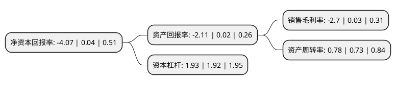

> 本页面由自动化程序生成于 2022年5月20日 01:03
> 内容可能存在错误，如有bug请提交issue至：https://github.com/Eroleice/doc-pi/issues
{.is-warning}

# 上市公司基本情况

## 基本资料

南方黑芝麻集团股份有限公司（以下简称“黑芝麻”）成立于1993年05月31日，玉林市。于1997年04月18日在深交所主板上市。

黑芝麻注册资本74,399.955万元，主要产品:黑芝麻系列食品，饮料。主营业务:致力于黑芝麻产业的经营。以下是详细信息：

- 公司名称: 南方黑芝麻集团股份有限公司
- 股票代码: 000716.SZ
- 所在地: 广西 - 玉林市
- 成立日期: 1993年05月31日
- 注册资本: 74,399.955万元
- 法定代表人: 韦清文
- 主营业务: 主要产品:黑芝麻系列食品，饮料主营业务:致力于黑芝麻产业的经营
- 公司官网: www.nanfangfood.com
- 公司介绍: 公司是一家以黑芝麻产业为主业、集黑芝麻健康产品研发、生产、销售为一体的大型民营企业集团。“南方黑芝麻糊”是公司创业几十年来成功的产品，畅销多年，备受消费者青睐，享有中国糊类知名的美誉。为引导年轻消费群体，提升黑芝麻糊的品质和食用方便性，除原有袋装黑芝麻糊外，近年研发推出了杯装黑芝麻糊、罐装黑芝麻糊、盒装黑芝麻糊等几十个新包装、新品种的黑芝麻糊。公司是国家农业产业化龙头企业，享受国家农业产业化和民族产品优惠政策，公司的黑芝麻产业化利用技术曾两次获得国家科技进步奖。

## 股东及高管情况

上市公司第一大股东为广西黑五类食品集团有限责任公司，持股227,946,277股，占比30.64%，为上市公司实际控制人。

截至2022年03月31日，上市公司的前十大股东中，共有6名自然人股东，3名机构股东，1个产品账户，其中5%以上大股东共有1名。上市公司前十大股东明细如下：

> 截至2022年03月31日，上市公司前十大股东信息如下：

| 股东名称 | 持股数量（股） | 持股比例 |
| --- | --- | --- |
| 广西黑五类食品集团有限责任公司 | 227,946,277 | 30.64% |
| 刘世红 | 28,202,268 | 3.79% |
| 韦清文 | 24,823,400 | 3.34% |
| 李汉朝 | 10,500,000 | 1.41% |
| 李汉荣 | 10,500,000 | 1.41% |
| 李玉琦 | 10,000,000 | 1.34% |
| 中国银河证券股份有限公司约定购回专用账户 | 6,922,700 | 0.93% |
| 北京东方华盖创业投资有限公司 | 5,079,614 | 0.68% |
| 王正东 | 4,142,548 | 0.56% |
| 柳州市城市投资建设发展有限公司 | 3,882,051 | 0.52% |

## 利润表分析

上市公司2021年总收入为40.24亿元，净利润为-1.09亿元，**未实现盈利**。

## 杜邦分析

> 数据列示周期：2021年 | 2020年 | 2019年
{.is-info}

上市公司的净资产收益率在近一年有所下降，下降幅度为-10275%，其变化情况分解如下：
- 上市公司的销售毛利率在近一年下降了-9100%，可能是生产效率的下降、商品原材料价格上涨或商品价格的下跌所致。
- 上市公司的资产周转率在近一年上升了6.85%，可能是源自于更快的销售回款或库存管理效果提升。
- 上市公司的财务杠杆比率在近一年上升了0.52%，可能是增加负债扩大生产规模。

