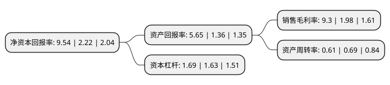

> 本页面由自动化程序生成于 2022年5月20日 01:04
> 内容可能存在错误，如有bug请提交issue至：https://github.com/Eroleice/doc-pi/issues
{.is-warning}

# 上市公司基本情况

## 基本资料

广西粤桂广业控股股份有限公司（以下简称“粤桂股份”）成立于1994年10月05日，贵港市。于1998年11月11日在深交所主板上市。

粤桂股份注册资本66,840.185万元，主要业务为:机制糖(白砂糖，赤砂糖)的生产和销售，纸浆和机制纸(文化纸，生活用纸)的生产和销售，硫铁矿的开采，加工，销售及硫酸，铁矿粉(硫铁矿烧渣)和磷肥(普通过磷酸钙)的生产和销售。主要产品:白砂糖，赤砂糖，纸浆(机制浆)，书写纸，生活用纸，硫铁矿矿石，硫酸，铁矿粉，磷肥。以下是详细信息：

- 公司名称: 广西粤桂广业控股股份有限公司
- 股票代码: 000833.SZ
- 所在地: 广西 - 贵港市
- 成立日期: 1994年10月05日
- 注册资本: 66,840.185万元
- 法定代表人: 刘富华
- 主营业务: 主要业务为:机制糖(白砂糖，赤砂糖)的生产和销售，纸浆和机制纸(文化纸，生活用纸)的生产和销售，硫铁矿的开采，加工，销售及硫酸，铁矿粉(硫铁矿烧渣)和磷肥(普通过磷酸钙)的生产和销售主要产品:白砂糖，赤砂糖，纸浆(机制浆)，书写纸，生活用纸，硫铁矿矿石，硫酸，铁矿粉，磷肥
- 公司官网: www.yuegui.cn
- 公司介绍: 公司是一家以制糖、造纸为主的综合生产企业。公司现有制糖厂、热电厂、文化用纸厂、生活用纸厂、制浆厂、轻机厂等生产分厂。公司的“桂花”牌白砂糖产品，采用碳酸法制糖工艺，连续多年在全国甘蔗糖质量评比中名列前茅，荣获“全国用户满意产品”。桂花牌白砂糖率先成为可口可乐、百事可乐、娃哈哈、雀巢、美赞臣、绿箭糖果等公司在国内首选糖。公司的高级书写纸、胶印书刊纸和双胶纸等文化用纸系列产品以及“纯点”、“碧绿湾”、“蝶恋花”牌生活用纸系列产品多年荣获“广西名牌产品”。公司拥有国家认定的企业技术中心和博士后科研工作站、广西首批自治区级人才小高地。公司充分发挥在科研上的优势，拥有多项具有国内领先水平的环保自主知识产权。先后荣获“全国资源综合利用先进企业”、“全国环保先进企业”、“全国用户满意企业”等国家级和多项省部级荣誉称号。

## 股东及高管情况

上市公司第一大股东为云浮广业硫铁矿集团有限公司，持股209,261,113股，占比31.31%，为上市公司实际控制人。

截至2022年04月08日，上市公司的前十大股东中，共有2名自然人股东，8名机构股东，其中5%以上大股东共有5名。上市公司前十大股东明细如下：

> 截至2022年04月08日，上市公司前十大股东信息如下：

| 股东名称 | 持股数量（股） | 持股比例 |
| --- | --- | --- |
| 云浮广业硫铁矿集团有限公司 | 209,261,113 | 31.31% |
| 云浮广业硫铁矿集团有限公司 | 209,261,113 | 31.31% |
| 广东省环保集团有限公司 | 81,051,861 | 12.13% |
| 广东省环保集团有限公司 | 81,051,861 | 12.13% |
| 广西广业粤桂投资集团有限公司 | 72,120,000 | 10.7899% |
| 方少瑜 | 10,769,458 | 1.61% |
| 列凤媚 | 5,510,656 | 0.82% |
| 华泰证券股份有限公司 | 2,637,563 | 0.39% |
| 广西贵港甘化股份有限公司 | 1,400,000 | 0.21% |
| 中国国际金融香港资产管理有限公司-客户资金2 | 1,317,430 | 0.2% |

## 利润表分析

上市公司2021年总收入为30.58亿元，净利润为2.84亿元，实现盈利。

## 杜邦分析

> 数据列示周期：2021年 | 2020年 | 2019年
{.is-info}

上市公司的净资产收益率在近一年有所上升，上升幅度为329.73%，其变化情况分解如下：
- 上市公司的销售毛利率在近一年上升了369.7%，可能是生产效率的提升、商品原材料价格下跌或商品价格的上涨所致。
- 上市公司的资产周转率在近一年下降了-11.59%，可能是源自于更慢的销售回款或库存管理效果下降。
- 上市公司的财务杠杆比率在近一年上升了3.68%，可能是增加负债扩大生产规模。

