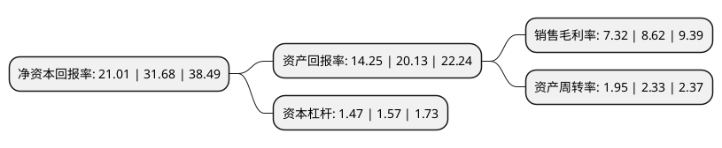

> 本页面由自动化程序生成于 2022年5月20日 01:04
> 内容可能存在错误，如有bug请提交issue至：https://github.com/Eroleice/doc-pi/issues
{.is-warning}

# 上市公司基本情况

## 基本资料

河南双汇投资发展股份有限公司（以下简称“双汇发展”）成立于1998年10月15日，漯河市。于1998年12月10日在深交所主板上市。

双汇发展注册资本346,466.121万元，主要产品:高温肉制品，低温肉制品，鲜冻猪产品，商业连锁服务。以下是详细信息：

- 公司名称: 河南双汇投资发展股份有限公司
- 股票代码: 000895.SZ
- 所在地: 河南 - 漯河市
- 成立日期: 1998年10月15日
- 注册资本: 346,466.121万元
- 法定代表人: 万隆
- 主营业务: 主要产品:高温肉制品，低温肉制品，鲜冻猪产品，商业连锁服务
- 公司官网: www.shuanghui.net
- 公司介绍: 公司是国内最大的肉类加工企业，主要从事畜禽屠宰，加工销售肉类食品、肉类罐头、速冻肉制品、定型包装熟肉制品(含清真食品)、水产品(鱼糜制品)、蛋制品；销售方便食品(米乐高八宝肠)；生产销售食品包装；生产加工肉制品及相关产品配套原辅料；技术咨询服务，化工产品销售(不含易燃易爆危险品)，食品行业的投资，销售代理，物流及其相关经营业务的配套服务等。公司始终坚持围绕“农”字做文章，围绕肉类加工上项目，实施产业化经营。以屠宰和肉类加工业为核心，向上游发展饲料业和养殖业，向下游发展包装业、商业、外贸等，形成了主业突出、行业配套的产业群。公司先后通过ISO9001、ISO14001、HACCP等体系认证，同时用自动化和信息化改造工业化，实现标准化管理、自动化生产、信息化控制，确保产品质量和安全。

## 股东及高管情况

上市公司第一大股东为罗特克斯有限公司，持股2,436,727,364股，占比70.33%，为上市公司实际控制人。

截至2022年03月31日，上市公司的前十大股东中，共有3名机构股东，5个产品账户，1个海外主体，1名其他股东，其中5%以上大股东共有1名。上市公司前十大股东明细如下：

> 截至2022年03月31日，上市公司前十大股东信息如下：

| 股东名称 | 持股数量（股） | 持股比例 |
| --- | --- | --- |
| 罗特克斯有限公司 | 2,436,727,364 | 70.33% |
| 香港中央结算有限公司(陆股通) | 109,797,745 | 3.17% |
| 中国证券金融股份有限公司 | 57,971,092 | 1.67% |
| 中央汇金资产管理有限责任公司 | 30,904,989 | 0.89% |
| 中国人寿保险股份有限公司-传统-普通保险产品-005L-CT001深 | 21,415,039 | 0.62% |
| 中国人寿保险(集团)公司-传统-普通保险产品-港股通(创新策略) | 19,163,062 | 0.55% |
| 全国社保基金五零三组合 | 16,000,000 | 0.46% |
| 全国社保基金一零一组合 | 12,102,200 | 0.35% |
| 全国社保基金一零六组合 | 11,956,935 | 0.35% |
| 澳门金融管理局-自有资金 | 10,388,070 | 0.3% |

## 利润表分析

上市公司2021年总收入为667.97亿元，净利润为48.83亿元，实现盈利。

## 杜邦分析

> 数据列示周期：2021年 | 2020年 | 2019年
{.is-info}

上市公司的净资产收益率在近一年有所下降，下降幅度为-33.68%，其变化情况分解如下：
- 上市公司的销售毛利率在近一年下降了-15.08%，可能是生产效率的下降、商品原材料价格上涨或商品价格的下跌所致。
- 上市公司的资产周转率在近一年下降了-16.31%，可能是源自于更慢的销售回款或库存管理效果下降。
- 上市公司的财务杠杆比率在近一年下降了-6.37%，可能是减少负债降低财务费用。

