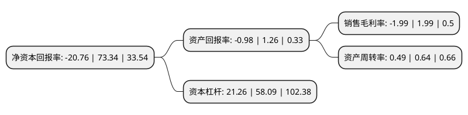

> 本页面由自动化程序生成于 2022年5月20日 01:04
> 内容可能存在错误，如有bug请提交issue至：https://github.com/Eroleice/doc-pi/issues
{.is-warning}

# 上市公司基本情况

## 基本资料

南宁糖业股份有限公司（以下简称“南宁糖业”）成立于1999年05月14日，南宁市。于1999年05月27日在深交所主板上市。

南宁糖业注册资本40,031.982万元，主要产品:机制糖，机制纸，蔗渣浆。以下是详细信息：

- 公司名称: 南宁糖业股份有限公司
- 股票代码: 000911.SZ
- 所在地: 广西 - 南宁市
- 成立日期: 1999年05月14日
- 注册资本: 40,031.982万元
- 法定代表人: 莫菲城
- 主营业务: 主要产品:机制糖，机制纸，蔗渣浆
- 公司官网: www.nnsugar.com
- 公司介绍: 公司是国内制糖行业最大的国有控股上市公司。主营机制糖、各类文化用纸、酒精、复合肥等产品的制造和销售。公司与先进同行，做行业标杆，是广西第一家整体通过了全球食品安全倡议组织认可的FSSC22000食品安全体系认证的企业，公司四个品牌的白砂糖均获得“绿色食品”认证，“云鸥”牌、“明阳”牌白砂糖曾荣获“中国名牌”称号公司曾荣获“国家农业产业化重点龙头企业”、“中国轻工业制糖行业十强企业”、“广西百强企业”、“广西农业产业化十大龙头企业”、“广西优秀企业”、“广西诚信企业”等荣誉称号；2014年荣获首届南宁市“市长质量奖”，中国“质量之光”、“质量标杆企业示范”称号。

## 股东及高管情况

上市公司第一大股东为广西农村投资集团有限公司，持股153,052,709股，占比38.23%，为上市公司实际控制人。

截至2022年03月31日，上市公司的前十大股东中，共有4名自然人股东，3名机构股东，3个产品账户，其中5%以上大股东共有2名。上市公司前十大股东明细如下：

> 截至2022年03月31日，上市公司前十大股东信息如下：

| 股东名称 | 持股数量（股） | 持股比例 |
| --- | --- | --- |
| 广西农村投资集团有限公司 | 153,052,709 | 38.23% |
| 南宁振宁资产经营有限责任公司 | 59,954,972 | 14.98% |
| 蒋理 | 14,477,812 | 3.62% |
| 李明庆 | 2,931,000 | 0.73% |
| 蒋红英 | 2,768,300 | 0.69% |
| 招商银行股份有限公司-华泰柏瑞品质成长混合型证券投资基金 | 1,753,300 | 0.44% |
| 工银安盛人寿保险有限公司-自有资金 | 1,600,000 | 0.4% |
| 中国银行股份有限公司-华泰柏瑞创新升级混合型证券投资基金 | 1,591,800 | 0.4% |
| 殷实 | 1,180,000 | 0.29% |
| 中国建设银行股份有限公司-华泰柏瑞富利灵活配置混合型证券投资基金 | 1,166,500 | 0.29% |

## 利润表分析

上市公司2021年总收入为32.33亿元，净利润为-0.65亿元，**未实现盈利**。

## 杜邦分析

> 数据列示周期：2021年 | 2020年 | 2019年
{.is-info}

上市公司的净资产收益率在近一年有所下降，下降幅度为-128.31%，其变化情况分解如下：
- 上市公司的销售毛利率在近一年下降了-200%，可能是生产效率的下降、商品原材料价格上涨或商品价格的下跌所致。
- 上市公司的资产周转率在近一年下降了-23.44%，可能是源自于更慢的销售回款或库存管理效果下降。
- 上市公司的财务杠杆比率在近一年下降了-63.4%，可能是减少负债降低财务费用。

