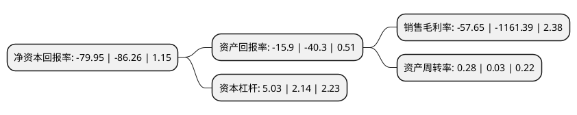

> 本页面由自动化程序生成于 2022年5月20日 01:04
> 内容可能存在错误，如有bug请提交issue至：https://github.com/Eroleice/doc-pi/issues
{.is-warning}

# 上市公司基本情况

## 基本资料

中基健康产业股份有限公司（以下简称“*ST中基”）成立于1994年06月30日，五家渠市。于2000年09月26日在深交所主板上市。

*ST中基注册资本77,128.358万元，主要业务:番茄制品的加工，销售以下是详细信息：

- 公司名称: 中基健康产业股份有限公司
- 股票代码: 000972.SZ
- 所在地: 新疆 - 五家渠市
- 成立日期: 1994年06月30日
- 注册资本: 77,128.358万元
- 法定代表人: 匡列文
- 主营业务: 番茄制品的加工，销售
- 公司官网: www.chalkistomato.com
- 公司介绍: 公司隶属于新疆生产建设兵团第六师，是兵团重点支持发展的国家级农业产业化龙头企业。公司依托新疆得天独厚的地域和自然优势，致力于发展番茄“红色产业”，产业规模居于前列，产品行销世界数十国家和地区，是全球主要食品企业长期、固定的原料供应商。公司所属“企业技术中心”被国家发改委认定为全国番茄行业唯一的“国家级企业技术中心”，成为行业标准的制定者和参与者；公司的“ChalkiS”牌番茄酱被商务部评定为国家重点支持发展的名牌产品；公司“中心实验室”通过国家认证认可监督委员会认定；公司博士后科研工作站通过相关部门评定。公司产品番茄红素软胶囊是中国人民解放军总医院(301医院)唯一指定使用的番茄红素保健食品。

## 股东及高管情况

上市公司第一大股东为新疆生产建设兵团第六师国有资产经营有限责任公司，持股124,769,223股，占比16.18%，**疑似为**上市公司实际控制人。

截至2022年03月31日，上市公司的前十大股东中，共有2名自然人股东，7名机构股东，1名其他股东，其中5%以上大股东共有3名。上市公司前十大股东明细如下：

> 未能通过持股比例判定出上市公司实际控制人（持股30%以上）
> 可能存在通过间接持股、联合持股、协议控制等方式拥有实际控制权的主体，具体请参考上市公司定期公告！
{.is-warning}

> 截至2022年03月31日，上市公司前十大股东信息如下：

| 股东名称 | 持股数量（股） | 持股比例 |
| --- | --- | --- |
| 新疆生产建设兵团第六师国有资产经营有限责任公司 | 124,769,223 | 16.18% |
| 新疆国恒投资发展集团有限公司 | 100,000,000 | 12.97% |
| 新疆生产建设兵团投资有限责任公司 | 50,103,596 | 6.5% |
| 新疆绿原鑫融贸易有限公司 | 22,717,509 | 2.95% |
| 新疆生产建设兵团第十二师五一农场 | 19,608,290 | 2.54% |
| 新疆双河国投运营集团有限公司 | 19,442,583 | 2.52% |
| 新疆生产建设兵团建设工程(集团)有限责任公司 | 11,102,550 | 1.44% |
| 中国建设银行股份有限公司新疆维吾尔自治区分行 | 7,120,196 | 0.92% |
| 张维林 | 5,008,700 | 0.65% |
| 杨建 | 3,600,000 | 0.47% |

## 利润表分析

上市公司2021年总收入为1.74亿元，净利润为-1.01亿元，**未实现盈利**。

## 杜邦分析

> 数据列示周期：2021年 | 2020年 | 2019年
{.is-info}

上市公司的净资产收益率在近一年有所下降，下降幅度为-7.32%，其变化情况分解如下：
- 上市公司的销售毛利率在近一年下降了-95.04%，可能是生产效率的下降、商品原材料价格上涨或商品价格的下跌所致。
- 上市公司的资产周转率在近一年上升了833.33%，可能是源自于更快的销售回款或库存管理效果提升。
- 上市公司的财务杠杆比率在近一年上升了135.05%，可能是增加负债扩大生产规模。

