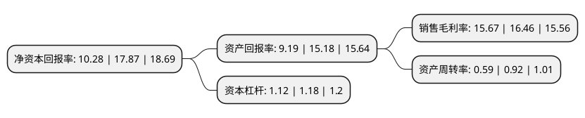

> 本页面由自动化程序生成于 2022年5月20日 01:05
> 内容可能存在错误，如有bug请提交issue至：https://github.com/Eroleice/doc-pi/issues
{.is-warning}

# 上市公司基本情况

## 基本资料

青岛食品股份有限公司（以下简称“青岛食品”）成立于1997年01月27日，青岛市。于2021年10月21日在深交所主板上市。

青岛食品注册资本8,875万元，公司主要从事饼干与花生酱等休闲食品的研发，生产及销售。公司主要产品包括“青食”品牌钙奶饼干，“青食”品牌休闲饼干和“海友”品牌花生酱，同时亦通过OEM模式代工生产少量花生酱产品。以下是详细信息：

- 公司名称: 青岛食品股份有限公司
- 股票代码: 001219.SZ
- 所在地: 山东 - 青岛市
- 成立日期: 1997年01月27日
- 注册资本: 8,875万元
- 法定代表人: 仲明
- 主营业务: 公司主要从事饼干与花生酱等休闲食品的研发，生产及销售公司主要产品包括“青食”品牌钙奶饼干，“青食”品牌休闲饼干和“海友”品牌花生酱，同时亦通过OEM模式代工生产少量花生酱产品
- 公司官网: www.qdfood.com
- 公司介绍: 公司主要从事饼干与花生酱等休闲食品的研发、生产及销售，自设立以来主营业务未发生重大变化。公司主要产品包括“青食”品牌钙奶饼干、“青食”品牌休闲饼干和“海友”品牌花生酱，同时亦通过OEM模式代工生产少量花生酱产品。公司是国内区域性饼干龙头企业，产品在山东地区具有较高的品牌知名度和美誉度。公司是中国焙烤食品糖制品工业协会认定的“中国焙烤食品糖制品行业(饼干)十强企业”，也是中国国家标准化管理委员会与中华人民共和国国家质量监督检验检疫总局联合发布的国家标准——《饼干》(GB/T20980-2007)的起草单位之一。公司核心品牌“青食”自2010年起至今连续10年荣获山东省著名商标，于2012年荣获国家工商行政管理总局认定的“中国驰名商标”。

## 股东及高管情况

上市公司第一大股东为青岛华通国有资本投资运营集团有限公司，持股41,481,522股，占比46.74%，为上市公司实际控制人。

截至2022年03月31日，上市公司的前十大股东中，共有5名自然人股东，4名机构股东，1个产品账户，其中5%以上大股东共有1名。上市公司前十大股东明细如下：

> 截至2022年03月31日，上市公司前十大股东信息如下：

| 股东名称 | 持股数量（股） | 持股比例 |
| --- | --- | --- |
| 青岛华通国有资本投资运营集团有限公司 | 41,481,522 | 46.74% |
| 青岛食品股份有限公司未确权股份托管专用证券账户 | 2,919,078 | 3.29% |
| 青岛安信资产管理有限公司 | 1,231,600 | 1.39% |
| 山东康桥投资集团有限公司 | 1,100,000 | 1.24% |
| 青岛欧森海事技术服务有限公司 | 1,067,000 | 1.2% |
| 王莉 | 871,200 | 0.98% |
| 石杰 | 830,572 | 0.94% |
| 任伟 | 451,883 | 0.51% |
| 毛剑东 | 440,000 | 0.5% |
| 刘竹轩 | 426,010 | 0.48% |

## 利润表分析

上市公司2021年总收入为4.34亿元，净利润为0.68亿元，实现盈利。

## 杜邦分析

> 数据列示周期：2021年 | 2020年 | 2019年
{.is-info}

上市公司的净资产收益率在近一年有所下降，下降幅度为-42.47%，其变化情况分解如下：
- 上市公司的销售毛利率在近一年下降了-4.8%，可能是生产效率的下降、商品原材料价格上涨或商品价格的下跌所致。
- 上市公司的资产周转率在近一年下降了-35.87%，可能是源自于更慢的销售回款或库存管理效果下降。
- 上市公司的财务杠杆比率在近一年下降了-5.08%，可能是减少负债降低财务费用。

