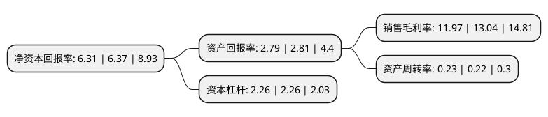

> 本页面由自动化程序生成于 2022年5月20日 01:05
> 内容可能存在错误，如有bug请提交issue至：https://github.com/Eroleice/doc-pi/issues
{.is-warning}

# 上市公司基本情况

## 基本资料

云南能源投资股份有限公司（以下简称“云南能投”）成立于2002年07月25日，昆明市。于2006年06月27日在深交所中小板上市。

云南能投注册资本76,097.857万元，主营业务:食盐，工业盐，日化盐，芒硝等系列产品的生产销售以及天然气管网建设，天然气销售，入户安装服务等以下是详细信息：

- 公司名称: 云南能源投资股份有限公司
- 股票代码: 002053.SZ
- 所在地: 云南 - 昆明市
- 成立日期: 2002年07月25日
- 注册资本: 76,097.857万元
- 法定代表人: 周满富
- 主营业务: 主营业务:食盐，工业盐，日化盐，芒硝等系列产品的生产销售以及天然气管网建设，天然气销售，入户安装服务等
- 公司官网: www.cnyeic.com
- 公司介绍: 公司是“盐＋天然气”双主业发展的企业，是国家授权云南省唯一的食盐定点生产企业和云南省政府授权唯一经营合格碘盐的企业，承担着普及合格碘盐，消除碘缺乏危害，提高民族素质的神圣职责，负责天然气中下游支线管网开发建设及终端市场的整合拓展。公司经营范围包括食盐、工业盐、日化盐、芒硝等系列产品的生产销售以及天然气管网建设、运营等，旗下现有“白象牌”系列盐产品，“艾肤妮”牌系列日化盐产品。公司于先后通过ISO9001、ISO14001、OHSAS18001、ISO10012体系认证。2019年，公司收购马龙公司100%股权、大姚公司100%股权、会泽公司100%股权、泸西公司70%股权，主营业务均为陆上风力发电的项目开发、建设及运营，主要产品为电力。公司将快速进入风电运营领域，实现在清洁能源领域内的进一步拓展，为未来在清洁能源领域内的进一步拓展奠定了坚实基础。

## 股东及高管情况

上市公司第一大股东为云南省能源投资集团有限公司，持股240,735,345股，占比31.63%，为上市公司实际控制人。

截至2022年03月31日，上市公司的前十大股东中，共有2名自然人股东，6名机构股东，1个产品账户，1个海外主体，其中5%以上大股东共有3名。上市公司前十大股东明细如下：

> 截至2022年03月31日，上市公司前十大股东信息如下：

| 股东名称 | 持股数量（股） | 持股比例 |
| --- | --- | --- |
| 云南省能源投资集团有限公司 | 240,735,345 | 31.63% |
| 云南能投新能源投资开发有限公司 | 202,649,230 | 26.63% |
| 云天化集团有限责任公司 | 149,654,728 | 19.67% |
| 中央汇金资产管理有限责任公司 | 5,275,200 | 0.69% |
| 新疆立兴股权投资管理有限公司 | 3,520,002 | 0.46% |
| 兴证全球基金-宁波银行-兴全宁泰6号集合资产管理计划 | 2,364,500 | 0.31% |
| UBS AG | 1,357,096 | 0.18% |
| 陈旭华 | 1,151,300 | 0.15% |
| 长城人寿保险股份有限公司-万能-个险万能 | 971,010 | 0.13% |
| 刘春凤 | 970,696 | 0.13% |

## 利润表分析

上市公司2021年总收入为22.58亿元，净利润为2.7亿元，实现盈利。

## 杜邦分析

> 数据列示周期：2021年 | 2020年 | 2019年
{.is-info}

上市公司的净资产收益率在近一年有所下降，下降幅度为-0.94%，其变化情况分解如下：
- 上市公司的销售毛利率在近一年下降了-8.21%，可能是生产效率的下降、商品原材料价格上涨或商品价格的下跌所致。
- 上市公司的资产周转率在近一年上升了4.55%，可能是源自于更快的销售回款或库存管理效果提升。
- 上市公司的财务杠杆比率在近一年下降了0%，可能是减少负债降低财务费用。

