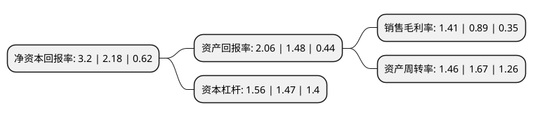

> 本页面由自动化程序生成于 2022年5月20日 01:08
> 内容可能存在错误，如有bug请提交issue至：https://github.com/Eroleice/doc-pi/issues
{.is-warning}

# 上市公司基本情况

## 基本资料

山东得利斯食品股份有限公司（以下简称“得利斯”）成立于2003年06月20日，潍坊市。于2010年01月06日在深交所中小板上市。

得利斯注册资本63,760.879万元，本公司主营业务为生猪屠宰，冷却肉及冷冻肉和低温肉制品的生产与销售。本公司主要产品包括:生肉制品与熟肉制品两大类别。以下是详细信息：

- 公司名称: 山东得利斯食品股份有限公司
- 股票代码: 002330.SZ
- 所在地: 山东 - 潍坊市
- 成立日期: 2003年06月20日
- 注册资本: 63,760.879万元
- 法定代表人: 郑思敏
- 主营业务: 本公司主营业务为生猪屠宰，冷却肉及冷冻肉和低温肉制品的生产与销售本公司主要产品包括:生肉制品与熟肉制品两大类别
- 公司官网: www.delisi.com.cn
- 公司介绍: 公司是以生猪屠宰、冷却肉、低温肉制品、调理食品加工为主的大型食品专营企业。公司引进意大利先进设备及工艺技术，精选优良猪种“莱芜黑”作为原料，经过12-36个月的自然发酵而培育出的高端美食“帕珞斯”以及“萨拉米”、“库巴”等其他西式发酵类产品，更是得到了业界及消费者的高度认可。公司作为国内首批农业产业化龙头企业，品牌影响力深厚。公司始终以企业文化为先导，坚持树人、创新、诚信、自律，谨守“制欲感恩”生存理念，奉行“增强国人体魄、提高民族素质”企业宗旨，遵循“贸工农一体化”、“农业产业化”发展方向，引领冷却肉、低温肉制品消费潮流，不断完善全程控制的肉食品产业链条。

## 股东及高管情况

上市公司第一大股东为诸城同路人投资有限公司，持股155,024,041股，占比24.31%，**疑似为**上市公司实际控制人。

截至2022年04月21日，上市公司的前十大股东中，共有1名自然人股东，7名机构股东，2个产品账户，其中5%以上大股东共有4名。上市公司前十大股东明细如下：

> 未能通过持股比例判定出上市公司实际控制人（持股30%以上）
> 可能存在通过间接持股、联合持股、协议控制等方式拥有实际控制权的主体，具体请参考上市公司定期公告！
{.is-warning}

> 截至2022年04月21日，上市公司前十大股东信息如下：

| 股东名称 | 持股数量（股） | 持股比例 |
| --- | --- | --- |
| 诸城同路人投资有限公司 | 155,024,041 | 24.31% |
| 庞海控股有限公司 | 105,280,000 | 16.51% |
| 庞海控股有限公司 | 105,280,000 | 16.51% |
| 新疆中泰农业发展有限责任公司 | 50,450,000 | 7.91% |
| 山东桑莎制衣集团有限公司 | 25,200,000 | 3.95% |
| 银河资本-浙商银行-银河资本-鑫鑫一号集合资产管理计划 | 17,848,443 | 2.8% |
| 郭伟松 | 13,531,799 | 2.12% |
| 中国国际金融股份有限公司 | 12,178,619 | 1.91% |
| 中国银河证券股份有限公司 | 9,472,259 | 1.49% |
| 青岛凡益资产管理有限公司-凡益多策略与时偕行1号私募证券投资基金 | 5,412,719 | 0.85% |

## 杜邦分析

> 数据列示周期：2021年 | 2020年 | 2019年
{.is-info}

上市公司的净资产收益率在近一年有所上升，上升幅度为46.79%，其变化情况分解如下：
- 上市公司的销售毛利率在近一年上升了58.43%，可能是生产效率的提升、商品原材料价格下跌或商品价格的上涨所致。
- 上市公司的资产周转率在近一年下降了-12.57%，可能是源自于更慢的销售回款或库存管理效果下降。
- 上市公司的财务杠杆比率在近一年上升了6.12%，可能是增加负债扩大生产规模。

