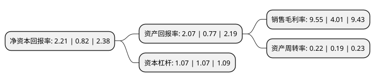

> 本页面由自动化程序生成于 2022年5月20日 01:09
> 内容可能存在错误，如有bug请提交issue至：https://github.com/Eroleice/doc-pi/issues
{.is-warning}

# 上市公司基本情况

## 基本资料

广东佳隆食品股份有限公司（以下简称“佳隆股份”）成立于2002年05月30日，揭阳市。于2010年11月02日在深交所中小板上市。

佳隆股份注册资本93,562.56万元，主营业务为鸡粉，鸡精产品的研发，生产和销售。主导产品为鸡粉，鸡精。以下是详细信息：

- 公司名称: 广东佳隆食品股份有限公司
- 股票代码: 002495.SZ
- 所在地: 广东 - 揭阳市
- 成立日期: 2002年05月30日
- 注册资本: 93,562.56万元
- 法定代表人: 林平涛
- 主营业务: 主营业务为鸡粉，鸡精产品的研发，生产和销售主导产品为鸡粉，鸡精
- 公司官网: www.gdjlfood.com
- 公司介绍: 公司是一家集食品科研开发、生产、销售为一体的民营股份制企业。被广东省评为重点农业龙头企业、广东省高新技术企业。在产品开发方面，公司坚持以市场需求为出发点，以科技进步为先导，不断推陈出新。目前品种达30多种，具有特色的是“佳隆”牌鸡粉、鸡精、鸡汁；“家丰”牌鸡粉；“佳隆”牌玉米粳；“佳隆”牌EAS芥辣和狮球吉士粉。公司先后通过了HACCP-EC-01食品安全管理体系认证，保证产品的质量要求。公司生产的鸡粉被农业部农产品质量安全中心认定为无公害农产品，荣获“95年首届中国国际食品博览会”金奖、“中国调味品协会推荐产品”等荣誉称号。佳隆公司被评为中国调味品企业50强单位、中国鸡精行业10强单位、食品安全示范单位。

## 股东及高管情况

上市公司第一大股东为林平涛，持股160,454,761股，占比17.15%，**疑似为**上市公司实际控制人。

截至2022年03月31日，上市公司的前十大股东中，共有9名自然人股东，1个海外主体，其中5%以上大股东共有3名。上市公司前十大股东明细如下：

> 未能通过持股比例判定出上市公司实际控制人（持股30%以上）
> 可能存在通过间接持股、联合持股、协议控制等方式拥有实际控制权的主体，具体请参考上市公司定期公告！
{.is-warning}

> 截至2022年03月31日，上市公司前十大股东信息如下：

| 股东名称 | 持股数量（股） | 持股比例 |
| --- | --- | --- |
| 林平涛 | 160,454,761 | 17.15% |
| 林长浩 | 78,194,308 | 8.36% |
| 许巧婵 | 56,938,527 | 6.09% |
| 林长青 | 45,052,485 | 4.82% |
| 林长春 | 17,548,528 | 1.88% |
| 陈黎丽 | 5,630,521 | 0.6% |
| 蒋文球 | 5,000,800 | 0.53% |
| 陈坚 | 4,833,300 | 0.52% |
| MERRILL LYNCH INTERNATIONAL | 4,750,018 | 0.51% |
| 张秀 | 4,680,000 | 0.5% |

## 利润表分析

上市公司2021年总收入为2.79亿元，净利润为0.26亿元，实现盈利。

## 杜邦分析

> 数据列示周期：2021年 | 2020年 | 2019年
{.is-info}

上市公司的净资产收益率在近一年有所上升，上升幅度为169.51%，其变化情况分解如下：
- 上市公司的销售毛利率在近一年上升了138.15%，可能是生产效率的提升、商品原材料价格下跌或商品价格的上涨所致。
- 上市公司的资产周转率在近一年上升了15.79%，可能是源自于更快的销售回款或库存管理效果提升。
- 上市公司的财务杠杆比率在近一年下降了0%，可能是减少负债降低财务费用。

