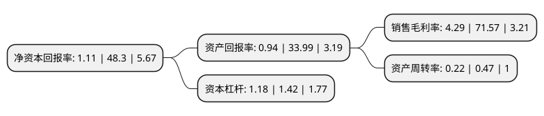

> 本页面由自动化程序生成于 2022年5月20日 01:10
> 内容可能存在错误，如有bug请提交issue至：https://github.com/Eroleice/doc-pi/issues
{.is-warning}

# 上市公司基本情况

## 基本资料

好想你健康食品股份有限公司（以下简称“好想你”）成立于1997年09月24日，郑州市。于2011年05月20日在深交所中小板上市。

好想你注册资本45,697.798万元，枣类相关产品的生产，加工和销售。目前有十大系列230多个单品，分别为免洗红枣系列(新郑红枣，健康情枣，枣博士，贡枣，皇帝御枣，水晶枣，香枣等)，枣片系列(草莓味枣片，柑桔味枣片，阿胶枣片等)，蜜饯系列(蜜枣，野酸枣，玫瑰枣，阿胶枣，八珍枣等)，枣干系列(水晶枣干，香枣干等)，焦枣系列(芝麻焦枣，香心焦枣等)，脆枣系列(枣开心，早上好等)，枣粉系列(原味枣粉，高钙枣粉等)，蜂蜜系列(枣花蜂蜜，槐花蜂蜜)，枣饮料系列(枣花蜜茶，枣花清茶，红枣酪，红枣姜茶，花粉1号等)，木本粮系列(好7粉，幸福情等)。以下是详细信息：

- 公司名称: 好想你健康食品股份有限公司
- 股票代码: 002582.SZ
- 所在地: 河南 - 郑州市
- 成立日期: 1997年09月24日
- 注册资本: 45,697.798万元
- 法定代表人: 石聚彬
- 主营业务: 枣类相关产品的生产，加工和销售目前有十大系列230多个单品，分别为免洗红枣系列(新郑红枣，健康情枣，枣博士，贡枣，皇帝御枣，水晶枣，香枣等)，枣片系列(草莓味枣片，柑桔味枣片，阿胶枣片等)，蜜饯系列(蜜枣，野酸枣，玫瑰枣，阿胶枣，八珍枣等)，枣干系列(水晶枣干，香枣干等)，焦枣系列(芝麻焦枣，香心焦枣等)，脆枣系列(枣开心，早上好等)，枣粉系列(原味枣粉，高钙枣粉等)，蜂蜜系列(枣花蜂蜜，槐花蜂蜜)，枣饮料系列(枣花蜜茶，枣花清茶，红枣酪，红枣姜茶，花粉1号等)，木本粮系列(好7粉，幸福情等)
- 公司官网: www.haoxiangni.cn
- 公司介绍: 公司是中国红枣行业的龙头企业、中国红枣领导品牌。公司“好想你”品牌产品被国家农业部评为“中国名牌农产品”。主要从事红枣、冻干产品、坚果、果干等健康食品的研发、采购、生产和销售。公司的“好想你”商标被评为中国驰名商标。公司通过了ISO9001:2008国际质量管理体系认证，并导入HACCP食品安全管理体系认证，建立了更为高效完善的ISO22000食品卫生安全管理体系，按医药行业GMP要求建了十万级净化车间。公司先后获得了“新郑市市长质量奖”、“郑州市市长质量奖”、“河南省省长质量奖”等多项殊荣。

## 股东及高管情况

上市公司第一大股东为石聚彬，持股129,289,218股，占比28.29%，**疑似为**上市公司实际控制人。

截至2022年03月31日，上市公司的前十大股东中，共有8名自然人股东，1名机构股东，1个产品账户，其中5%以上大股东共有2名。上市公司前十大股东明细如下：

> 未能通过持股比例判定出上市公司实际控制人（持股30%以上）
> 可能存在通过间接持股、联合持股、协议控制等方式拥有实际控制权的主体，具体请参考上市公司定期公告！
{.is-warning}

> 截至2022年03月31日，上市公司前十大股东信息如下：

| 股东名称 | 持股数量（股） | 持股比例 |
| --- | --- | --- |
| 石聚彬 | 129,289,218 | 28.29% |
| 杭州浩红实业有限公司 | 29,535,700 | 6.46% |
| 张五须 | 11,038,064 | 2.42% |
| 石聚领 | 8,283,200 | 1.81% |
| 常国杰 | 3,785,416 | 0.83% |
| 中国农业银行股份有限公司-泰达宏利中证主要消费红利指数型证券投资基金 | 3,681,300 | 0.81% |
| 王论春 | 3,190,000 | 0.7% |
| 张贺敏 | 2,742,300 | 0.6% |
| 卢国杰 | 2,336,860 | 0.51% |
| 许式荣 | 2,202,900 | 0.48% |

## 利润表分析

上市公司2021年总收入为12.81亿元，净利润为0.54亿元，实现盈利。

## 杜邦分析

> 数据列示周期：2021年 | 2020年 | 2019年
{.is-info}

上市公司的净资产收益率在近一年有所下降，下降幅度为-97.7%，其变化情况分解如下：
- 上市公司的销售毛利率在近一年下降了-94.01%，可能是生产效率的下降、商品原材料价格上涨或商品价格的下跌所致。
- 上市公司的资产周转率在近一年下降了-53.19%，可能是源自于更慢的销售回款或库存管理效果下降。
- 上市公司的财务杠杆比率在近一年下降了-16.9%，可能是减少负债降低财务费用。

