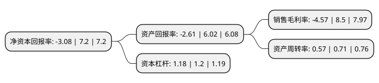

> 本页面由自动化程序生成于 2022年5月20日 01:11
> 内容可能存在错误，如有bug请提交issue至：https://github.com/Eroleice/doc-pi/issues
{.is-warning}

# 上市公司基本情况

## 基本资料

加加食品集团股份有限公司（以下简称“加加食品”）成立于1996年08月03日，长沙市。于2012年01月06日在深交所中小板上市。

加加食品注册资本115,200万元，主要产品:酱油，食醋，味精，鸡精，食用植物油等五大类180个品种规格。酱油和食用植物油是本公司的主要产品。主营业务:酱油，食用植物油和其他调味品的研发，生产和销售。以下是详细信息：

- 公司名称: 加加食品集团股份有限公司
- 股票代码: 002650.SZ
- 所在地: 湖南 - 长沙市
- 成立日期: 1996年08月03日
- 注册资本: 115,200万元
- 法定代表人: 周建文
- 主营业务: 主要产品:酱油，食醋，味精，鸡精，食用植物油等五大类180个品种规格酱油和食用植物油是本公司的主要产品主营业务:酱油，食用植物油和其他调味品的研发，生产和销售
- 公司官网: www.jiajiagroup.com
- 公司介绍: 公司是一家集研发、生产、营销于一体的大型调味品生产企业。主营业务为酱油、食用植物油和其他调味品的研发、生产和销售。公司以“加加”系列酱油为主导，食醋、鸡精、味精和食用植物油等多品类协同发展，产品包括酱油、食醋、味精、鸡精、食用植物油等五大类百余个品种规格。公司品牌“加加”在全国市场上具有广泛社会知名度和美誉度。公司先后荣获“中国名牌”、“中国驰名商标”、“国家级农业产业化重点龙头企业”、“国家食品工业重点企业”、“全国酿造酱油示范企业”等荣誉称号。

## 股东及高管情况

上市公司第一大股东为湖南卓越投资有限公司，持股216,419,200股，占比18.79%，**疑似为**上市公司实际控制人。

截至2022年03月31日，上市公司的前十大股东中，共有8名自然人股东，1名机构股东，1个产品账户，其中5%以上大股东共有4名。上市公司前十大股东明细如下：

> 未能通过持股比例判定出上市公司实际控制人（持股30%以上）
> 可能存在通过间接持股、联合持股、协议控制等方式拥有实际控制权的主体，具体请参考上市公司定期公告！
{.is-warning}

> 截至2022年03月31日，上市公司前十大股东信息如下：

| 股东名称 | 持股数量（股） | 持股比例 |
| --- | --- | --- |
| 湖南卓越投资有限公司 | 216,419,200 | 18.79% |
| 杨振 | 117,777,653 | 10.22% |
| 杨子江 | 82,440,000 | 7.16% |
| 肖赛平 | 70,560,000 | 6.13% |
| 钟幸华 | 5,569,282 | 0.48% |
| 周国勇 | 5,530,700 | 0.48% |
| 广发证券资管-工商银行-广发原驰·加加食品1号集合资产管理计划 | 4,698,950 | 0.41% |
| 洪强 | 4,498,400 | 0.39% |
| 孙雷民 | 4,430,000 | 0.38% |
| 钟育坤 | 3,851,470 | 0.33% |

## 利润表分析

上市公司2021年总收入为17.54亿元，净利润为-0.81亿元，**未实现盈利**。

## 杜邦分析

> 数据列示周期：2021年 | 2020年 | 2019年
{.is-info}

上市公司的净资产收益率在近一年有所下降，下降幅度为-142.78%，其变化情况分解如下：
- 上市公司的销售毛利率在近一年下降了-153.76%，可能是生产效率的下降、商品原材料价格上涨或商品价格的下跌所致。
- 上市公司的资产周转率在近一年下降了-19.72%，可能是源自于更慢的销售回款或库存管理效果下降。
- 上市公司的财务杠杆比率在近一年下降了-1.67%，可能是减少负债降低财务费用。

