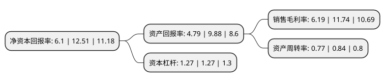

> 本页面由自动化程序生成于 2022年5月20日 01:11
> 内容可能存在错误，如有bug请提交issue至：https://github.com/Eroleice/doc-pi/issues
{.is-warning}

# 上市公司基本情况

## 基本资料

江西煌上煌集团食品股份有限公司（以下简称“煌上煌”）成立于1999年04月01日，南昌市。于2012年09月05日在深交所中小板上市。

煌上煌注册资本51,243.04万元，酱卤肉制品及佐餐凉菜快捷消费食品的开发，生产和销售。以下是详细信息：

- 公司名称: 江西煌上煌集团食品股份有限公司
- 股票代码: 002695.SZ
- 所在地: 江西 - 南昌市
- 成立日期: 1999年04月01日
- 注册资本: 51,243.04万元
- 法定代表人: 褚浚
- 主营业务: 酱卤肉制品及佐餐凉菜快捷消费食品的开发，生产和销售
- 公司官网: www.jxhsh.com.cn
- 公司介绍: 公司是一家以畜禽肉制品加工为主的食品加工企业。先后通过ISO9001：2008GB/T19001-2008质量管理体系认证和GB/T22000-2006/ISO22000：2005食品安全管理体系认证。公司实施肉鸭养殖——屠宰——肉制品深加工产业化特色经营，被农业部列为第三批全国农产品加工业示范基地，也连续多年被农业部等八部委评定为农业产业化国家重点龙头企业，是全国绿色食品示范企业。

## 股东及高管情况

上市公司第一大股东为煌上煌集团有限公司，持股197,952,000股，占比38.63%，为上市公司实际控制人。

截至2022年03月31日，上市公司的前十大股东中，共有3名自然人股东，2名机构股东，5个产品账户，其中5%以上大股东共有3名。上市公司前十大股东明细如下：

> 截至2022年03月31日，上市公司前十大股东信息如下：

| 股东名称 | 持股数量（股） | 持股比例 |
| --- | --- | --- |
| 煌上煌集团有限公司 | 197,952,000 | 38.63% |
| 新余煌上煌投资管理中心(有限合伙) | 66,364,797 | 12.95% |
| 褚建庚 | 28,960,000 | 5.65% |
| 褚浚 | 16,544,000 | 3.23% |
| 褚剑 | 16,544,000 | 3.23% |
| 全国社保基金四一八组合 | 7,897,531 | 1.54% |
| 中信证券股份有限公司-社保基金17051组合 | 7,473,806 | 1.46% |
| 江西煌上煌集团食品股份有限公司-2021年员工持股计划 | 7,164,000 | 1.4% |
| 中信证券-中国太平洋人寿股票相对收益型产品(保额分红)委托投资-中国太平洋人寿股票相对收益型产品(保额分红)单一资管计+ | 2,656,093 | 0.52% |
| 基本养老保险基金一二零八组合 | 2,398,414 | 0.47% |

## 利润表分析

上市公司2021年总收入为23.38亿元，净利润为1.44亿元，实现盈利。

## 杜邦分析

> 数据列示周期：2021年 | 2020年 | 2019年
{.is-info}

上市公司的净资产收益率在近一年有所下降，下降幅度为-51.24%，其变化情况分解如下：
- 上市公司的销售毛利率在近一年下降了-47.27%，可能是生产效率的下降、商品原材料价格上涨或商品价格的下跌所致。
- 上市公司的资产周转率在近一年下降了-8.33%，可能是源自于更慢的销售回款或库存管理效果下降。
- 上市公司的财务杠杆比率在近一年下降了0%，可能是减少负债降低财务费用。

