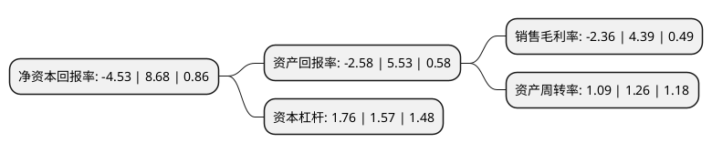

> 本页面由自动化程序生成于 2022年5月20日 01:11
> 内容可能存在错误，如有bug请提交issue至：https://github.com/Eroleice/doc-pi/issues
{.is-warning}

# 上市公司基本情况

## 基本资料

海欣食品股份有限公司（以下简称“海欣食品”）成立于2005年04月22日，福州市。于2012年10月11日在深交所中小板上市。

海欣食品注册资本48,076万元，主营业务为以速冻鱼糜制品，速冻肉制品为主的速冻食品的研发，生产，销售。主要产品包括灌汤福州鱼丸，福州虾丸，福州特级墨鱼丸等40余种鱼丸类产品，仿蟹肉棒，蟹王棒等几种棒类产品，太平燕，西湖肉燕等10余种饺燕类产品，鱼肉卷，龙凤卷等几种卷类产品，以及鲍鱼糕，黄金鱼板，干贝丝饼等20余种油炸类产品。公司速冻肉制品包括贡丸，牛肉丸等10余种肉丸类产品及亲亲肠，蟹王肠，桂花肠等10余种肠类产品。以下是详细信息：

- 公司名称: 海欣食品股份有限公司
- 股票代码: 002702.SZ
- 所在地: 福建 - 福州市
- 成立日期: 2005年04月22日
- 注册资本: 48,076万元
- 法定代表人: 滕用庄
- 主营业务: 主营业务为以速冻鱼糜制品，速冻肉制品为主的速冻食品的研发，生产，销售主要产品包括灌汤福州鱼丸，福州虾丸，福州特级墨鱼丸等40余种鱼丸类产品，仿蟹肉棒，蟹王棒等几种棒类产品，太平燕，西湖肉燕等10余种饺燕类产品，鱼肉卷，龙凤卷等几种卷类产品，以及鲍鱼糕，黄金鱼板，干贝丝饼等20余种油炸类产品公司速冻肉制品包括贡丸，牛肉丸等10余种肉丸类产品及亲亲肠，蟹王肠，桂花肠等10余种肠类产品
- 公司官网: www.haixinfoods.com
- 公司介绍: 公司是一家具有百年历史传承的国家农业产业化重点龙头企业。近年来，公司逐步形成了以速冻鱼糜制品系列产品为核心，兼顾速冻肉制品等其他速冻食品的整体业务体系，并完善了鱼糜及鱼糜制品深加工和销售的产业格局。公司致力于用现代科技改造传统海产品加工业，将先进的食品工程技术、生物技术应用于海洋水产品的精深和高值化加工方面并取得突出成绩，拥有多项自主创新的发明专利技术。公司先后获得“中国改革开放30年中华老字号传承创新优秀企业”、“高新技术企业”、“福州市现代农业技术创新基地”、“全国农产品加工业示范企业”和“国家鱼糜制品加工技术研发分中心”等认定。

## 股东及高管情况

上市公司第一大股东为滕用雄，持股89,760,000股，占比18.67%，**疑似为**上市公司实际控制人。

截至2022年03月31日，上市公司的前十大股东中，共有8名自然人股东，2名机构股东，其中5%以上大股东共有4名。上市公司前十大股东明细如下：

> 未能通过持股比例判定出上市公司实际控制人（持股30%以上）
> 可能存在通过间接持股、联合持股、协议控制等方式拥有实际控制权的主体，具体请参考上市公司定期公告！
{.is-warning}

> 截至2022年03月31日，上市公司前十大股东信息如下：

| 股东名称 | 持股数量（股） | 持股比例 |
| --- | --- | --- |
| 滕用雄 | 89,760,000 | 18.67% |
| 滕用庄 | 45,220,000 | 9.41% |
| 滕用严 | 42,500,000 | 8.84% |
| 滕用伟 | 38,420,000 | 7.99% |
| 王君施 | 3,950,970 | 0.82% |
| 肖海东 | 2,585,000 | 0.54% |
| 华泰证券股份有限公司 | 2,411,405 | 0.5% |
| 林东宁 | 1,200,000 | 0.25% |
| 华泰金融控股(香港)有限公司-自有资金 | 849,596 | 0.18% |
| 林艺容 | 839,100 | 0.17% |

## 杜邦分析

> 数据列示周期：2021年 | 2020年 | 2019年
{.is-info}

上市公司的净资产收益率在近一年有所下降，下降幅度为-152.19%，其变化情况分解如下：
- 上市公司的销售毛利率在近一年下降了-153.76%，可能是生产效率的下降、商品原材料价格上涨或商品价格的下跌所致。
- 上市公司的资产周转率在近一年下降了-13.49%，可能是源自于更慢的销售回款或库存管理效果下降。
- 上市公司的财务杠杆比率在近一年上升了12.1%，可能是增加负债扩大生产规模。

