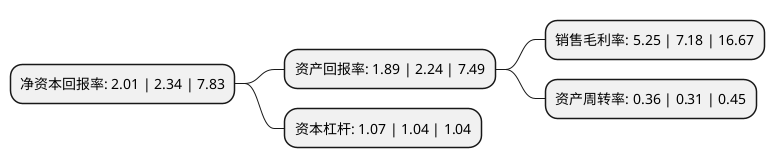

> 本页面由自动化程序生成于 2022年5月20日 01:12
> 内容可能存在错误，如有bug请提交issue至：https://github.com/Eroleice/doc-pi/issues
{.is-warning}

# 上市公司基本情况

## 基本资料

天津桂发祥十八街麻花食品股份有限公司（以下简称“桂发祥”）成立于1994年09月20日，天津市。于2016年11月18日在深交所中小板上市。

桂发祥注册资本20,480万元，主营业务:从事传统特色及其他休闲食品的研发，生产和销售。主要产品:包括以十八街麻花为代表的传统特色休闲食品，以及糕点，面包，甘栗，果仁等其他休闲食品，共计100多种产品。以下是详细信息：

- 公司名称: 天津桂发祥十八街麻花食品股份有限公司
- 股票代码: 002820.SZ
- 所在地: 天津 - 天津市
- 成立日期: 1994年09月20日
- 注册资本: 20,480万元
- 法定代表人: 冯国东
- 主营业务: 主营业务:从事传统特色及其他休闲食品的研发，生产和销售主要产品:包括以十八街麻花为代表的传统特色休闲食品，以及糕点，面包，甘栗，果仁等其他休闲食品，共计100多种产品
- 公司官网: www.gfx.com.cn
- 公司介绍: 公司是专业从事传统特色及其他休闲食品的研发、生产和销售的中华老字号企业。公司的产品包括以十八街麻花为代表的传统特色休闲食品，以及糕点、甘栗、果仁等其他休闲食品；主打产品为“桂发祥十八街”系列麻花，其制作技艺被评为国家非物质文化遗产，是我国传统特色饮食文化的代表之一，以酥脆香甜、久放不绵等优点享誉国内外。

## 股东及高管情况

上市公司第一大股东为天津市桂发祥麻花饮食集团有限公司，持股67,353,014股，占比32.8872%，为上市公司实际控制人。

截至2022年05月17日，上市公司的前十大股东中，共有6名自然人股东，3名机构股东，1个海外主体，其中5%以上大股东共有2名。上市公司前十大股东明细如下：

> 截至2022年05月17日，上市公司前十大股东信息如下：

| 股东名称 | 持股数量（股） | 持股比例 |
| --- | --- | --- |
| 天津市桂发祥麻花饮食集团有限公司 | 67,353,014 | 32.8872% |
| 天津市桂发祥麻花饮食集团有限公司 | 66,258,514 | 32.35% |
| 南通凯普德股权投资合伙企业(有限合伙) | 8,745,116 | 4.27% |
| 李辉忠 | 8,211,678 | 4.01% |
| 黄吉武 | 2,450,790 | 1.2% |
| 李林 | 1,965,260 | 0.96% |
| MORGAN STANLEY & CO. INTERNATIONAL PLC. | 1,271,338 | 0.62% |
| 吴宏 | 1,132,024 | 0.55% |
| 刘玉珠 | 1,011,000 | 0.49% |
| 李铭祥 | 710,289 | 0.35% |

## 利润表分析

上市公司2021年总收入为4.05亿元，净利润为0.21亿元，实现盈利。

## 杜邦分析

> 数据列示周期：2021年 | 2020年 | 2019年
{.is-info}

上市公司的净资产收益率在近一年有所下降，下降幅度为-14.1%，其变化情况分解如下：
- 上市公司的销售毛利率在近一年下降了-26.88%，可能是生产效率的下降、商品原材料价格上涨或商品价格的下跌所致。
- 上市公司的资产周转率在近一年上升了16.13%，可能是源自于更快的销售回款或库存管理效果提升。
- 上市公司的财务杠杆比率在近一年上升了2.88%，可能是增加负债扩大生产规模。

