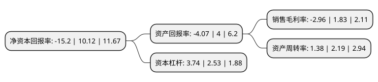

> 本页面由自动化程序生成于 2022年5月20日 01:12
> 内容可能存在错误，如有bug请提交issue至：https://github.com/Eroleice/doc-pi/issues
{.is-warning}

# 上市公司基本情况

## 基本资料

浙江华统肉制品股份有限公司（以下简称“华统股份”）成立于2001年08月08日，金华市。于2017年01月10日在深交所中小板上市。

华统股份注册资本45,624.076万元，公司以畜禽屠宰业务为核心，全力打造产业链一体化经营模式，主营业务覆盖“饲料加工，畜禽养殖，畜禽屠宰加工，肉制品深加工”四大环节，对外销售的产品主要包括饲料，生鲜猪肉，生鲜禽肉，金华火腿，酱卤制品等。以下是详细信息：

- 公司名称: 浙江华统肉制品股份有限公司
- 股票代码: 002840.SZ
- 所在地: 浙江 - 金华市
- 成立日期: 2001年08月08日
- 注册资本: 45,624.076万元
- 法定代表人: 朱俭军
- 主营业务: 公司以畜禽屠宰业务为核心，全力打造产业链一体化经营模式，主营业务覆盖“饲料加工，畜禽养殖，畜禽屠宰加工，肉制品深加工”四大环节，对外销售的产品主要包括饲料，生鲜猪肉，生鲜禽肉，金华火腿，酱卤制品等
- 公司官网: www.huatongmeat.com
- 公司介绍: 公司是农业产业化国家重点龙头企业，同时也是浙江省畜禽屠宰龙头企业；公司一直坚持以畜禽屠宰业务为核心，全力打造产业链一体化经营模式，目前公司已形成“饲料加工——畜禽养殖——畜禽屠宰加工——肉制品深加工”四大业务环节，对外销售的产品主要包括饲料、生鲜猪肉、生鲜禽肉、金华火腿、酱卤制品等。公司先后被授予全国农产品加工示范企业、2011年中国肉类食品行业强势企业、全国设施农业装备与技术示范单位、浙江省农业科技企业等称号；公司通过中央储备冻肉冷库资质审定，获得中央储备冻猪肉收储资格。而后,公司被商务部确定为全国第一批“市场应急保供骨干企业”，也是本次评定中浙江省唯一一家应急保供骨干企业。

## 股东及高管情况

上市公司第一大股东为华统集团有限公司，持股187,046,405股，占比39.586%，为上市公司实际控制人。

截至2022年05月05日，上市公司的前十大股东中，共有1名自然人股东，6名机构股东，3个产品账户，其中5%以上大股东共有5名。上市公司前十大股东明细如下：

> 截至2022年05月05日，上市公司前十大股东信息如下：

| 股东名称 | 持股数量（股） | 持股比例 |
| --- | --- | --- |
| 华统集团有限公司 | 187,046,405 | 39.586% |
| 华统集团有限公司 | 184,677,705 | 39.08% |
| 王翔宇 | 25,265,452 | 5.35% |
| 温氏(深圳)股权投资管理有限公司 | 24,081,089 | 5.1% |
| 温氏(深圳)股权投资管理有限公司 | 24,081,089 | 5.1% |
| 义乌市华晨投资咨询有限公司 | 12,713,011 | 2.69% |
| 正大投资股份有限公司 | 11,760,240 | 2.49% |
| 中国工商银行股份有限公司-财通价值动量混合型证券投资基金 | 10,571,492 | 2.24% |
| 深圳市乾元股权投资基金管理有限公司-乾元成长六号私募证券投资基金 | 5,250,013 | 1.11% |
| 中国工商银行股份有限公司-财通科创主题3年封闭运作灵活配置混合型证券投资基金 | 3,874,131 | 0.82% |

## 利润表分析

上市公司2021年总收入为83.42亿元，净利润为-2.47亿元，**未实现盈利**。

## 杜邦分析

> 数据列示周期：2021年 | 2020年 | 2019年
{.is-info}

上市公司的净资产收益率在近一年有所下降，下降幅度为-250.2%，其变化情况分解如下：
- 上市公司的销售毛利率在近一年下降了-261.75%，可能是生产效率的下降、商品原材料价格上涨或商品价格的下跌所致。
- 上市公司的资产周转率在近一年下降了-36.99%，可能是源自于更慢的销售回款或库存管理效果下降。
- 上市公司的财务杠杆比率在近一年上升了47.83%，可能是增加负债扩大生产规模。

