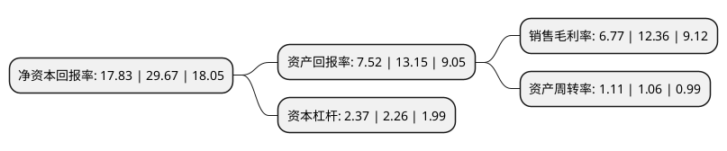

> 本页面由自动化程序生成于 2022年5月20日 01:12
> 内容可能存在错误，如有bug请提交issue至：https://github.com/Eroleice/doc-pi/issues
{.is-warning}

# 上市公司基本情况

## 基本资料

盐津铺子食品股份有限公司（以下简称“盐津铺子”）成立于2005年08月04日，长沙市。于2017年02月08日在深交所中小板上市。

盐津铺子注册资本12,936万元，公司一直专业从事小品类休闲食品的研发，生产和销售。主要产品为“盐津铺子”品牌的休闲食品，包括休闲豆制品，凉果蜜饯，坚果炒货，休闲素食，休闲肉制品五大类近百种产品。以下是详细信息：

- 公司名称: 盐津铺子食品股份有限公司
- 股票代码: 002847.SZ
- 所在地: 湖南 - 长沙市
- 成立日期: 2005年08月04日
- 注册资本: 12,936万元
- 法定代表人: 张学武
- 主营业务: 公司一直专业从事小品类休闲食品的研发，生产和销售主要产品为“盐津铺子”品牌的休闲食品，包括休闲豆制品，凉果蜜饯，坚果炒货，休闲素食，休闲肉制品五大类近百种产品
- 公司官网: www.yanjinpuzi.com
- 公司介绍: 公司是一家专业从事食品科研、生产、加工、销售于一体的综合型企业。公司秉承“好零食，盐津造”的品牌理念，专业、专注于休闲食品行业，以具有地方特色的凉果蜜饯产品发轫，推陈出新，建立起中国传统特色小品类休闲食品全品类产品体系，主要包括休闲豆制品、凉果蜜饯、坚果炒货、休闲素食、休闲肉制品、糕点制品等“盐津铺子”系列产品。经过多年的发展，公司在原料配方、生产工艺、技术设备、质量标准、产品质量、品牌信誉方面达到了行业领先水平。以“直营商超主导、经销跟随”的营销网络发展理念，以点带面，形成了多层次、广覆盖、高效率的立体营销网络，销售区域覆盖全国31个省、自治区和直辖市，已经成为沃尔玛、家乐福、麦德龙、大润发等跨国超大型连锁超市，以及华润万家、步步高、人人乐、天虹百货、中百等国内知名连锁商超的核心供应商，是我国较具影响力、产品品类较为齐全的小品类休闲食品企业之一。

## 股东及高管情况

上市公司第一大股东为湖南盐津铺子控股有限公司，持股48,381,503股，占比37.4%，为上市公司实际控制人。

截至2022年03月31日，上市公司的前十大股东中，共有3名自然人股东，1名机构股东，5个产品账户，1个海外主体，其中5%以上大股东共有3名。上市公司前十大股东明细如下：

> 截至2022年03月31日，上市公司前十大股东信息如下：

| 股东名称 | 持股数量（股） | 持股比例 |
| --- | --- | --- |
| 湖南盐津铺子控股有限公司 | 48,381,503 | 37.4% |
| 张学文 | 20,935,811 | 16.18% |
| 张学武 | 13,575,514 | 10.49% |
| 中信银行股份有限公司-交银施罗德品质增长一年持有期混合型证券投资基金 | 1,914,369 | 1.48% |
| 中国农业银行股份有限公司-交银施罗德内需增长一年持有期混合型证券投资基金 | 1,615,088 | 1.25% |
| 广发基金管理有限公司-社保基金四二零组合 | 1,511,366 | 1.17% |
| 香港中央结算有限公司(陆股通) | 1,470,025 | 1.14% |
| 中国建设银行股份有限公司-富国价值创造混合型证券投资基金 | 1,246,176 | 0.96% |
| 中国银行股份有限公司-嘉实消费精选股票型证券投资基金 | 1,155,204 | 0.89% |
| 王宾 | 1,135,268 | 0.88% |

## 利润表分析

上市公司2021年总收入为22.81亿元，净利润为1.54亿元，实现盈利。

## 杜邦分析

> 数据列示周期：2021年 | 2020年 | 2019年
{.is-info}

上市公司的净资产收益率在近一年有所下降，下降幅度为-39.91%，其变化情况分解如下：
- 上市公司的销售毛利率在近一年下降了-45.23%，可能是生产效率的下降、商品原材料价格上涨或商品价格的下跌所致。
- 上市公司的资产周转率在近一年上升了4.72%，可能是源自于更快的销售回款或库存管理效果提升。
- 上市公司的财务杠杆比率在近一年上升了4.87%，可能是增加负债扩大生产规模。

