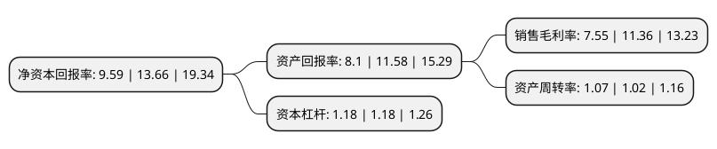

> 本页面由自动化程序生成于 2022年5月20日 01:13
> 内容可能存在错误，如有bug请提交issue至：https://github.com/Eroleice/doc-pi/issues
{.is-warning}

# 上市公司基本情况

## 基本资料

劲仔食品集团股份有限公司（以下简称“劲仔食品”）成立于2010年08月12日，岳阳市。于2020年09月14日在深交所中小板上市。

劲仔食品注册资本40,320万元，主营业务为风味小鱼，风味豆干等传统风味休闲食品的研发，生产与销售。主要产品包括风味小鱼，风味豆干等传统风味休闲食品。以下是详细信息：

- 公司名称: 劲仔食品集团股份有限公司
- 股票代码: 003000.SZ
- 所在地: 湖南 - 岳阳市
- 成立日期: 2010年08月12日
- 注册资本: 40,320万元
- 法定代表人: 周劲松
- 主营业务: 主营业务为风味小鱼，风味豆干等传统风味休闲食品的研发，生产与销售主要产品包括风味小鱼，风味豆干等传统风味休闲食品
- 公司官网: www.jinzaifood.com.cn
- 公司介绍: 公司是我国具有较高知名度的传统风味休闲食品企业之一，主营业务为风味小鱼、风味豆干等传统风味休闲食品的研发、生产与销售。公司以消费者体验为核心，不断提升自身自动化生产水平和研发能力，逐渐发展成为一家集研发、生产、销售于一体的现代化休闲食品生产企业，公司拥有的主要品牌为“劲仔”，是传统风味休闲食品行业中的知名品牌。公司的“劲仔牌豆制品”、“劲仔牌风味鱼制品”被湖南省质量技术监督局评选为“湖南名牌”；“劲仔”品牌被湖南省工商行政管理局评选为“湖南省著名商标”，被中国休闲食品文化节组委会评选为“湖南省食品安全首选品牌”，公司被湖南省人民政府评定为“湖南省农业产业化龙头企业”，被中国食品工业协会豆制品专业委员会评选为“2019中国豆制品行业50强”。

## 股东及高管情况

上市公司第一大股东为周劲松，持股124,426,368股，占比30.86%，为上市公司实际控制人。

截至2022年05月05日，上市公司的前十大股东中，共有8名自然人股东，2名机构股东，其中5%以上大股东共有10名。上市公司前十大股东明细如下：

> 截至2022年05月05日，上市公司前十大股东信息如下：

| 股东名称 | 持股数量（股） | 持股比例 |
| --- | --- | --- |
| 周劲松 | 124,426,368 | 30.86% |
| 周劲松 | 124,426,368 | 30.86% |
| 周劲松 | 124,426,368 | 30.86% |
| 佳沃(青岛)现代农业有限公司 | 71,280,000 | 17.68% |
| 佳沃(青岛)现代农业有限公司 | 66,580,000 | 16.5129% |
| 李冰玉 | 36,210,240 | 8.98% |
| 李冰玉 | 36,210,240 | 8.98% |
| 李冰玉 | 36,210,240 | 8.98% |
| 刘特元 | 24,548,832 | 6.09% |
| 刘特元 | 24,548,832 | 6.09% |

## 利润表分析

上市公司2021年总收入为11.11亿元，净利润为0.83亿元，实现盈利。

## 杜邦分析

> 数据列示周期：2021年 | 2020年 | 2019年
{.is-info}

上市公司的净资产收益率在近一年有所下降，下降幅度为-29.8%，其变化情况分解如下：
- 上市公司的销售毛利率在近一年下降了-33.54%，可能是生产效率的下降、商品原材料价格上涨或商品价格的下跌所致。
- 上市公司的资产周转率在近一年上升了4.9%，可能是源自于更快的销售回款或库存管理效果提升。
- 上市公司的财务杠杆比率在近一年下降了0%，可能是减少负债降低财务费用。

