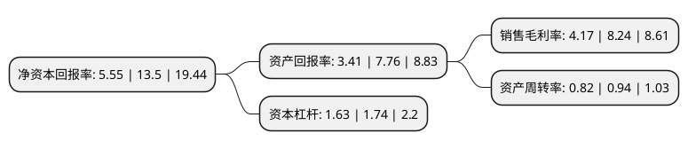

> 本页面由自动化程序生成于 2022年5月20日 01:14
> 内容可能存在错误，如有bug请提交issue至：https://github.com/Eroleice/doc-pi/issues
{.is-warning}

# 上市公司基本情况

## 基本资料

祖名豆制品股份有限公司（以下简称“祖名股份”）成立于2000年02月18日，杭州市。于2021年01月06日在深交所中小板上市。

祖名股份注册资本12,478万元，主营业务为豆制品的研发，生产和销售，主要产品为生鲜豆制品，植物蛋白饮品，休闲豆制品等以下是详细信息：

- 公司名称: 祖名豆制品股份有限公司
- 股票代码: 003030.SZ
- 所在地: 浙江 - 杭州市
- 成立日期: 2000年02月18日
- 注册资本: 12,478万元
- 法定代表人: 蔡祖明
- 主营业务: 主营业务为豆制品的研发，生产和销售，主要产品为生鲜豆制品，植物蛋白饮品，休闲豆制品等
- 公司官网: www.chinazuming.cn
- 公司介绍: 公司从创建至今，一直秉持“做健康食品，关注人类健康”的理念，凭借优质的产品和完善的服务，产品深耕江浙沪地区并且覆盖国内绝大多数省、自治区和直辖市，客户涵盖大润发、欧尚、永辉、世纪联华、华润万家、物美、三江超市、家乐福等大中型超市，海底捞、外婆家、老娘舅、杨国福等知名餐饮机构，盒马鲜生、叮咚买菜、每日优鲜等生鲜专营新零售平台，赢得了消费者和市场的高度认可。公司是江浙沪地区的豆制品领导品牌之一，是CAC国际标准以及国家标准、多个行业标准起草单位之一。近年来，公司先后获得下列主要荣誉或称号：“中国驰名商标”“浙江省著名商标”“中国绿色食品博览会金奖”“中国豆制品质量安全示范单位”“浙江省名牌产品”“浙江省知名商号”“浙江农博十大企业知名品牌农产品”“G20杭州峰会食材总仓供应企业”公司产品先后获得下列主要荣誉或称号：“第十四届、第十六届中国国际农产品交易会参展农产品金奖”“中国豆制品行业科技进步奖一等奖”“长江三角洲地区名优食品”。

## 股东及高管情况

上市公司第一大股东为蔡祖明，持股30,045,400股，占比24.08%，**疑似为**上市公司实际控制人。

截至2022年03月31日，上市公司的前十大股东中，共有8名自然人股东，2名机构股东，其中5%以上大股东共有6名。上市公司前十大股东明细如下：

> 未能通过持股比例判定出上市公司实际控制人（持股30%以上）
> 可能存在通过间接持股、联合持股、协议控制等方式拥有实际控制权的主体，具体请参考上市公司定期公告！
{.is-warning}

> 截至2022年03月31日，上市公司前十大股东信息如下：

| 股东名称 | 持股数量（股） | 持股比例 |
| --- | --- | --- |
| 蔡祖明 | 30,045,400 | 24.08% |
| 杭州纤品投资有限公司 | 17,650,000 | 14.14% |
| 蔡水埼 | 12,211,200 | 9.79% |
| 王茶英 | 9,158,400 | 7.34% |
| 上海筑景投资中心(有限合伙) | 8,820,000 | 7.07% |
| 沈勇 | 6,380,500 | 5.11% |
| 张志祥 | 4,733,350 | 3.79% |
| 章建华 | 688,009 | 0.55% |
| 余罗芳 | 680,000 | 0.54% |
| 许海培 | 673,916 | 0.54% |

## 利润表分析

上市公司2021年总收入为13.37亿元，净利润为0.55亿元，实现盈利。

## 杜邦分析

> 数据列示周期：2021年 | 2020年 | 2019年
{.is-info}

上市公司的净资产收益率在近一年有所下降，下降幅度为-58.89%，其变化情况分解如下：
- 上市公司的销售毛利率在近一年下降了-49.39%，可能是生产效率的下降、商品原材料价格上涨或商品价格的下跌所致。
- 上市公司的资产周转率在近一年下降了-12.77%，可能是源自于更慢的销售回款或库存管理效果下降。
- 上市公司的财务杠杆比率在近一年下降了-6.32%，可能是减少负债降低财务费用。

