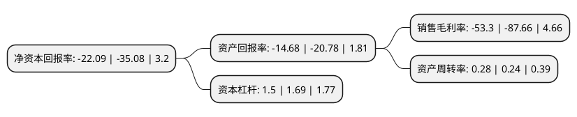

> 本页面由自动化程序生成于 2022年5月20日 01:15
> 内容可能存在错误，如有bug请提交issue至：https://github.com/Eroleice/doc-pi/issues
{.is-warning}

# 上市公司基本情况

## 基本资料

朗源股份有限公司（以下简称“朗源股份”）成立于2002年03月26日，烟台市。于2011年02月15日在深交所创业板上市。

朗源股份注册资本47,080万元，主营业务为鲜果和干果种植管理，加工，仓储及销售，主要产品为新鲜苹果和葡萄干，所处行业为农产品初加工服务业中的果品加工业。以下是详细信息：

- 公司名称: 朗源股份有限公司
- 股票代码: 300175.SZ
- 所在地: 山东 - 烟台市
- 成立日期: 2002年03月26日
- 注册资本: 47,080万元
- 法定代表人: 戚永楙
- 主营业务: 主营业务为鲜果和干果种植管理，加工，仓储及销售，主要产品为新鲜苹果和葡萄干，所处行业为农产品初加工服务业中的果品加工业
- 公司官网: www.lontrue.com
- 公司介绍: 公司是山东省首家农业行业创业板上市公司。公司的经营范围包括生鲜水果、坚果、果干的种植、储存、加工、销售，三大拳头产品为苹果、葡萄干、松子仁。依托公司多年来深耕农产品领域积累的丰富经验及资源，以及对标准化及食品安全的深刻理解，朗源股份在国内市场建立了强大的销售网络，在同行业一直处于领先的市场地位。在欧盟，北美，澳洲及东南亚等主要国际市场上也建立了强有力的品牌认知及领先的市场份额，得到众多国际高端品牌的一致认可。自2015年以来，公司积极布局在大数据行业的投资建设，拓展公司除农产品加工以外的业务，实现双主业并行发展。以全资子公司太原市德蓝达科技有限公司为项目主体，以自有资金投资在太原市经济开发区投资自建数据中心。IDC业务的开拓能够协助公司布局未来，提高盈利能力，有效提高公司的抗风险能力，将为广大中小股东的利益提供更为多元化、更为可靠的经营业绩保障。

## 股东及高管情况

上市公司第一大股东为王贵美，持股59,952,960股，占比12.73%，**疑似为**上市公司实际控制人。

截至2022年03月31日，上市公司的前十大股东中，共有7名自然人股东，2名机构股东，1个海外主体，其中5%以上大股东共有2名。上市公司前十大股东明细如下：

> 未能通过持股比例判定出上市公司实际控制人（持股30%以上）
> 可能存在通过间接持股、联合持股、协议控制等方式拥有实际控制权的主体，具体请参考上市公司定期公告！
{.is-warning}

> 截至2022年03月31日，上市公司前十大股东信息如下：

| 股东名称 | 持股数量（股） | 持股比例 |
| --- | --- | --- |
| 王贵美 | 59,952,960 | 12.73% |
| 新疆尚龙股权投资管理有限公司 | 52,800,000 | 11.21% |
| 徐建业 | 9,617,700 | 2.04% |
| 倪建山 | 8,796,200 | 1.87% |
| 黄炳辉 | 5,796,203 | 1.23% |
| 黄展鹏 | 4,670,217 | 0.99% |
| 王积武 | 4,000,000 | 0.85% |
| 中国国际金融香港资产管理有限公司-客户资金2 | 2,785,292 | 0.59% |
| 李建东 | 2,618,103 | 0.56% |
| JPMORGAN CHASE BANK,NATIONAL ASSOCIATION | 2,578,929 | 0.55% |

## 利润表分析

上市公司2021年总收入为2.46亿元，净利润为-1.32亿元，**未实现盈利**。

## 杜邦分析

> 数据列示周期：2021年 | 2020年 | 2019年
{.is-info}

上市公司的净资产收益率在近一年有所下降，下降幅度为-37.03%，其变化情况分解如下：
- 上市公司的销售毛利率在近一年下降了-39.2%，可能是生产效率的下降、商品原材料价格上涨或商品价格的下跌所致。
- 上市公司的资产周转率在近一年上升了16.67%，可能是源自于更快的销售回款或库存管理效果提升。
- 上市公司的财务杠杆比率在近一年下降了-11.24%，可能是减少负债降低财务费用。

