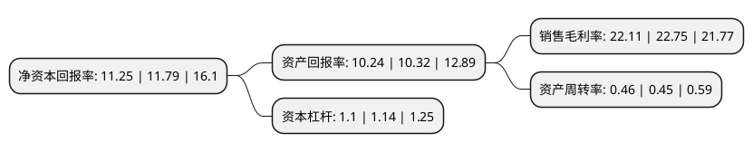

> 本页面由自动化程序生成于 2022年5月20日 01:20
> 内容可能存在错误，如有bug请提交issue至：https://github.com/Eroleice/doc-pi/issues
{.is-warning}

# 上市公司基本情况

## 基本资料

石药集团新诺威制药股份有限公司（以下简称“新诺威”）成立于2006年04月05日，石家庄市。于2019年03月22日在深交所创业板上市。

新诺威注册资本54,600万元，主营业务为功能食品的研发，生产与销售。主要产品为维生素C含片和咖啡因。以下是详细信息：

- 公司名称: 石药集团新诺威制药股份有限公司
- 股票代码: 300765.SZ
- 所在地: 河北 - 石家庄市
- 成立日期: 2006年04月05日
- 注册资本: 54,600万元
- 法定代表人: 韩峰
- 主营业务: 主营业务为功能食品的研发，生产与销售主要产品为维生素C含片和咖啡因
- 公司官网: www.xnwpharma.net
- 公司介绍: 公司咖啡因产品作为食品添加剂广泛应用于功能饮料中，具有提神醒脑、抗疲劳、暂时驱走睡意并恢复精力的作用，产品主要销往美国、德国、爱尔兰、巴西、印度等地，是百事可乐、可口可乐、红牛三大国际饮料公司的全球供应商。公司维生素C含片具有补充维生素C的保健功能，维生素C具有提高白细胞杀菌抗病毒能力，增强人体抵抗力；可以抗氧化，消除体内自由基，从而降低血液中血脂和胆固醇，预防心脑血管疾病；促进铁、钙吸收，增强补铁、补钙效果；促进胶原蛋白合成，促进伤口愈合等作用。

## 股东及高管情况

上市公司第一大股东为石药集团恩必普药业有限公司，持股404,135,550股，占比74.02%，为上市公司实际控制人。

截至2022年03月31日，上市公司的前十大股东中，共有3名自然人股东，3名机构股东，3个产品账户，1个海外主体，其中5%以上大股东共有1名。上市公司前十大股东明细如下：

> 截至2022年03月31日，上市公司前十大股东信息如下：

| 股东名称 | 持股数量（股） | 持股比例 |
| --- | --- | --- |
| 石药集团恩必普药业有限公司 | 404,135,550 | 74.02% |
| 中国工商银行-华安安信消费服务股票型证券投资基金 | 6,099,240 | 1.12% |
| 石药集团欧意药业有限公司 | 5,364,450 | 0.98% |
| 冯文渊 | 4,023,431 | 0.74% |
| 香港中央结算有限公司(陆股通) | 3,485,277 | 0.64% |
| 陈雯鸶 | 2,169,555 | 0.4% |
| 张伟 | 1,751,350 | 0.32% |
| 中国工商银行股份有限公司-交银施罗德趋势优先混合型证券投资基金 | 1,722,186 | 0.32% |
| 中国银行股份有限公司-建信创新驱动混合型证券投资基金 | 1,562,565 | 0.29% |
| 泰康人寿保险有限责任公司-分红-个人分红-019L-FH002深 | 1,557,900 | 0.29% |

## 利润表分析

上市公司2021年总收入为14.31亿元，净利润为3.16亿元，实现盈利。

## 杜邦分析

> 数据列示周期：2021年 | 2020年 | 2019年
{.is-info}

上市公司的净资产收益率在近一年有所下降，下降幅度为-4.58%，其变化情况分解如下：
- 上市公司的销售毛利率在近一年下降了-2.81%，可能是生产效率的下降、商品原材料价格上涨或商品价格的下跌所致。
- 上市公司的资产周转率在近一年上升了2.22%，可能是源自于更快的销售回款或库存管理效果提升。
- 上市公司的财务杠杆比率在近一年下降了-3.51%，可能是减少负债降低财务费用。

