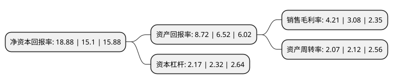

> 本页面由自动化程序生成于 2022年5月20日 01:20
> 内容可能存在错误，如有bug请提交issue至：https://github.com/Eroleice/doc-pi/issues
{.is-warning}

# 上市公司基本情况

## 基本资料

三只松鼠股份有限公司（以下简称“三只松鼠”）成立于2012年02月16日，芜湖市。于2019年07月12日在深交所创业板上市。

三只松鼠注册资本40,100万元，主营业务:主要从事自有品牌休闲食品的研发，检测，分装和销售，产品组合覆盖坚果，干果，果干，花茶及零食等多个主要休闲食品品类。以下是详细信息：

- 公司名称: 三只松鼠股份有限公司
- 股票代码: 300783.SZ
- 所在地: 安徽 - 芜湖市
- 成立日期: 2012年02月16日
- 注册资本: 40,100万元
- 法定代表人: 章燎源
- 主营业务: 主营业务:主要从事自有品牌休闲食品的研发，检测，分装和销售，产品组合覆盖坚果，干果，果干，花茶及零食等多个主要休闲食品品类
- 公司官网: www.3songshu.com
- 公司介绍: 公司是行业领先的以休闲食品为核心的品牌电商，主要从事自有品牌休闲食品的研发、检测、分装及销售，产品组合覆盖坚果、干果、果干、花茶及零食等多个主要休闲食品品类，为消费者创造了一站式的休闲食品购买体验。公司的核心品牌“三只松鼠”及三个松鼠形象“松鼠小酷”、“松鼠小美”、“松鼠小贱”在消费者群体中享有较高的知名度。公司坚持“以客户为主人”的企业价值观，从品牌、品质、服务、速度等方面着力提升消费体验，构建了覆盖天猫商城、京东、1号店等主流第三方电商平台及公司自营手机APP、大客户团购、线下体验店等多元化渠道的销售模式。公司还和众多上游优质供应商保持长期紧密合作，充分保障公司采购的稳定性，同时通过严格的供应商开发管理制度和完善的质量控制体系确保食品安全。公司曾获“省级电子商务示范企业”、“互联网新锐奖”、“安徽省著名商标”、“省级林业产业化龙头企业”等多项荣誉。

## 股东及高管情况

上市公司第一大股东为章燎源，持股160,272,000股，占比39.97%，为上市公司实际控制人。

截至2022年04月15日，上市公司的前十大股东中，共有2名自然人股东，2名机构股东，1个产品账户，5个海外主体，其中5%以上大股东共有5名。上市公司前十大股东明细如下：

> 截至2022年04月15日，上市公司前十大股东信息如下：

| 股东名称 | 持股数量（股） | 持股比例 |
| --- | --- | --- |
| 章燎源 | 160,272,000 | 39.97% |
| NICE GROWTH LIMITED | 61,462,400 | 15.33% |
| NICE GROWTH LIMITED | 61,462,400 | 15.33% |
| LT GROWTH INVESTMENT IX (HK) LIMITED | 57,644,020 | 14.38% |
| LT GROWTH INVESTMENT IX (HK) LIMITED | 57,644,020 | 14.38% |
| 安徽松果投资管理中心(有限合伙) | 7,056,000 | 1.76% |
| 安徽燎原投资管理有限公司 | 6,696,000 | 1.67% |
| 香港中央结算有限公司(陆股通) | 3,136,231 | 0.78% |
| 全国社保基金一一七组合 | 2,300,000 | 0.57% |
| 任钊辉 | 1,744,661 | 0.44% |

## 利润表分析

上市公司2021年总收入为97.7亿元，净利润为4.11亿元，实现盈利。

## 杜邦分析

> 数据列示周期：2021年 | 2020年 | 2019年
{.is-info}

上市公司的净资产收益率在近一年有所上升，上升幅度为25.03%，其变化情况分解如下：
- 上市公司的销售毛利率在近一年上升了36.69%，可能是生产效率的提升、商品原材料价格下跌或商品价格的上涨所致。
- 上市公司的资产周转率在近一年下降了-2.36%，可能是源自于更慢的销售回款或库存管理效果下降。
- 上市公司的财务杠杆比率在近一年下降了-6.47%，可能是减少负债降低财务费用。

