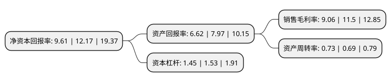

> 本页面由自动化程序生成于 2022年5月20日 01:20
> 内容可能存在错误，如有bug请提交issue至：https://github.com/Eroleice/doc-pi/issues
{.is-warning}

# 上市公司基本情况

## 基本资料

河南金丹乳酸科技股份有限公司（以下简称“金丹科技”）成立于2006年08月10日，周口市。于2020年04月22日在深交所创业板上市。

金丹科技注册资本18,065.455万元，公司是以研发，生产，销售乳酸及其系列产品为主业的高新技术企业，目前公司主要产品包括各种级别的乳酸和乳酸钙，乳酸钠及乳酸酯类等。以下是详细信息：

- 公司名称: 河南金丹乳酸科技股份有限公司
- 股票代码: 300829.SZ
- 所在地: 河南 - 周口市
- 成立日期: 2006年08月10日
- 注册资本: 18,065.455万元
- 法定代表人: 张鹏
- 主营业务: 公司是以研发，生产，销售乳酸及其系列产品为主业的高新技术企业，目前公司主要产品包括各种级别的乳酸和乳酸钙，乳酸钠及乳酸酯类等
- 公司官网: www.hnjindan.com
- 公司介绍: 公司是一家运用现代生物技术大规模工业化生产L-乳酸及其衍生产品的高新技术企业。目前，公司乳酸及其衍生品的年产销规模位居行业领先地位，产品销往全球80多个国家和地区。公司拥有完整的、自主研发的高效工程菌种的选育、乳酸及衍生产品的制备、提纯等多项核心技术和关键工艺，并通过技术引进与合作研发，掌握了以乳酸为原料，采用有机胍催化剂生产可降解环保新材料丙交酯及聚乳酸(PLA)的关键技术与工艺。公司是以研发、生产、销售乳酸及其系列产品为主业的高新技术企业，目前公司主要产品包括各种级别的乳酸和乳酸钙、乳酸钠及乳酸酯类等。公司致力于研究开发乳酸及其衍生产品高效、节能、环保的生产技术与制备工艺并进行产业化，经过多年的探索创新和沉淀积累，目前公司产品已销往全球八十多个国家和地区。

## 股东及高管情况

上市公司第一大股东为张鹏，持股59,049,600股，占比32.69%，为上市公司实际控制人。

截至2022年03月31日，上市公司的前十大股东中，共有7名自然人股东，3名机构股东，其中5%以上大股东共有3名。上市公司前十大股东明细如下：

> 截至2022年03月31日，上市公司前十大股东信息如下：

| 股东名称 | 持股数量（股） | 持股比例 |
| --- | --- | --- |
| 张鹏 | 59,049,600 | 32.69% |
| 广州诚信创业投资有限公司 | 11,631,900 | 6.44% |
| 深圳首中教育产业发展股权投资企业(有限合伙) | 9,554,400 | 5.29% |
| 于培星 | 6,468,022 | 3.58% |
| 史永祯 | 6,004,000 | 3.32% |
| 崔耀军 | 4,880,000 | 2.7% |
| 陈飞 | 3,956,080 | 2.19% |
| 王然明 | 3,490,080 | 1.93% |
| 郑州百瑞创新资本创业投资有限公司 | 3,043,519 | 1.68% |
| 王金祥 | 2,757,620 | 1.53% |

## 利润表分析

上市公司2021年总收入为14.38亿元，净利润为1.3亿元，实现盈利。

## 杜邦分析

> 数据列示周期：2021年 | 2020年 | 2019年
{.is-info}

上市公司的净资产收益率在近一年有所下降，下降幅度为-21.04%，其变化情况分解如下：
- 上市公司的销售毛利率在近一年下降了-21.22%，可能是生产效率的下降、商品原材料价格上涨或商品价格的下跌所致。
- 上市公司的资产周转率在近一年上升了5.8%，可能是源自于更快的销售回款或库存管理效果提升。
- 上市公司的财务杠杆比率在近一年下降了-5.23%，可能是减少负债降低财务费用。

