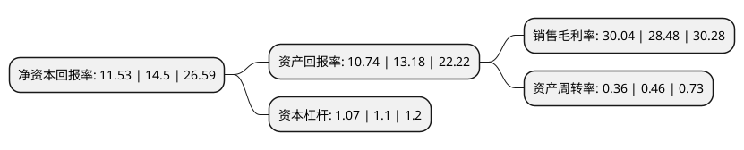

> 本页面由自动化程序生成于 2022年5月20日 01:21
> 内容可能存在错误，如有bug请提交issue至：https://github.com/Eroleice/doc-pi/issues
{.is-warning}

# 上市公司基本情况

## 基本资料

北京科拓恒通生物技术股份有限公司（以下简称“科拓生物”）成立于2003年09月05日，北京市。于2020年07月27日在深交所创业板上市。

科拓生物注册资本14,853.185万元，公司是一家主要从事复配食品添加剂，食用益生菌制品以及动植物微生态制剂研发，生产与销售的高新技术企业。公司的主要产品分为复配食品添加剂，食用益生菌制品以及动植物微生态制剂。以下是详细信息：

- 公司名称: 北京科拓恒通生物技术股份有限公司
- 股票代码: 300858.SZ
- 所在地: 北京 - 北京市
- 成立日期: 2003年09月05日
- 注册资本: 14,853.185万元
- 法定代表人: 刘晓军
- 主营业务: 公司是一家主要从事复配食品添加剂，食用益生菌制品以及动植物微生态制剂研发，生产与销售的高新技术企业公司的主要产品分为复配食品添加剂，食用益生菌制品以及动植物微生态制剂
- 公司官网: www.scitop.cn
- 公司介绍: 公司是一家主要从事复配食品添加剂、食用益生菌制品以及动植物微生态制剂研发、生产与销售的高新技术企业。自2003年成立以来，公司长期专注于食品配方、复配食品添加剂配方及相应工艺技术的研发，长期从事复配食品添加剂生产和销售，与下游食品生产企业紧密合作并为其提供或共同开发食品配方及相应工艺技术，并与蒙牛乳业、光明乳业、完达山乳业、新希望乳业等知名乳制品企业建立起良好的合作关系。公司拥有56项发明专利、14项实用新型专利以及多项非专利技术，并拥有国内最大的乳酸菌菌种资源库之一，包含10,000余株乳酸菌(含益生菌)菌株，其中包括乳酸菌的8个属98个种及亚种，其中已产业化的益生菌68株。

## 股东及高管情况

上市公司第一大股东为孙天松，持股44,918,642股，占比30.24%，为上市公司实际控制人。

截至2022年03月31日，上市公司的前十大股东中，共有4名自然人股东，3名机构股东，3个产品账户，其中5%以上大股东共有6名。上市公司前十大股东明细如下：

> 截至2022年03月31日，上市公司前十大股东信息如下：

| 股东名称 | 持股数量（股） | 持股比例 |
| --- | --- | --- |
| 孙天松 | 44,918,642 | 30.24% |
| 北京科融达投资合伙企业(有限合伙) | 17,973,911 | 12.1% |
| 张列兵 | 9,518,042 | 6.41% |
| 刘晓军 | 9,104,442 | 6.13% |
| 乔向前 | 7,925,400 | 5.34% |
| 北京科汇达投资合伙企业(有限合伙) | 7,770,512 | 5.23% |
| 中国平安人寿保险股份有限公司-投连-个险投连 | 2,999,940 | 2.02% |
| 北京顺禧股权投资基金(有限合伙) | 1,639,045 | 1.1% |
| 平安资管-建设银行-平安资产创赢122号资产管理产品 | 1,299,940 | 0.88% |
| 平安健康保险股份有限公司-传统保险产品 | 999,940 | 0.67% |

## 杜邦分析

> 数据列示周期：2021年 | 2020年 | 2019年
{.is-info}

上市公司的净资产收益率在近一年有所下降，下降幅度为-20.48%，其变化情况分解如下：
- 上市公司的销售毛利率在近一年上升了5.48%，可能是生产效率的提升、商品原材料价格下跌或商品价格的上涨所致。
- 上市公司的资产周转率在近一年下降了-21.74%，可能是源自于更慢的销售回款或库存管理效果下降。
- 上市公司的财务杠杆比率在近一年下降了-2.73%，可能是减少负债降低财务费用。

