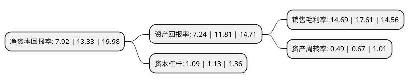

> 本页面由自动化程序生成于 2022年5月20日 01:21
> 内容可能存在错误，如有bug请提交issue至：https://github.com/Eroleice/doc-pi/issues
{.is-warning}

# 上市公司基本情况

## 基本资料

仲景食品股份有限公司（以下简称“仲景食品”）成立于2002年09月29日，南阳市。于2020年11月23日在深交所创业板上市。

仲景食品注册资本10,000万元，公司主营业务为研发，生产，销售调味配料和调味食品。。主要产品;仲景香菇酱系列，超临界香辛食品配料系列。主要产品为以花椒，辣椒系列为代表的调味配料和以仲景香菇酱，劲道牛肉酱，仲景调味油为代表的调味食品。以下是详细信息：

- 公司名称: 仲景食品股份有限公司
- 股票代码: 300908.SZ
- 所在地: 河南 - 南阳市
- 成立日期: 2002年09月29日
- 注册资本: 10,000万元
- 法定代表人: 孙耀志
- 主营业务: 公司主营业务为研发，生产，销售调味配料和调味食品主要产品;仲景香菇酱系列，超临界香辛食品配料系列主要产品为以花椒，辣椒系列为代表的调味配料和以仲景香菇酱，劲道牛肉酱，仲景调味油为代表的调味食品
- 公司官网: www.zhongjing.com.cn
- 公司介绍: 公司自2002年成立以来，持续进行调味配料的研发、生产和销售，是国内采用超临界CO2萃取技术生产调味配料的主要生产商之一。公司主营业务为研发、生产、销售调味配料和调味食品。调味配料以花椒、辣椒等香辛植物提取物为代表，调味食品以仲景香菇酱、劲道牛肉酱、仲景调味油为代表。公司以“让健康有滋有味”为使命，以产品差异化为竞争策略，通过不断的品类创新和风味技术创新，实现企业的发展壮大。公司坚持走技术创新、产品创新之路。先后获批建立了“河南省香菇加工工程技术研究中心”、“食品风味物质提取技术河南省工程实验室”、“河南省企业技术中心”。经中国食品科学技术学会鉴评，公司仲景香菇酱系列产品属国内首创，整体技术达到国内领先水平；香菇调味料关键技术研究和产业化应用项目具有原始创新特征；新型香辛料加工关键技术集成与产业化项目整体技术达到国内领先水平。

## 股东及高管情况

上市公司第一大股东为河南省宛西控股股份有限公司，持股39,430,000股，占比39.43%，为上市公司实际控制人。

截至2022年03月31日，上市公司的前十大股东中，共有9名自然人股东，1名机构股东，其中5%以上大股东共有2名。上市公司前十大股东明细如下：

> 截至2022年03月31日，上市公司前十大股东信息如下：

| 股东名称 | 持股数量（股） | 持股比例 |
| --- | --- | --- |
| 河南省宛西控股股份有限公司 | 39,430,000 | 39.43% |
| 朱新成 | 13,500,000 | 13.5% |
| 杨丽 | 1,500,000 | 1.5% |
| 马玉华 | 750,000 | 0.75% |
| 张明华 | 750,000 | 0.75% |
| 摆向荣 | 750,000 | 0.75% |
| 张永安 | 750,000 | 0.75% |
| 孙锋 | 750,000 | 0.75% |
| 章运典 | 750,000 | 0.75% |
| 孙伟 | 750,000 | 0.75% |

## 利润表分析

上市公司2021年总收入为8.06亿元，净利润为1.18亿元，实现盈利。

## 杜邦分析

> 数据列示周期：2021年 | 2020年 | 2019年
{.is-info}

上市公司的净资产收益率在近一年有所下降，下降幅度为-40.59%，其变化情况分解如下：
- 上市公司的销售毛利率在近一年下降了-16.58%，可能是生产效率的下降、商品原材料价格上涨或商品价格的下跌所致。
- 上市公司的资产周转率在近一年下降了-26.87%，可能是源自于更慢的销售回款或库存管理效果下降。
- 上市公司的财务杠杆比率在近一年下降了-3.54%，可能是减少负债降低财务费用。

