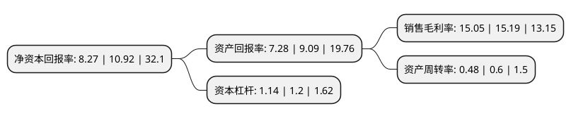

> 本页面由自动化程序生成于 2022年5月20日 01:21
> 内容可能存在错误，如有bug请提交issue至：https://github.com/Eroleice/doc-pi/issues
{.is-warning}

# 上市公司基本情况

## 基本资料

上海海融食品科技股份有限公司（以下简称“海融科技”）成立于2003年10月14日，上海市。于2020年12月02日在深交所创业板上市。

海融科技注册资本9,000万元，主营业务:公司自成立以来一直以植脂奶油，巧克力，果酱等烘焙食品原料的研发，生产，销售为主营业务，其中，植脂奶油系列产品为公司的主要产品。以下是详细信息：

- 公司名称: 上海海融食品科技股份有限公司
- 股票代码: 300915.SZ
- 所在地: 上海 - 上海市
- 成立日期: 2003年10月14日
- 注册资本: 9,000万元
- 法定代表人: 黄海瑚
- 主营业务: 主营业务:公司自成立以来一直以植脂奶油，巧克力，果酱等烘焙食品原料的研发，生产，销售为主营业务，其中，植脂奶油系列产品为公司的主要产品
- 公司官网: www.hiroad.sh.cn
- 公司介绍: 公司是集烘焙行业原料研发、生产、销售于一体的专业公司。公司精选世界顶级专业原料，自主研发，采用先进生产工艺，严格质量管理，向广大客户提供包括植脂奶油、含乳脂植脂奶油、果酱、巧克力在内的三大类几十款优质食品原料，填补了国内民族企业在植脂奶油行业中的空白。全力打造“中国创造”的世界级食品原料品牌，一直以来是上海海融作为一家民族企业的不懈追求。自2009年以来，“欣融牌”植脂奶油连续获得“上海名牌”称号。2012年，“海融牌”植脂奶油也获得“上海名牌”称号。同年，该产品及“津彩”果酱更获得“上海名优新产品”称号。十年磨一剑，上海海融食品工业有限公司正是如此。历经十年发展，海融不断丰富产品线，拓展国内外市场，发展势头迅猛。现今已经拥有中国上海及印度新德里两个生产基地，销售辐射整个中国以及东南亚。“海纳百川，融情世界”海融将把“中国创造”带给世界。

## 股东及高管情况

上市公司第一大股东为黄海晓，持股38,880,000股，占比43.2%，为上市公司实际控制人。

截至2022年03月31日，上市公司的前十大股东中，共有3名自然人股东，4名机构股东，3个产品账户，其中5%以上大股东共有2名。上市公司前十大股东明细如下：

> 截至2022年03月31日，上市公司前十大股东信息如下：

| 股东名称 | 持股数量（股） | 持股比例 |
| --- | --- | --- |
| 黄海晓 | 38,880,000 | 43.2% |
| 黄海瑚 | 25,920,000 | 28.8% |
| 中国太平洋人寿保险股份有限公司-传统-普通保险产品 | 1,322,876 | 1.47% |
| 上海巧朵投资管理合伙企业(有限合伙) | 814,500 | 0.91% |
| 上海津彩投资管理合伙企业(有限合伙) | 790,500 | 0.88% |
| 中国太平洋财产保险-传统-普通保险产品-013C-CT001深 | 353,050 | 0.39% |
| 中国太平洋人寿保险股份有限公司-分红-个人分红 | 350,800 | 0.39% |
| 中国太保集团股份有限公司-本级-集团自有资金-012G-ZY001深 | 306,350 | 0.34% |
| 于秀平 | 278,300 | 0.31% |
| 阳光资产-工商银行-主动量化1号资产管理产品 | 200,000 | 0.22% |

## 利润表分析

上市公司2021年总收入为7.46亿元，净利润为1.12亿元，实现盈利。

## 杜邦分析

> 数据列示周期：2021年 | 2020年 | 2019年
{.is-info}

上市公司的净资产收益率在近一年有所下降，下降幅度为-24.27%，其变化情况分解如下：
- 上市公司的销售毛利率在近一年下降了-0.92%，可能是生产效率的下降、商品原材料价格上涨或商品价格的下跌所致。
- 上市公司的资产周转率在近一年下降了-20%，可能是源自于更慢的销售回款或库存管理效果下降。
- 上市公司的财务杠杆比率在近一年下降了-5%，可能是减少负债降低财务费用。

