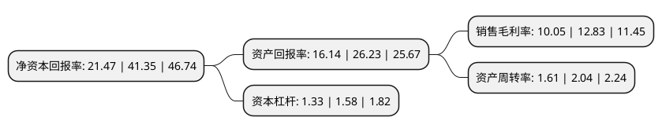

> 本页面由自动化程序生成于 2022年5月20日 01:21
> 内容可能存在错误，如有bug请提交issue至：https://github.com/Eroleice/doc-pi/issues
{.is-warning}

# 上市公司基本情况

## 基本资料

立高食品股份有限公司（以下简称“立高食品”）成立于2000年05月11日，广州市。于2021年04月15日在深交所创业板上市。

立高食品注册资本16,934万元，公司主要从事烘焙食品原料及冷冻烘焙食品的研发，生产和销售。公司主要产品包括奶油，水果制品，酱料，巧克力等烘焙食品原料和冷冻烘焙半成品及成品，此外还生产部分休闲食品。以下是详细信息：

- 公司名称: 立高食品股份有限公司
- 股票代码: 300973.SZ
- 所在地: 广东 - 广州市
- 成立日期: 2000年05月11日
- 注册资本: 16,934万元
- 法定代表人: 彭裕辉
- 主营业务: 公司主要从事烘焙食品原料及冷冻烘焙食品的研发，生产和销售公司主要产品包括奶油，水果制品，酱料，巧克力等烘焙食品原料和冷冻烘焙半成品及成品，此外还生产部分休闲食品
- 公司官网: www.ligaofoods.com
- 公司介绍: 公司主要从事烘焙食品原料及冷冻烘焙食品的研发、生产和销售。公司主要产品包括奶油、水果制品、酱料、巧克力等烘焙食品原料和冷冻烘焙半成品及成品，此外还生产部分休闲食品。公司产品类型众多，规格多样，截至2019年底，公司奶油、水果制品、酱料和冷冻烘焙食品的品规分别达到42种、304种、99种和180种，能够充分满足下游不同类型客户的多产品、多规格的一站式采购消费需求，提高了客户的使用便利性。由于产品的不断丰富，公司终端客户也从最初的烘焙门店发展到目前的烘焙门店、饮品店、餐饮、商超和便利店。公司具有雄厚的技术研发实力，其中立高食品及广州昊道均为国家高新技术企业。截至2019年底，公司拥有技术研发人员102名，并建立了广东省烘焙添加剂及配料工程技术研究中心，形成了61项技术专利成果，参与制订《植脂奶油》、《焙烤食品冷冻面团》等质量标准，参与的“蛋白乳浊体系稳定化及高品质乳制品产业化关键技术”研发项目获得2018年广东省科技进步一等奖，蛋黄酥、含乳脂植脂奶油、果溶等产品先后获得国内外多项奖项。

## 股东及高管情况

上市公司第一大股东为彭裕辉，持股25,889,000股，占比15.29%，**疑似为**上市公司实际控制人。

截至2022年04月27日，上市公司的前十大股东中，共有8名自然人股东，2名机构股东，其中5%以上大股东共有7名。上市公司前十大股东明细如下：

> 未能通过持股比例判定出上市公司实际控制人（持股30%以上）
> 可能存在通过间接持股、联合持股、协议控制等方式拥有实际控制权的主体，具体请参考上市公司定期公告！
{.is-warning}

> 截至2022年04月27日，上市公司前十大股东信息如下：

| 股东名称 | 持股数量（股） | 持股比例 |
| --- | --- | --- |
| 彭裕辉 | 25,889,000 | 15.29% |
| 赵松涛 | 17,259,300 | 10.19% |
| 赵松涛 | 17,259,300 | 10.19% |
| 白宝鲲 | 16,411,000 | 9.69% |
| 白宝鲲 | 16,411,000 | 9.69% |
| 赵键 | 14,087,900 | 8.3193% |
| 陈和军 | 10,858,500 | 6.41% |
| 广州立兴企业管理咨询合伙企业(有限合伙) | 5,817,100 | 3.44% |
| 彭永成 | 5,753,100 | 3.4% |
| 广州立创企业管理咨询合伙企业(有限合伙) | 4,459,800 | 2.63% |

## 利润表分析

上市公司2021年总收入为28.16亿元，净利润为2.83亿元，实现盈利。

## 杜邦分析

> 数据列示周期：2021年 | 2020年 | 2019年
{.is-info}

上市公司的净资产收益率在近一年有所下降，下降幅度为-48.08%，其变化情况分解如下：
- 上市公司的销售毛利率在近一年下降了-21.67%，可能是生产效率的下降、商品原材料价格上涨或商品价格的下跌所致。
- 上市公司的资产周转率在近一年下降了-21.08%，可能是源自于更慢的销售回款或库存管理效果下降。
- 上市公司的财务杠杆比率在近一年下降了-15.82%，可能是减少负债降低财务费用。

