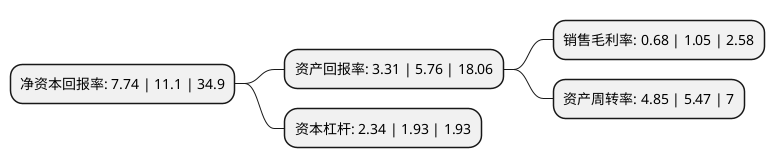

> 本页面由自动化程序生成于 2022年5月20日 01:23
> 内容可能存在错误，如有bug请提交issue至：https://github.com/Eroleice/doc-pi/issues
{.is-warning}

# 上市公司基本情况

## 基本资料

江苏益客食品集团股份有限公司（以下简称“益客食品”）成立于2008年08月07日，宿迁市。于2022年01月18日在深交所创业板上市。

益客食品注册资本44,897.959万元，主要从事禽类屠宰及加工，饲料生产及销售，商品代禽苗孵化及销售，以及熟食及调理品的生产与销售。以下是详细信息：

- 公司名称: 江苏益客食品集团股份有限公司
- 股票代码: 301116.SZ
- 所在地: 江苏 - 宿迁市
- 成立日期: 2008年08月07日
- 注册资本: 44,897.959万元
- 法定代表人: 田立余
- 主营业务: 主要从事禽类屠宰及加工，饲料生产及销售，商品代禽苗孵化及销售，以及熟食及调理品的生产与销售
- 公司官网: www.ecolovo.com
- 公司介绍: 公司主营业务主要涵盖禽类屠宰及加工、饲料生产及销售、商品代禽苗孵化及销售，以及熟食及调理品的生产与销售等四大业务板块。运营管理上，一方面，各个板块之间相互独立，皆具备独立对外经营的能力；另一方面，由于同属肉禽行业产业链，各业务板块之间存在一定程度的上下游联动关系，而通过良好地管理产业链上下游联动关系，公司获得较高的协同效益，从而能有效地抵御产业链单一业务环节的经营风险。公司现为中国畜牧业协会白羽肉鸭工作委员会执行主席单位、山东省畜牧协会水禽分会副会长单位、山东省肉类协会常务理事单位、山东省饲料行业协会副会长单位，并获得了《农业产业化国家重点龙头企业》《江苏省农产品加工业20强企业》《江苏省农业产业化省级重点龙头企业》《2017年中国肉类食品行业强势企业(有效期三年)》《2018年山东十大领军饲料企业》等诸多荣誉。

## 股东及高管情况

上市公司第一大股东为江苏益客农牧投资有限公司，持股314,772,806股，占比70.11%，为上市公司实际控制人。

截至2022年03月31日，上市公司的前十大股东中，共有7名机构股东，3个产品账户，其中5%以上大股东共有1名。上市公司前十大股东明细如下：

> 截至2022年03月31日，上市公司前十大股东信息如下：

| 股东名称 | 持股数量（股） | 持股比例 |
| --- | --- | --- |
| 江苏益客农牧投资有限公司 | 314,772,806 | 70.11% |
| 中央企业乡村产业投资基金股份有限公司 | 18,367,347 | 4.09% |
| 青岛运生股权投资合伙企业(普通合伙) | 12,711,864 | 2.83% |
| 中信证券投资有限公司 | 12,232,653 | 2.72% |
| 宿迁久德股权投资合伙企业(有限合伙) | 9,718,610 | 2.16% |
| 宿迁丰泽股权投资合伙企业(有限合伙) | 7,987,360 | 1.78% |
| 广州越秀产业投资基金管理股份有限公司-广州立创四号实业投资合伙企业(有限合伙) | 7,346,939 | 1.64% |
| 金石坤享股权投资(杭州)合伙企业(有限合伙) | 6,134,694 | 1.37% |
| 云南和源生物医药产业发展股权投资基金合伙企业(有限合伙) | 5,084,745 | 1.13% |
| 杭州毕易食投资合伙企业(有限合伙) | 3,813,559 | 0.85% |

## 杜邦分析

> 数据列示周期：2021年 | 2020年 | 2019年
{.is-info}

上市公司的净资产收益率在近一年有所下降，下降幅度为-30.27%，其变化情况分解如下：
- 上市公司的销售毛利率在近一年下降了-35.24%，可能是生产效率的下降、商品原材料价格上涨或商品价格的下跌所致。
- 上市公司的资产周转率在近一年下降了-11.33%，可能是源自于更慢的销售回款或库存管理效果下降。
- 上市公司的财务杠杆比率在近一年上升了21.24%，可能是增加负债扩大生产规模。

