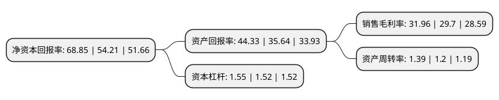

> 本页面由自动化程序生成于 2022年5月20日 01:23
> 内容可能存在错误，如有bug请提交issue至：https://github.com/Eroleice/doc-pi/issues
{.is-warning}

# 上市公司基本情况

## 基本资料

山东三元生物科技股份有限公司（以下简称“三元生物”）成立于2007年01月26日，滨州市。于2022年02月10日在深交所创业板上市。

三元生物注册资本13,488.38万元，食品添加剂，保健食品，酵母粉，淀粉及淀粉糖，赤藓糖醇及其复配产品的生产，销售以下是详细信息：

- 公司名称: 山东三元生物科技股份有限公司
- 股票代码: 301206.SZ
- 所在地: 山东 - 滨州市
- 成立日期: 2007年01月26日
- 注册资本: 13,488.38万元
- 法定代表人: 聂在建
- 主营业务: 食品添加剂，保健食品，酵母粉，淀粉及淀粉糖，赤藓糖醇及其复配产品的生产，销售
- 公司官网: www.sanyuanbz.com
- 公司介绍: 公司是国内较早开始工业化生产赤藓糖醇的专业厂商，自2007年成立以来公司专注深耕赤藓糖醇产品十余年，先后攻克菌种选育、配方优化、发酵控制、结晶提取等多个环节的工艺难题，逐步成长为全球赤藓糖醇行业领导者之一。公司在巩固赤藓糖醇行业优势地位的基础上，顺应市场应用变动趋势，推出罗汉果复配糖、甜菊糖复配糖、三氯蔗糖复配糖等新品种，同时积极推动新型甜味剂产品的研发试制工作，以更丰富的产品种类满足消费者差异化的需求。公司先后获得ISO9001(质量管理)、ISO14001(环境管理)、ISO22000(食品安全管理)三体系认证、国际食品安全品质认证(SQF)、食品安全全球标准认证(BRC)、犹太洁食认证(KOSHER)、清真洁食认证(HALAL)、美国食品药品监督管理局许可认证(FDA)、IP非转基因供应链标准认证、欧盟及美国ECOCERT有机认证等相关国内外权威资质认证，先后荣获“山东省中小企业隐形冠军”、“山东省瞪羚企业”、“山东省年度新旧动能转换及重点项目建设先进企业”等荣誉。公司先后荣获省级“一企一技术”研发中心、省级企业技术中心等认定。

## 股东及高管情况

上市公司第一大股东为聂在建，持股61,964,000股，占比45.94%，为上市公司实际控制人。

截至2022年03月31日，上市公司的前十大股东中，共有5名自然人股东，1名机构股东，4个产品账户，其中5%以上大股东共有3名。上市公司前十大股东明细如下：

> 截至2022年03月31日，上市公司前十大股东信息如下：

| 股东名称 | 持股数量（股） | 持股比例 |
| --- | --- | --- |
| 聂在建 | 61,964,000 | 45.94% |
| 山东鲁信祺晟投资管理有限公司-山东省鲁信资本市场发展股权投资基金合伙企业(有限合伙) | 16,520,000 | 12.25% |
| 吕熙安 | 8,568,000 | 6.35% |
| 山东科信创业投资有限责任公司 | 3,600,000 | 2.67% |
| 中国对外经济贸易信托有限公司-外贸信托·锐进16期中欧瑞博证券投资集合资金信托计划 | 1,925,166 | 1.43% |
| 李德春 | 1,920,000 | 1.42% |
| 张言杰 | 1,471,131 | 1.09% |
| 中国银行股份有限公司-华夏行业景气混合型证券投资基金 | 1,396,609 | 1.04% |
| 程保华 | 1,352,000 | 1% |
| 中国对外经济贸易信托有限公司-外贸信托-中欧瑞博成长智投证券投资集合资金信托计划 | 1,217,246 | 0.9% |

## 利润表分析

上市公司2021年总收入为16.75亿元，净利润为5.35亿元，实现盈利。

## 杜邦分析

> 数据列示周期：2021年 | 2020年 | 2019年
{.is-info}

上市公司的净资产收益率在近一年有所上升，上升幅度为27.01%，其变化情况分解如下：
- 上市公司的销售毛利率在近一年上升了7.61%，可能是生产效率的提升、商品原材料价格下跌或商品价格的上涨所致。
- 上市公司的资产周转率在近一年上升了15.83%，可能是源自于更快的销售回款或库存管理效果提升。
- 上市公司的财务杠杆比率在近一年上升了1.97%，可能是增加负债扩大生产规模。

