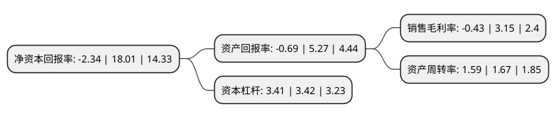

> 本页面由自动化程序生成于 2022年5月20日 01:24
> 内容可能存在错误，如有bug请提交issue至：https://github.com/Eroleice/doc-pi/issues
{.is-warning}

# 上市公司基本情况

## 基本资料

上海梅林正广和股份有限公司（以下简称“上海梅林”）成立于1997年06月27日，上海市。于1997年07月04日在上交所主板上市。

上海梅林注册资本93,772.947万元，主要产品为猪肉，牛肉，羊肉，罐头，蜂蜜，大白兔奶糖，保健酒，味精，烘焙食品，饮用水等，使用的商标品牌以“梅林”，“冠生园”，“大白兔”，“天厨”，“佛手”，“正广和”，“爱森”，“苏食”等为主。以下是详细信息：

- 公司名称: 上海梅林正广和股份有限公司
- 股票代码: 600073.SH
- 所在地: 上海 - 上海市
- 成立日期: 1997年06月27日
- 注册资本: 93,772.947万元
- 法定代表人: 吴坚
- 主营业务: 主要产品为猪肉，牛肉，羊肉，罐头，蜂蜜，大白兔奶糖，保健酒，味精，烘焙食品，饮用水等，使用的商标品牌以“梅林”，“冠生园”，“大白兔”，“天厨”，“佛手”，“正广和”，“爱森”，“苏食”等为主
- 公司官网: www.shanghaimaling.com
- 公司介绍: 公司以肉类食品和休闲食品的开发、生产和销售为主，旗下拥有“冠生园”、“大白兔”两个中国驰名商标和“梅林”、“佛手”、“华佗”、“正广和”、“SF”、“爱森”、“96858”等一批上海市著名商标。“梅林”荣获上海市出口名牌称号。“梅林”牌罐头食品、调味品，畅销国内外，产品销往亚洲、欧美等几十个国家和地区，国内的销售点也遍及除中国台湾外的各个省、市、自治区及直辖市。公司依托光明食品集团强大的综合食品竞争优势，通过内外资源的优化配置，构建从资源控制、食品加工和通路建设全产业链公司组织架构，努力实现公司食品制造与食品分销为双主业的二次转型。2016年，公司收购SFF牛肉50%股权，通过收购经营能力良好、拥有优质牛羊肉产业链的相关资产，实现控制国外优质牛羊肉上游资源的战略布局。

## 股东及高管情况

上市公司第一大股东为上海益民食品一厂(集团)有限公司，持股298,386,000股，占比31.82%，为上市公司实际控制人。

截至2022年03月31日，上市公司的前十大股东中，共有4名自然人股东，2名机构股东，3个产品账户，1个海外主体，其中5%以上大股东共有2名。上市公司前十大股东明细如下：

> 截至2022年03月31日，上市公司前十大股东信息如下：

| 股东名称 | 持股数量（股） | 持股比例 |
| --- | --- | --- |
| 上海益民食品一厂(集团)有限公司 | 298,386,000 | 31.82% |
| 光明食品(集团)有限公司 | 55,978,874 | 5.97% |
| 兴业银行股份有限公司-富国兴远优选12个月持有期混合型证券投资基金 | 27,270,160 | 2.91% |
| 卢宇超 | 13,379,138 | 1.43% |
| 信达国萃股权投资基金(上海)合伙企业(有限合伙) | 11,227,902 | 1.2% |
| 香港中央结算有限公司(陆股通) | 10,792,049 | 1.15% |
| 中国工商银行股份有限公司-富国文体健康股票型证券投资基金 | 6,699,614 | 0.71% |
| 郭大维 | 6,670,000 | 0.71% |
| 徐钦山 | 5,573,500 | 0.59% |
| 丁晓俊 | 4,562,939 | 0.49% |

## 利润表分析

上市公司2021年总收入为236.17亿元，净利润为-1.03亿元，**未实现盈利**。

## 杜邦分析

> 数据列示周期：2021年 | 2020年 | 2019年
{.is-info}

上市公司的净资产收益率在近一年有所下降，下降幅度为-112.99%，其变化情况分解如下：
- 上市公司的销售毛利率在近一年下降了-113.65%，可能是生产效率的下降、商品原材料价格上涨或商品价格的下跌所致。
- 上市公司的资产周转率在近一年下降了-4.79%，可能是源自于更慢的销售回款或库存管理效果下降。
- 上市公司的财务杠杆比率在近一年下降了-0.29%，可能是减少负债降低财务费用。

