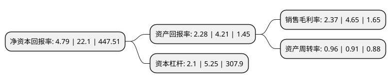

> 本页面由自动化程序生成于 2022年5月20日 01:24
> 内容可能存在错误，如有bug请提交issue至：https://github.com/Eroleice/doc-pi/issues
{.is-warning}

# 上市公司基本情况

## 基本资料

莲花健康产业集团股份有限公司（以下简称“莲花健康”）成立于1998年07月02日，周口市。于1998年08月25日在上交所主板上市。

莲花健康注册资本179,390.114万元，主要产品:味精，面粉，小麦淀粉及副产品，热力，电力。以下是详细信息：

- 公司名称: 莲花健康产业集团股份有限公司
- 股票代码: 600186.SH
- 所在地: 河南 - 周口市
- 成立日期: 1998年07月02日
- 注册资本: 179,390.114万元
- 法定代表人: 李厚文
- 主营业务: 主要产品:味精，面粉，小麦淀粉及副产品，热力，电力
- 公司官网: www.mylotushealth.com
- 公司介绍: 公司以食品生产经营为主营业务，产品主要包括以“莲花”牌味精、“莲花”牌鸡精、“九品香”调味料为主的调味品系列，以小麦谷朊粉为主的植物蛋白系列、以“六月春”牌面粉为主的小麦面粉系列，以及小麦淀粉系列。“莲花”牌味精长期占据中国市场主导地位，被商务部评为味精行业最具市场竞争力品牌，被中国绿色食品发展中心认定为“绿色食品”，入选“中国500最有价值品牌”。公司设有经国家人事部批准设立的“博士后科研工作站”，下辖五个重点实验室：小麦深加工实验室、氨基酸实验室、淀粉糖实验室、质量控制实验室、生物工程实验室，在氨基酸发酵生产、葡萄糖生产、环保技术、发酵副产物综合利用和小麦深加工等方面拥有大批具有自主知识产权的核心技术。公司在味精行业率先获得ISO9001质量体系认证，相继通过了HACCP体系认证、HALAL认证、美国犹太证书认证等认证，并获国家实验室CNAS认证。在巩固国内市场主导地位的同时，公司积极开拓国际市场，莲花味精、莲花鸡精、莲花谷朊粉出口量迅速增长，销往美国、欧洲、东南亚、中亚、俄罗斯等世界120多个国家和地区。

## 股东及高管情况

上市公司第一大股东为芜湖市莲泰投资管理中心(有限合伙)，持股180,509,529股，占比10.06%，**疑似为**上市公司实际控制人。

截至2022年03月31日，上市公司的前十大股东中，共有3名自然人股东，7名机构股东，其中5%以上大股东共有3名。上市公司前十大股东明细如下：

> 未能通过持股比例判定出上市公司实际控制人（持股30%以上）
> 可能存在通过间接持股、联合持股、协议控制等方式拥有实际控制权的主体，具体请参考上市公司定期公告！
{.is-warning}

> 截至2022年03月31日，上市公司前十大股东信息如下：

| 股东名称 | 持股数量（股） | 持股比例 |
| --- | --- | --- |
| 芜湖市莲泰投资管理中心(有限合伙) | 180,509,529 | 10.06% |
| 周口城投投资有限公司 | 166,666,666 | 9.29% |
| 枞阳县莲兴企业服务管理中心合伙企业(有限合伙) | 125,122,472 | 6.97% |
| 成都交子东方投资发展合伙企业(有限合伙) | 83,333,333 | 4.65% |
| 项城市国有资产控股管理集团有限公司 | 68,996,198 | 3.85% |
| 深圳市润通贰号投资企业(有限合伙) | 66,470,517 | 3.71% |
| 河南省农业综合开发有限公司 | 24,395,573 | 1.36% |
| 刘保军 | 16,843,366 | 0.94% |
| 肖文琴 | 12,278,381 | 0.68% |
| 张晓峰 | 10,044,855 | 0.56% |

## 利润表分析

上市公司2021年总收入为18.14亿元，净利润为0.42亿元，实现盈利。

## 杜邦分析

> 数据列示周期：2021年 | 2020年 | 2019年
{.is-info}

上市公司的净资产收益率在近一年有所下降，下降幅度为-78.33%，其变化情况分解如下：
- 上市公司的销售毛利率在近一年下降了-49.03%，可能是生产效率的下降、商品原材料价格上涨或商品价格的下跌所致。
- 上市公司的资产周转率在近一年上升了5.49%，可能是源自于更快的销售回款或库存管理效果提升。
- 上市公司的财务杠杆比率在近一年下降了-60%，可能是减少负债降低财务费用。

