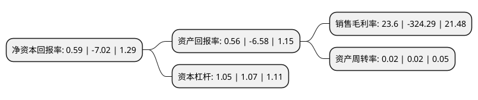

> 本页面由自动化程序生成于 2022年5月20日 01:25
> 内容可能存在错误，如有bug请提交issue至：https://github.com/Eroleice/doc-pi/issues
{.is-warning}

# 上市公司基本情况

## 基本资料

包头华资实业股份有限公司（以下简称“*ST华资”）成立于1998年11月30日，包头市。于1998年12月10日在上交所主板上市。

*ST华资注册资本48,493.2万元，主要产品:糖及其副产品，电子信息产品。以下是详细信息：

- 公司名称: 包头华资实业股份有限公司
- 股票代码: 600191.SH
- 所在地: 内蒙古 - 包头市
- 成立日期: 1998年11月30日
- 注册资本: 48,493.2万元
- 法定代表人: 宋卫东
- 主营业务: 主要产品:糖及其副产品，电子信息产品
- 公司官网: www.huazi.com
- 公司介绍: 公司是我国目前甜菜制糖企业唯一一家上市公司。公司主营业务为甜菜制糖业和电子业。主要产品包括“草原”牌糖产品和“包糖”牌食用酒精、“BY”牌石英晶体谐振器等电子元器件，计算机的研制、开发、生产和售后服务以及糖机设备的制造与销售。其中“草原”牌幼砂精糖、颗粒粕及“BY”牌石英晶体谐振器均为国家级新产品。历经多年发展，华资实业为繁荣地方经济做出了杰出贡献，多次受到国家、自治区和包头市的表彰。公司“草原”商标被国家工商总局评定为“中国驰名商标”。

## 股东及高管情况

上市公司第一大股东为包头草原糖业(集团)有限责任公司，持股152,717,960股，占比31.49%，为上市公司实际控制人。

截至2022年03月31日，上市公司的前十大股东中，共有4名自然人股东，6名机构股东，其中5%以上大股东共有6名。上市公司前十大股东明细如下：

> 截至2022年03月31日，上市公司前十大股东信息如下：

| 股东名称 | 持股数量（股） | 持股比例 |
| --- | --- | --- |
| 包头草原糖业(集团)有限责任公司 | 152,717,960 | 31.49% |
| 海南盛泰创发实业有限公司 | 144,994,030 | 29.9% |
| 世通投资(山东)有限公司 | 85,404,925 | 17.61% |
| 包头市实创经济技术开发有限公司 | 85,404,925 | 17.61% |
| 滨州康兴粮油贸易有限公司 | 33,056,658 | 6.82% |
| 包头市北普实业有限公司 | 25,332,728 | 5.22% |
| 庞宪珍 | 3,546,600 | 0.73% |
| 王兴存 | 3,350,000 | 0.69% |
| 谢爱月 | 3,000,000 | 0.62% |
| 代家连 | 2,800,000 | 0.58% |

## 利润表分析

上市公司2021年总收入为0.42亿元，净利润为0.09亿元，实现盈利。

## 杜邦分析

> 数据列示周期：2021年 | 2020年 | 2019年
{.is-info}

上市公司的净资产收益率在近一年有所下降，下降幅度为-108.4%，其变化情况分解如下：
- 上市公司的销售毛利率在近一年下降了-107.28%，可能是生产效率的下降、商品原材料价格上涨或商品价格的下跌所致。
- 上市公司的资产周转率在近一年下降了0%，可能是源自于更慢的销售回款或库存管理效果下降。
- 上市公司的财务杠杆比率在近一年下降了-1.87%，可能是减少负债降低财务费用。

