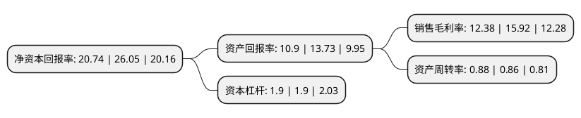

> 本页面由自动化程序生成于 2022年5月20日 01:25
> 内容可能存在错误，如有bug请提交issue至：https://github.com/Eroleice/doc-pi/issues
{.is-warning}

# 上市公司基本情况

## 基本资料

安琪酵母股份有限公司（以下简称“安琪酵母”）成立于1998年03月25日，宜昌市。于2000年08月18日在上交所主板上市。

安琪酵母注册资本83,286.094万元，主要产品:公司主要产品包括:酵母及深加工产品，保健食品，特殊营养食品，烘焙原料，食品添加剂，乳制品，调味品等。以下是详细信息：

- 公司名称: 安琪酵母股份有限公司
- 股票代码: 600298.SH
- 所在地: 湖北 - 宜昌市
- 成立日期: 1998年03月25日
- 注册资本: 83,286.094万元
- 法定代表人: 熊涛
- 主营业务: 主要产品:公司主要产品包括:酵母及深加工产品，保健食品，特殊营养食品，烘焙原料，食品添加剂，乳制品，调味品等
- 公司官网: www.angelyeast.com
- 公司介绍: 公司是研究天然酵母，并进行规模化制造的专业化公司，酵母产业化水平在国内处于领先地位，是酵母行业唯一的高科技上市公司。公司主导产品包括面包酵母、酿酒酵母、酵母抽提物、营养健康产品、生物饲料添加剂等，产品广泛应用于烘焙食品、发酵面食、酿酒及酒精工业、食品调味、医药及营养保健、动物营养等领域。公司产品品种多、规格全，能提供5克至25千克各种规格的产品；销售到欧洲、美洲、澳洲、非洲、亚洲150多个国家和地区，可快速运输到指定的交货地。公司技术中心被认定为国家级企业技术中心，是全国“守合同、重信用”企业、中国人民银行AAA信誉等级企业。

## 股东及高管情况

上市公司第一大股东为湖北安琪生物集团有限公司，持股329,451,670股，占比39.56%，为上市公司实际控制人。

截至2022年03月31日，上市公司的前十大股东中，共有2名机构股东，5个产品账户，2个海外主体，1名其他股东，其中5%以上大股东共有2名。上市公司前十大股东明细如下：

> 截至2022年03月31日，上市公司前十大股东信息如下：

| 股东名称 | 持股数量（股） | 持股比例 |
| --- | --- | --- |
| 湖北安琪生物集团有限公司 | 329,451,670 | 39.56% |
| 香港中央结算有限公司(陆股通) | 100,583,911 | 12.08% |
| 瑞银资产管理(新加坡)有限公司-瑞银卢森堡投资SICAV | 11,357,880 | 1.36% |
| 兴业银行股份有限公司-工银瑞信文体产业股票型证券投资基金 | 10,804,158 | 1.3% |
| 科威特政府投资局-自有资金 | 9,886,568 | 1.19% |
| 全国社保基金五零三组合 | 7,500,002 | 0.9% |
| 全国社保基金一零一组合 | 7,325,564 | 0.88% |
| MERRILL LYNCH INTERNATIONAL | 6,729,176 | 0.81% |
| 招商银行股份有限公司-工银瑞信圆兴混合型证券投资基金 | 6,606,100 | 0.79% |
| 汇添富基金管理股份有限公司-社保基金四二三组合 | 5,266,536 | 0.63% |

## 利润表分析

上市公司2021年总收入为106.75亿元，净利润为13.21亿元，实现盈利。

## 杜邦分析

> 数据列示周期：2021年 | 2020年 | 2019年
{.is-info}

上市公司的净资产收益率在近一年有所下降，下降幅度为-20.38%，其变化情况分解如下：
- 上市公司的销售毛利率在近一年下降了-22.24%，可能是生产效率的下降、商品原材料价格上涨或商品价格的下跌所致。
- 上市公司的资产周转率在近一年上升了2.33%，可能是源自于更快的销售回款或库存管理效果提升。
- 上市公司的财务杠杆比率在近一年下降了0%，可能是减少负债降低财务费用。

