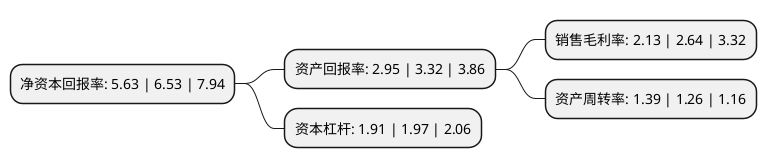

> 本页面由自动化程序生成于 2022年5月20日 01:28
> 内容可能存在错误，如有bug请提交issue至：https://github.com/Eroleice/doc-pi/issues
{.is-warning}

# 上市公司基本情况

## 基本资料

中粮糖业控股股份有限公司（以下简称“中粮糖业”）成立于1993年09月18日，昌吉回族自治州。于1996年07月31日在上交所主板上市。

中粮糖业注册资本213,884.823万元，主要产品:番茄产品，农副产品，水泥产品。以下是详细信息：

- 公司名称: 中粮糖业控股股份有限公司
- 股票代码: 600737.SH
- 所在地: 新疆 - 昌吉回族自治州
- 成立日期: 1993年09月18日
- 注册资本: 213,884.823万元
- 法定代表人: 李明华
- 主营业务: 主要产品:番茄产品，农副产品，水泥产品
- 公司官网: www.cofcosugar.com
- 公司介绍: 公司是我国领先的果蔬食品生产供应商，拥有番茄、食糖两大产业，是领先的番茄制品生产企业，国内最大的食糖生产和贸易企业，主营番茄加工、食糖加工贸易、果蔬罐头贸易、种业和品牌产品业务，致力于成为果蔬食品行业的领导者和品质一流的食品企业。产品包括番茄大桶酱、番茄沙司、小包装番茄酱、番茄红素、番茄汁、番茄粉等。公司针对旗下产品，实施全产业链监控，形成种业研发、机械化种植采收、生产加工、品管品控、物流、营销的完整全产业链格局。“从田间到餐桌”，严格把控每一个生产环节，保证产品质量和食品安全，达到出口欧美的食品安全认证。

## 股东及高管情况

上市公司第一大股东为中粮集团有限公司，持股1,085,033,073股，占比50.73%，为上市公司实际控制人。

截至2022年03月31日，上市公司的前十大股东中，共有4名机构股东，5个产品账户，1个海外主体，其中5%以上大股东共有1名。上市公司前十大股东明细如下：

> 截至2022年03月31日，上市公司前十大股东信息如下：

| 股东名称 | 持股数量（股） | 持股比例 |
| --- | --- | --- |
| 中粮集团有限公司 | 1,085,033,073 | 50.73% |
| 天津农垦宏益联投资有限公司 | 26,595,744 | 1.24% |
| 中欧基金-农业银行-中欧中证金融资产管理计划 | 15,145,300 | 0.71% |
| 中国华融资产管理股份有限公司 | 10,655,727 | 0.5% |
| 华夏人寿保险股份有限公司-自有资金 | 10,541,100 | 0.49% |
| 大成基金-农业银行-大成中证金融资产管理计划 | 8,387,066 | 0.39% |
| 上海呈瑞投资管理有限公司-呈瑞和兴9号私募证券投资基金 | 6,800,091 | 0.32% |
| 广发基金-农业银行-广发中证金融资产管理计划 | 5,775,016 | 0.27% |
| 中国农业银行股份有限公司-中证500交易型开放式指数证券投资基金 | 5,175,574 | 0.24% |
| 香港中央结算有限公司(陆股通) | 4,670,267 | 0.22% |

## 利润表分析

上市公司2021年总收入为251.6亿元，净利润为5.35亿元，实现盈利。

## 杜邦分析

> 数据列示周期：2021年 | 2020年 | 2019年
{.is-info}

上市公司的净资产收益率在近一年有所下降，下降幅度为-13.78%，其变化情况分解如下：
- 上市公司的销售毛利率在近一年下降了-19.32%，可能是生产效率的下降、商品原材料价格上涨或商品价格的下跌所致。
- 上市公司的资产周转率在近一年上升了10.32%，可能是源自于更快的销售回款或库存管理效果提升。
- 上市公司的财务杠杆比率在近一年下降了-3.05%，可能是减少负债降低财务费用。

