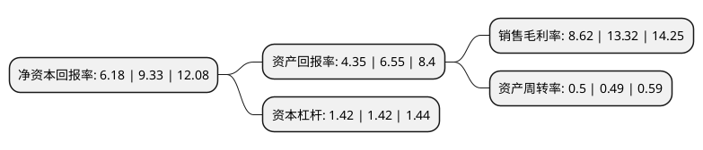

> 本页面由自动化程序生成于 2022年5月20日 01:29
> 内容可能存在错误，如有bug请提交issue至：https://github.com/Eroleice/doc-pi/issues
{.is-warning}

# 上市公司基本情况

## 基本资料

广东肇庆星湖生物科技股份有限公司（以下简称“星湖科技”）成立于1992年04月18日，肇庆市。于1994年08月18日在上交所主板上市。

星湖科技注册资本73,901.917万元，肌苷，利巴韦林，脯氨酸，腺苷及其他，呈味核苷酸，味精，鲜上鲜，酱油以下是详细信息：

- 公司名称: 广东肇庆星湖生物科技股份有限公司
- 股票代码: 600866.SH
- 所在地: 广东 - 肇庆市
- 成立日期: 1992年04月18日
- 注册资本: 73,901.917万元
- 法定代表人: 陈武
- 主营业务: 肌苷，利巴韦林，脯氨酸，腺苷及其他，呈味核苷酸，味精，鲜上鲜，酱油
- 公司官网: www.starlake.com.cn
- 公司介绍: 公司主营产品是粤宝牌原料药系列(肌苷、利巴韦林、脯氨酸等)、星湖牌调味品系列(味精、鸡精、酱油等)、星湖牌饲料添加剂系列(L-赖氨酸盐酸盐、植酸酶等)三大类。公司多个主导产品的生产规模、市场占有率较高，其中肌苷原料药等的生产规模为全球最大，核苷酸系列产品(肌苷酸二钠、鸟苷酸二钠等)则是填补国内空白的新产品。公司技术力量雄厚，建立了完善的技术开发体系，拥有国家级企业技术中心、博士后科研工作站以及多个产学研实验室，主要产品质量均达到国际先进水平，粤宝牌原料药通过了国家GMP认证，利巴韦林通过了美国FDA检查，核苷酸厂通过HACCP认证。

## 股东及高管情况

上市公司第一大股东为广东省广新控股集团有限公司，持股149,422,420股，占比20.22%，**疑似为**上市公司实际控制人。

截至2022年03月31日，上市公司的前十大股东中，共有8名自然人股东，2名机构股东，其中5%以上大股东共有1名。上市公司前十大股东明细如下：

> 未能通过持股比例判定出上市公司实际控制人（持股30%以上）
> 可能存在通过间接持股、联合持股、协议控制等方式拥有实际控制权的主体，具体请参考上市公司定期公告！
{.is-warning}

> 截至2022年03月31日，上市公司前十大股东信息如下：

| 股东名称 | 持股数量（股） | 持股比例 |
| --- | --- | --- |
| 广东省广新控股集团有限公司 | 149,422,420 | 20.22% |
| 深圳长城汇理资产服务企业(有限合伙) | 36,950,400 | 5% |
| 吴彩银 | 16,358,748 | 2.21% |
| 陈裕良 | 16,247,500 | 2.2% |
| 张国良 | 10,917,897 | 1.48% |
| 赵娟 | 10,110,600 | 1.37% |
| 袁仁泉 | 9,498,688 | 1.29% |
| 张凤 | 9,306,528 | 1.26% |
| 黄泽坚 | 8,310,000 | 1.12% |
| 刘世祥 | 5,252,000 | 0.71% |

## 利润表分析

上市公司2021年总收入为12.35亿元，净利润为1.06亿元，实现盈利。

## 杜邦分析

> 数据列示周期：2021年 | 2020年 | 2019年
{.is-info}

上市公司的净资产收益率在近一年有所下降，下降幅度为-33.76%，其变化情况分解如下：
- 上市公司的销售毛利率在近一年下降了-35.29%，可能是生产效率的下降、商品原材料价格上涨或商品价格的下跌所致。
- 上市公司的资产周转率在近一年上升了2.04%，可能是源自于更快的销售回款或库存管理效果提升。
- 上市公司的财务杠杆比率在近一年下降了0%，可能是减少负债降低财务费用。

