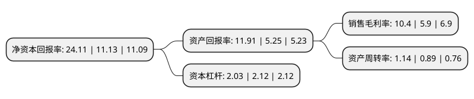

> 本页面由自动化程序生成于 2022年5月20日 01:29
> 内容可能存在错误，如有bug请提交issue至：https://github.com/Eroleice/doc-pi/issues
{.is-warning}

# 上市公司基本情况

## 基本资料

梅花生物科技集团股份有限公司（以下简称“梅花生物”）成立于1995年02月09日，拉萨市。于1995年02月17日在上交所主板上市。

梅花生物注册资本309,861.993万元，味精，氨基酸，有机肥等生物发酵产品的生产及销售。以下是详细信息：

- 公司名称: 梅花生物科技集团股份有限公司
- 股票代码: 600873.SH
- 所在地: 西藏 - 拉萨市
- 成立日期: 1995年02月09日
- 注册资本: 309,861.993万元
- 法定代表人: 王爱军
- 主营业务: 味精，氨基酸，有机肥等生物发酵产品的生产及销售
- 公司官网: www.meihuagrp.com
- 公司介绍: 公司是全球领先的氨基酸营养健康解决方案提供商。公司通过为全球100多个国家和地区多家知名客户提供各类氨基酸产品及使用解决方案，让全世界用户享有技术的全方位沟通。梅花集团拥有生物发酵行业中最完整的、最长的产业链和配套设施，通过全系列的研、产、供、销服务，灵活满足全球不同客户的差异化需求以及快速创新的追求，专注于打造生物发酵和生物制药的高端产业平台。

## 股东及高管情况

上市公司第一大股东为孟庆山，持股854,103,033股，占比27.56%，**疑似为**上市公司实际控制人。

截至2022年03月31日，上市公司的前十大股东中，共有5名自然人股东，5个产品账户，其中5%以上大股东共有1名。上市公司前十大股东明细如下：

> 未能通过持股比例判定出上市公司实际控制人（持股30%以上）
> 可能存在通过间接持股、联合持股、协议控制等方式拥有实际控制权的主体，具体请参考上市公司定期公告！
{.is-warning}

> 截至2022年03月31日，上市公司前十大股东信息如下：

| 股东名称 | 持股数量（股） | 持股比例 |
| --- | --- | --- |
| 孟庆山 | 854,103,033 | 27.56% |
| 北京隆慧投资有限公司-隆慧汇晨战略投资私募证券投资基金 | 102,535,764 | 3.31% |
| 胡继军 | 100,986,151 | 3.26% |
| 招商银行股份有限公司-兴全合润混合型证券投资基金 | 76,317,599 | 2.46% |
| 王爱军 | 71,316,274 | 2.3% |
| 招商银行股份有限公司-兴全合宜灵活配置混合型证券投资基金(LOF) | 69,000,993 | 2.23% |
| 杨维永 | 56,537,169 | 1.82% |
| 梁宇博 | 54,508,518 | 1.76% |
| 梅花生物科技集团股份有限公司-2021年员工持股计划 | 49,051,000 | 1.58% |
| 梅花生物科技集团股份有限公司回购专用证券账户 | 44,938,081 | 1.45% |

## 利润表分析

上市公司2021年总收入为228.36亿元，净利润为23.76亿元，实现盈利。

## 杜邦分析

> 数据列示周期：2021年 | 2020年 | 2019年
{.is-info}

上市公司的净资产收益率在近一年有所上升，上升幅度为116.62%，其变化情况分解如下：
- 上市公司的销售毛利率在近一年上升了76.27%，可能是生产效率的提升、商品原材料价格下跌或商品价格的上涨所致。
- 上市公司的资产周转率在近一年上升了28.09%，可能是源自于更快的销售回款或库存管理效果提升。
- 上市公司的财务杠杆比率在近一年下降了-4.25%，可能是减少负债降低财务费用。

