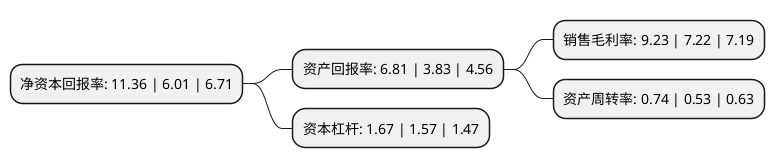

> 本页面由自动化程序生成于 2022年5月20日 01:30
> 内容可能存在错误，如有bug请提交issue至：https://github.com/Eroleice/doc-pi/issues
{.is-warning}

# 上市公司基本情况

## 基本资料

雪天盐业集团股份有限公司（以下简称“雪天盐业”）成立于2011年12月16日，长沙市。于2018年03月26日在上交所主板上市。

雪天盐业注册资本135,016.98万元，发行人的主营业务为盐及盐化工产品的生产，销售。其主要产品为食盐，两碱用盐，小工业盐及芒硝。以下是详细信息：

- 公司名称: 雪天盐业集团股份有限公司
- 股票代码: 600929.SH
- 所在地: 湖南 - 长沙市
- 成立日期: 2011年12月16日
- 注册资本: 135,016.98万元
- 法定代表人: 冯传良
- 主营业务: 发行人的主营业务为盐及盐化工产品的生产，销售其主要产品为食盐，两碱用盐，小工业盐及芒硝
- 公司官网: www.snowskysalt.com.cn
- 公司介绍: 公司成立于2011年，是由湖南轻盐集团、湖南轻盐创投、湖南湘江投资、贵州盐业、江苏盐业、广西盐业、湖南发展投资集团有限公司、湖南财信共同发起设立，是行业内第一家跨省联合的现代企业。公司自设立以来专注于盐及盐化工产品的生产、销售，其主要产品为食盐、两碱用盐、小工业盐及芒硝。近年来，公司加快战略扩张步伐，于2014年对外收购了江西九二盐业。“雪天”注册商标被评为中国驰名商标、湖南省著名商标；“天鹅”注册商标被评为湖南省著名商标。“雪天”牌精制盐为湖南省名牌产品、“天鹅”牌工业盐、食用盐被授予湖南省名牌产品称号。

## 股东及高管情况

上市公司第一大股东为湖南省轻工盐业集团有限公司，持股862,826,865股，占比63.91%，为上市公司实际控制人。

截至2022年03月31日，上市公司的前十大股东中，共有2名自然人股东，6名机构股东，2个产品账户，其中5%以上大股东共有2名。上市公司前十大股东明细如下：

> 截至2022年03月31日，上市公司前十大股东信息如下：

| 股东名称 | 持股数量（股） | 持股比例 |
| --- | --- | --- |
| 湖南省轻工盐业集团有限公司 | 862,826,865 | 63.91% |
| 湖南轻盐晟富盐化产业私募股权基金合伙企业(有限合伙) | 95,578,867 | 7.08% |
| 贵州盐业(集团)有限责任公司 | 27,984,053 | 2.07% |
| 湖南轻盐创业投资管理有限公司 | 26,258,502 | 1.94% |
| 华菱津杉(天津)产业投资基金合伙企业(有限合伙) | 21,519,235 | 1.59% |
| 周建 | 19,600,067 | 1.45% |
| 江苏省盐业集团有限责任公司 | 12,720,938 | 0.94% |
| 湖南发展集团矿业开发有限公司 | 7,683,573 | 0.57% |
| 廖小英 | 6,899,000 | 0.51% |
| 湖南高新创业投资集团有限公司 | 5,000,000 | 0.37% |

## 利润表分析

上市公司2021年总收入为47.8亿元，净利润为4.41亿元，实现盈利。

## 杜邦分析

> 数据列示周期：2021年 | 2020年 | 2019年
{.is-info}

上市公司的净资产收益率在近一年有所上升，上升幅度为89.02%，其变化情况分解如下：
- 上市公司的销售毛利率在近一年上升了27.84%，可能是生产效率的提升、商品原材料价格下跌或商品价格的上涨所致。
- 上市公司的资产周转率在近一年上升了39.62%，可能是源自于更快的销售回款或库存管理效果提升。
- 上市公司的财务杠杆比率在近一年上升了6.37%，可能是增加负债扩大生产规模。

