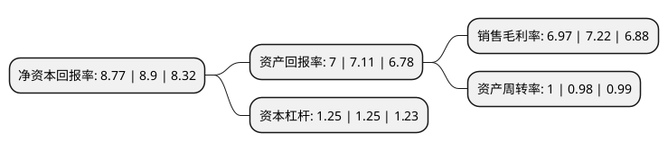

> 本页面由自动化程序生成于 2022年5月20日 01:32
> 内容可能存在错误，如有bug请提交issue至：https://github.com/Eroleice/doc-pi/issues
{.is-warning}

# 上市公司基本情况

## 基本资料

爱普香料集团股份有限公司（以下简称“爱普股份”）成立于1995年06月28日，上海市。于2015年03月25日在上交所主板上市。

爱普股份注册资本38,323.777万元，公司主营业务为香料，香精的研发，生产和销售以及食品配料经营。主要产品包括香料(含合成香料和天然香料)，香精(含食用香精，日化香精和烟草香精)，同时经销国际知名品牌的黄油，奶酪，巧克力，可可等食品配料，向下游客户提供“食用香精+食品配料”的一站式解决方案。以下是详细信息：

- 公司名称: 爱普香料集团股份有限公司
- 股票代码: 603020.SH
- 所在地: 上海 - 上海市
- 成立日期: 1995年06月28日
- 注册资本: 38,323.777万元
- 法定代表人: 魏中浩
- 主营业务: 公司主营业务为香料，香精的研发，生产和销售以及食品配料经营主要产品包括香料(含合成香料和天然香料)，香精(含食用香精，日化香精和烟草香精)，同时经销国际知名品牌的黄油，奶酪，巧克力，可可等食品配料，向下游客户提供“食用香精+食品配料”的一站式解决方案
- 公司官网: www.cnaff.com
- 公司介绍: 公司是中国香料香精和食品添加剂行业的领先制造企业，产品涵盖食用香精、日化香精、香料及食品添加剂。公司连续进入“上海市百强民营企业”排名，是中国优秀民营科技企业，上海市高新技术企业，国家火炬计划重点高新技术企业，全国守合同重信用公示企业。公司秉承“安全和环保、创意和创新”的产品开发理念，积极推进产品创新和技术创新。众多知名品牌的产品中融入了爱普独有的香味和香韵。公司坚持“企业发展，社会责任，员工幸福，客户满意”的企业宗旨，致力于以企业发展带动行业发展，建立可持续发展的平台，持续推进公司的国际化战略。

## 股东及高管情况

上市公司第一大股东为魏中浩，持股117,014,266股，占比30.53%，为上市公司实际控制人。

截至2022年03月31日，上市公司的前十大股东中，共有4名自然人股东，5名机构股东，1个产品账户，其中5%以上大股东共有1名。上市公司前十大股东明细如下：

> 截至2022年03月31日，上市公司前十大股东信息如下：

| 股东名称 | 持股数量（股） | 持股比例 |
| --- | --- | --- |
| 魏中浩 | 117,014,266 | 30.53% |
| 上海轶乐实业有限公司 | 13,320,000 | 3.48% |
| 上海馨宇投资管理有限公司 | 13,000,000 | 3.39% |
| 中国国际金融股份有限公司 | 6,881,534 | 1.8% |
| 东方证券股份有限公司 | 6,745,362 | 1.76% |
| 肖峻 | 5,116,312 | 1.34% |
| 上海富善投资有限公司-致远CTA陆家嘴精选2期私募证券投资基金 | 4,637,436 | 1.21% |
| 刘建军 | 4,160,000 | 1.09% |
| 肖益群 | 3,662,500 | 0.96% |
| 上海新行建设投资有限公司 | 3,600,000 | 0.94% |

## 利润表分析

上市公司2021年总收入为33.44亿元，净利润为2.32亿元，实现盈利。

## 杜邦分析

> 数据列示周期：2021年 | 2020年 | 2019年
{.is-info}

上市公司的净资产收益率在近一年有所下降，下降幅度为-1.46%，其变化情况分解如下：
- 上市公司的销售毛利率在近一年下降了-3.46%，可能是生产效率的下降、商品原材料价格上涨或商品价格的下跌所致。
- 上市公司的资产周转率在近一年上升了2.04%，可能是源自于更快的销售回款或库存管理效果提升。
- 上市公司的财务杠杆比率在近一年下降了0%，可能是减少负债降低财务费用。

